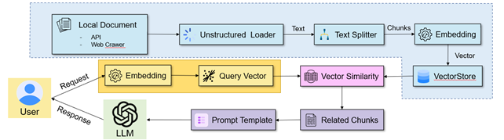
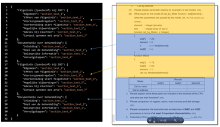
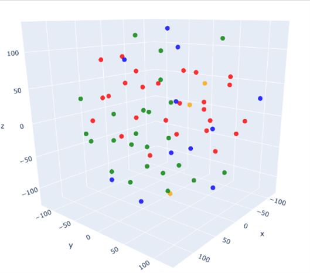

## ABSTRSCT

本研究旨在設計並開發一款基於檢索增強生成(RAG)技術的教育聊天機器人，並將其應用於大學計算機概論課程，以提供個性化且高效的學習支持。系統整合歷屆考試題目與教學資源，並採用語義檢索與內容生成技術，確保在學習場景中的實用性、互動性與精確性。研究針對南部某大學 98 名一年級學生，進行為期四週的系統測試，旨在測量系統在語義完整性、內容準確性及學習支持功能方面的表現。進一步探討 Warmth Perception、Competence Perception、Post-Recovery Satisfaction、Re-Use Intentions 等心理變項。研究結果顯示，這些心理變項之間呈現顯著正向關係，反映了情感支持與系統效能在提升用戶滿意度與參與度方面的重要性。然而，根據相依樣本 t 檢定結果，系統在使用前後的系統可用性量表(SUS)未達顯著差異。揭示了系統在滿足使用者需求方面仍需進一步改進。反映出系統設計與使用者需求間仍存在優化空間。未來可進一步優化系統設計，滿足學習者多樣化需求，提升教育科技於高等教育場域的應用潛力。

    

 

    
    

 

