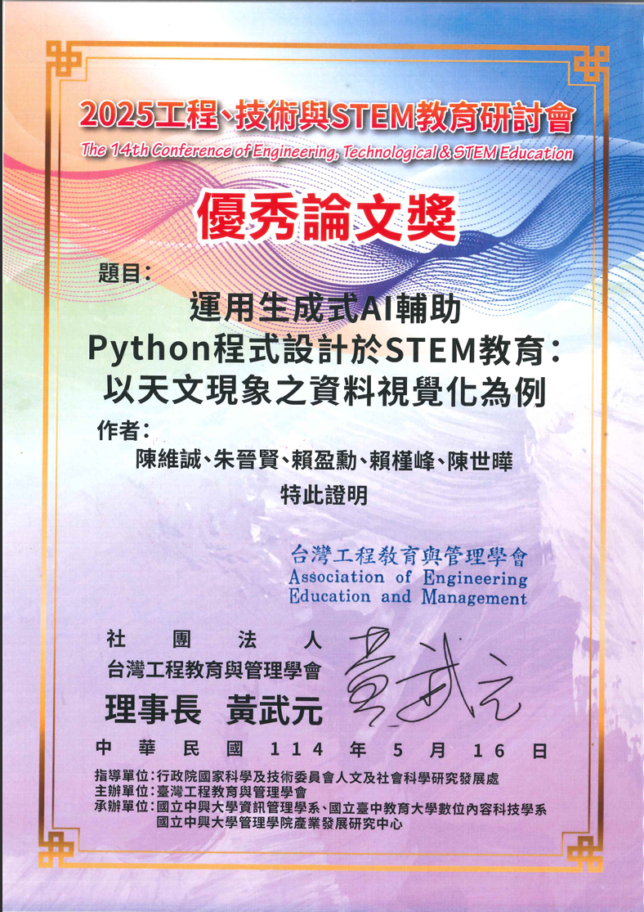
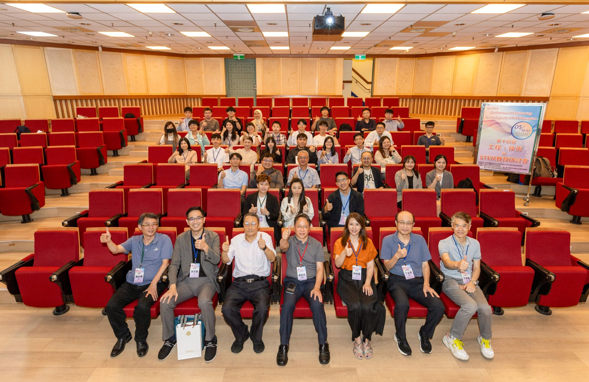

## ABSTRACT

本研究探討生成式 AI 工具與 Python 資料視覺化在 STEM 教育中的應用，以天文教育為例，分析其對學生學習成效的影響。研究對象為臺灣南部某大學 96 名理工科一年級學生，隨機分為控制組與實驗組。控制組使用傳統線上資源學習，實驗組則透過整合 ChatGPT API 的生成式 AI 聊天機器人輔助學習。結果顯示，實驗組學生在 STEM 自我效能與學習意向上顯著優於控制組，顯示生成式 AI 能夠降低學習門檻、提供即時回饋，並增強學習信心與動機。然而，天文學學習態度的提升未達顯著差異，可能受限於學科的抽象性與課程時間。研究表明，生成式 AI 在 STEM 教育中具備提升學習體驗與動機的潛力，未來應進一步探索互動式與沉浸式學習方法，並強調生成式 AI 作為教育創新工具的價值，同時平衡技術技能培養與情感、認知參與的重要性，以促進學生對學科的深度參與及長期興趣。

This study explores the application of generative AI tools and Python-based data visualization in STEM education, focusing on astronomy as a case study. A total of 96 first-year science and engineering students from a university in southern Taiwan were randomly assigned to either a control group (traditional online resources) or an experimental group (ChatGPT-integrated AI chatbot). Results showed that the experimental group exhibited significantly higher STEM self-efficacy and learning motivation, suggesting that generative AI can lower learning barriers, provide real-time feedback, and boost confidence. However, no significant improvement was found in students’ attitudes toward astronomy, possibly due to the subject's abstract nature and time constraints. This study highlights generative AI's potential to enhance STEM learning. Future research should explore interactive and immersive teaching methods while balancing technical skill development with cognitive and emotional engagement to foster long-term student interest.

關鍵字：資料視覺化、生成式 AI、程式設計、天文教育、STEM 教育

    

 

    

 

    

