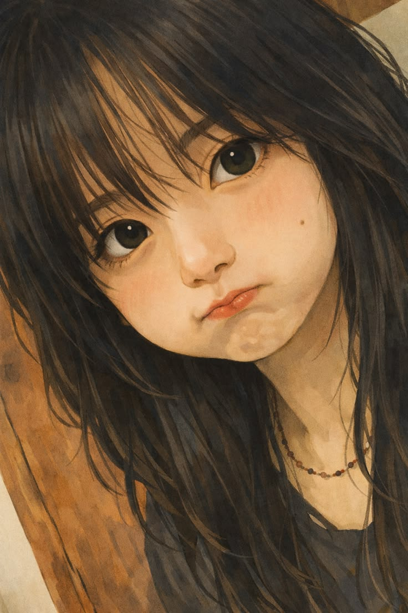
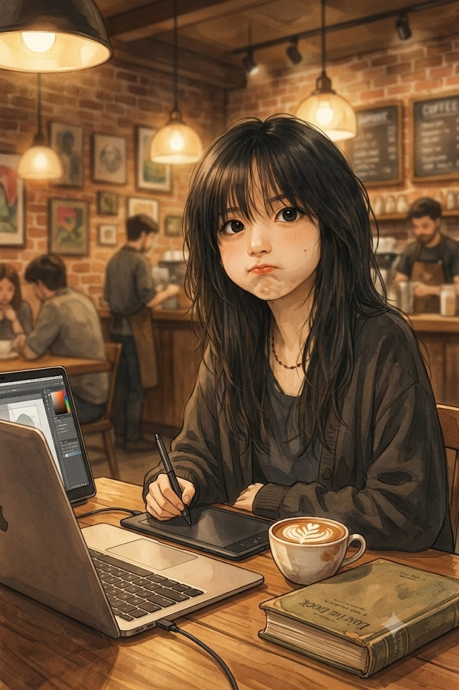
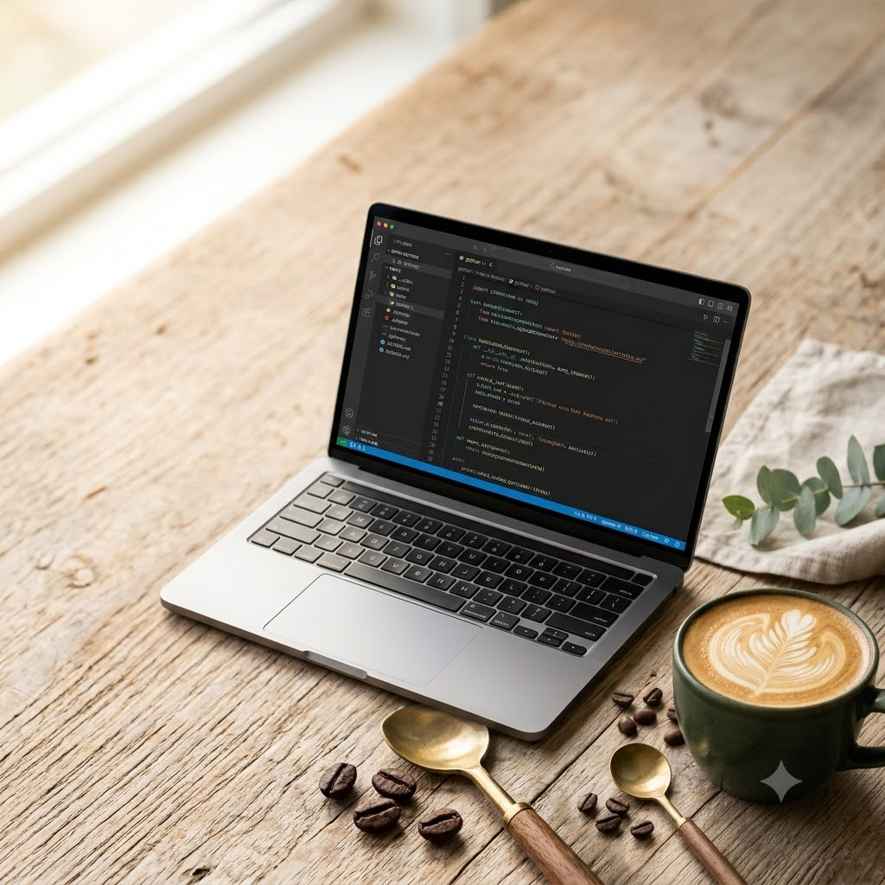
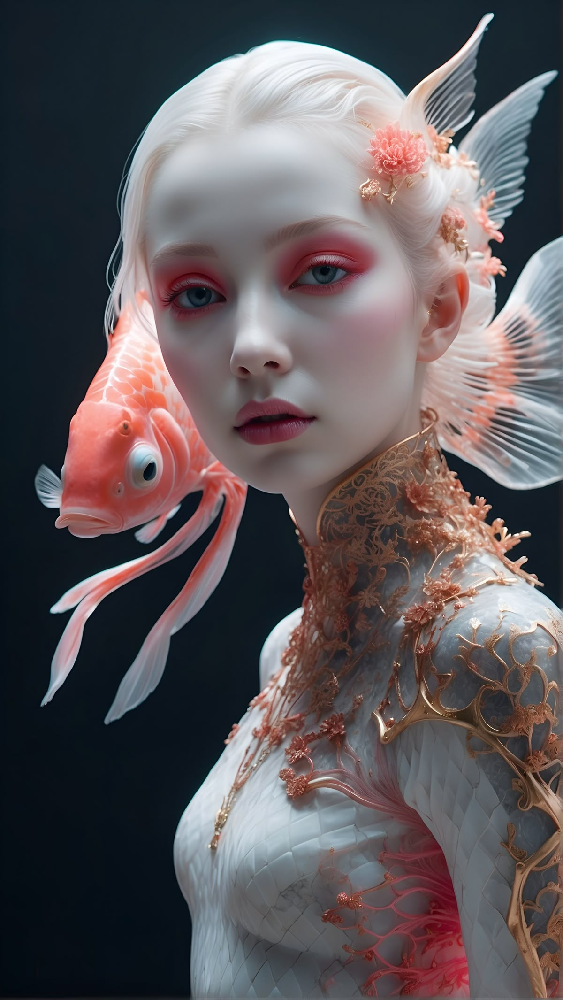
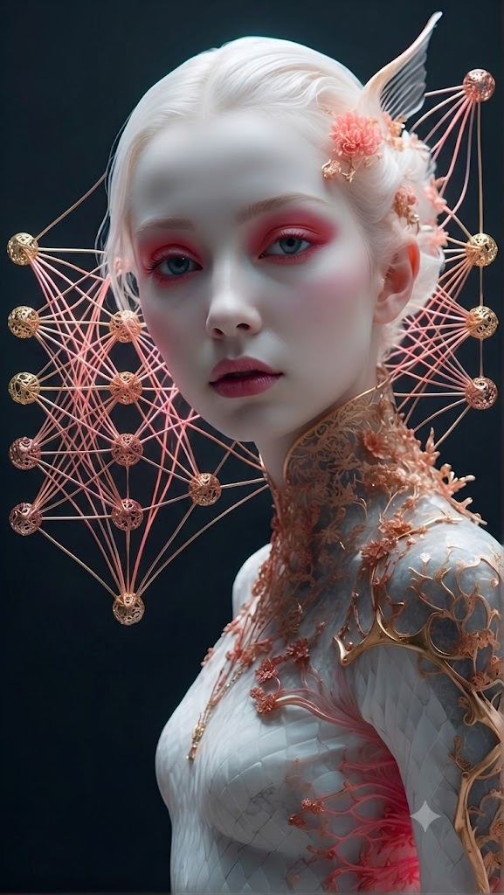
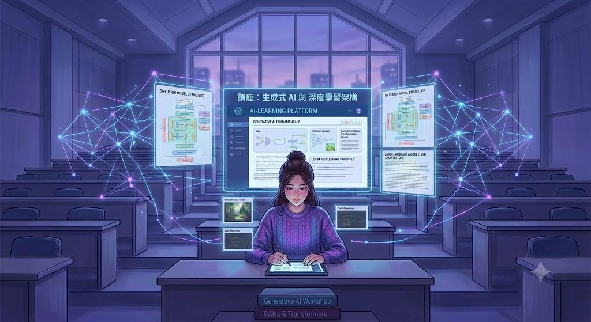
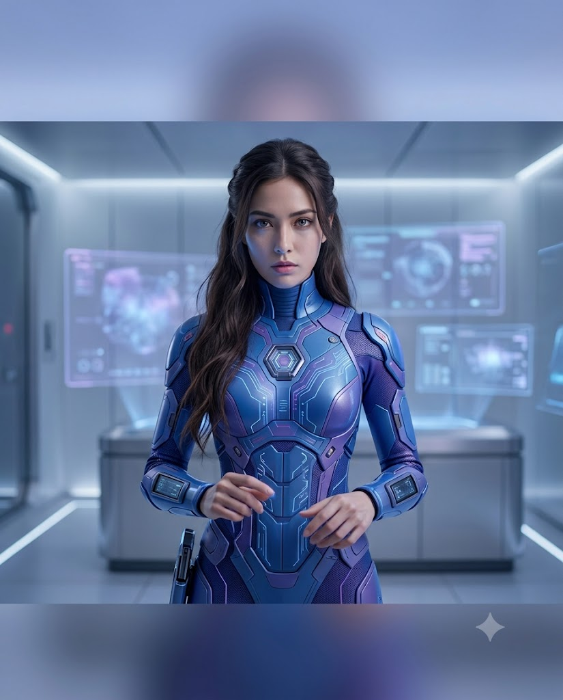
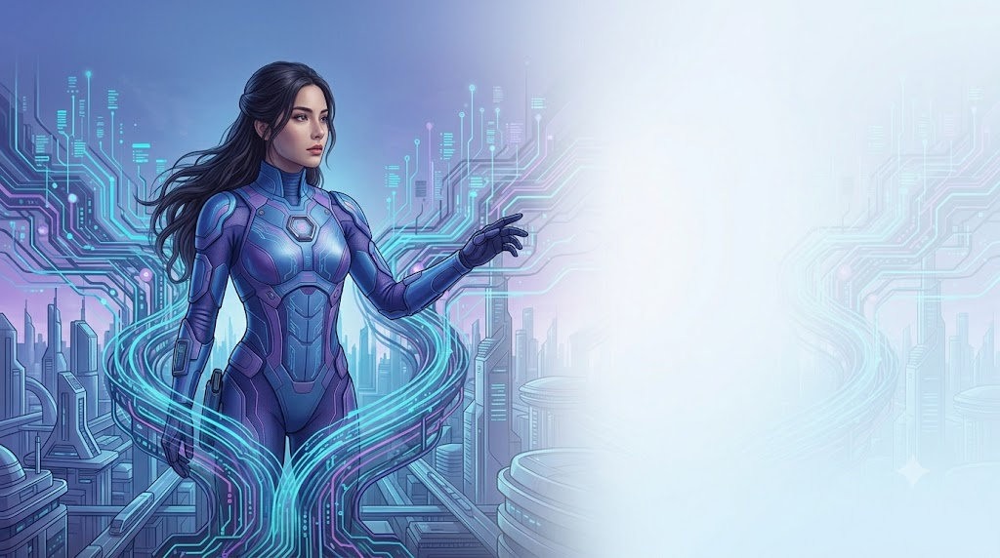

# 圖像策略：建立個人與品牌視覺

## 圖像的價值升級：從作品到品牌

### 為什麼單張圖片沒有長期價值

在許多教學中，我們只要生成一張好看的圖片，就認為任務完成。但在品牌經營與內容創作中，單張圖通常有三個限制：

1. 無法形成記憶：讀者看到圖片，卻不知道是誰製作的。
2. 無法提升效率：每次都需要重新設計，不能在既有基礎上延伸。
3. 無法建立品牌：圖像彼此沒有關聯，不能形成一致風格。

常見原因：

- 每張圖的風格不同。
- 沒有固定色調或視覺元素。
- 無法建立連續性。
- 每次都從空白開始。

關鍵轉換

```text
做出一張好看的圖
↓
建立可以持續使用的圖像系統
↓
累積成可長期使用的視覺資產
```

這會讓短期成果轉變為：

- 可以被累積的長期資產。
- 可以在不同主題、場景與尺寸中延伸的系統。
- 能讓讀者一眼辨識來源的品牌印象。

## 視覺資產

視覺資產（Visual Asset）是：可以被重複使用、延伸發展，並逐步累積價值的圖像系統。

它不只是一次性的內容，而具有：

- 持續使用的可能。
- 多場景應用的彈性。
- 長期累積的效果。

視覺資產的三個特徵：

第一，可重複使用。同一套視覺可應用於社群貼文、教學內容、行銷素材、簡報、網站。
第二，可延伸發展。可在原有基礎上變化：

- 同一角色，不同場景。
- 同一風格，不同主題。
- 同一構圖，多版本輸出。

第三，可辨識。圖像具有一致性時，讀者會逐漸建立連結：

> 一看到這張圖，就想到這個人或品牌。

```
### 課堂提問

以下哪一個比較接近視覺資產？為什麼？

A. 每週隨機生成一張不同風格的 AI 圖。
B. 固定角色、色彩與構圖規則，每週延伸不同主題。

參考答案：B。因為它能重複、延伸與累積，並建立辨識度。
```

## 品牌視覺的核心概念

品牌視覺不是單一風格，也不是某一張代表圖，而是讓所有圖像看起來屬於同一個來源。即使觀眾沒有看到名稱，也能產生「這應該是同一個人或品牌做的」的感受。

### 品牌視覺的三個關鍵

第一，一致性（Consistency）。所有圖像在視覺上保持穩定，使不同圖片彼此有連結，例如：

- 相似色調
- 類似風格
- 固定畫面語言

第二，辨識度（Identity）。圖像具有容易記住的特徵，例如：

- 特定角色
- 固定構圖
- 特定視覺元素

第三，延展性（Scalability）。同一視覺可用在多個場景，例如：

- 社群貼文
- 書籍封面
- 廣告素材
- 簡報與網站

> 每次做一張不同的圖 → 建立一套可以重複出現的視覺系統。

當圖像具備一致性、辨識度與延展性，它就不只是創作，而開始發揮品牌力量。

### 視覺一致性：建立你的圖像語言

```
為什麼作品放在一起沒有整體感。常見原因：

- 風格時而寫實、時而插畫。
- 色調忽冷忽暖。
- 構圖與元素沒有固定規則。
```

### 一致性的三大元素：色彩 × 風格 × 構圖

> 色彩建立氛圍；風格決定表現；構圖組織畫面。

色彩：建立第一印象。色彩最容易被感知，也是建立品牌感最快的方法。常見方法：

- 固定主色，例如藍紫科技風、暖色生活風。
- 控制整體色溫，例如偏冷或偏暖。
- 限制色彩數量，避免過多顏色。

風格：統一表現方式。風格決定圖像如何呈現，例如：

- 寫實攝影
- 插畫風格
- 半寫實插畫
- 3D 模型
- 科技 UI 視覺

構圖：固定畫面結構。構圖決定畫面的排列方式。可固定：

- 主體位置：置中、偏左或偏右。
- 留白區域：是否保留文字空間。
- 元素配置：人物、背景與標題區。
- 鏡頭距離：半身、中景或全身。

三者同時穩定，才會形成真正的一致性。

### Problem. 建立視覺規則卡

請每組完成：

```text
品牌／個人名稱：
目標受眾：
希望帶來的三種感受：
主色：
輔色：
重點色：
固定風格：
固定光線：
固定主體位置：
固定留白位置：
固定視覺元素：
禁止出現的元素：
```

## 如何用 AI 維持一致性

一致性不是靠記住，而是靠方法維持。

### 方法一：延續既有圖像（Image-to-Image）。

不要每次重新生成，而是在同一張基礎圖上持續修改。這能保留：

- 原本的風格。
- 光線與色調。
- 構圖與角色。

### Problem. 延伸咖啡廳版本

<!-- 兩張 -->
<div style="display: flex; flex-wrap: wrap; gap: 20px;">
    
    
</div>

```text
將這張圖轉換為咖啡廳場景，
保持人物外觀、風格與整體氛圍一致。
背景改為溫暖燈光的室內咖啡廳，
桌面加入咖啡與書本，人物持續使用電腦與繪圖板創作。
畫面自然融合，風格統一。
```

### 方法二：固定 Prompt 結構

讓每次生成結果穩定的另一個關鍵，是使用固定描述結構：

```text
【主題】唯一會改變的內容
【風格】寫實／插畫／科技風
【色彩】冷色／暖色／品牌色
【光線】柔光／電影感／高對比
【構圖】主體位置、鏡頭距離、留白區域
【固定元素】角色、符號、背景類型或框架
【輸出用途】社群、書封、Banner、簡報
```

### Problem.

<!-- 兩張 -->
<div style="display: flex; flex-wrap: wrap; gap: 20px;">
    
    
</div>

```
【主題】一杯剛沖好的精品拿鐵，放在木質桌面上，咖啡表面帶有細緻葉片拉花
【風格】寫實商業攝影，質感簡約，帶有生活風格雜誌的視覺氛圍
【色彩】暖棕色、米白色與深綠色，維持自然低飽和色調
【光線】上午窗邊柔光從畫面左側照入，形成柔和陰影與溫暖光影
【構圖】45度近距離拍攝，咖啡杯位於畫面右下方，左上方保留乾淨的文字空間
【固定元素】深綠色陶瓷杯、淺色木桌、少量咖啡豆與綠色植物葉片
【輸出用途】Instagram正方形社群貼文，1:1比例，高解析度

---

【主題】一台筆電，上面是寫程式vscode的畫面，放在木質桌面上，
【風格】寫實商業攝影，質感簡約，帶有生活風格雜誌的視覺氛圍
【色彩】暖棕色、米白色與深綠色，維持自然低飽和色調
【光線】上午窗邊柔光從畫面左側照入，形成柔和陰影與溫暖光影
【構圖】45度近距離拍攝，咖啡杯位於畫面右下方，左上方保留乾淨的文字空間
【固定元素】深綠色陶瓷杯、淺色木桌、少量咖啡豆與綠色植物葉片
【輸出用途】Instagram正方形社群貼文，1:1比例，高解析度
```

### Problem.

<!-- 兩張 -->
<div style="display: flex; flex-wrap: wrap; gap: 20px;">
    
    
</div>

```text
【主題】一位年輕學員使用筆記型電腦學習AI工具，螢幕周圍浮現圖表、圖像生成與聊天介面
【風格】現代科技插畫，半寫實3D風格，畫面專業且具有親和力
【色彩】深藍色、紫色與青色漸層，搭配少量亮橘色作為視覺焦點
【光線】柔和科技光從電腦螢幕照向人物臉部，背景帶有輕微霓虹光暈
【構圖】人物位於畫面右側，採中景視角，左側保留約40%的標題與課程資訊空間
【固定元素】筆記型電腦、AI節點圖示、資料圖表、幾何線條與乾淨的深色背景
【輸出用途】網站首頁橫幅Banner，16:9比例，高解析度，不產生任何文字
---
【主題】一位樂齡學員使用手機學習AI工具，螢幕周圍浮現圖表、圖像生成與聊天介面
【風格】現代科技插畫，半寫實3D風格，畫面專業且具有親和力
【色彩】深藍色、紫色與青色漸層，搭配少量亮橘色作為視覺焦點
【光線】柔和科技光從電腦螢幕照向人物臉部，背景帶有輕微霓虹光暈
【構圖】人物位於畫面右側，採中景視角，左側保留約40%的標題與課程資訊空間
【固定元素】筆記型電腦、AI節點圖示、資料圖表、幾何線條與乾淨的深色背景
【輸出用途】網站首頁橫幅Banner，16:9比例，高解析度，不產生任何文字
```

### 方法三：固定視覺元素

除了固定描述，也可固定畫面中的關鍵元素：

- 同一角色或人物。
- 相同背景類型。
- 固定構圖，例如上圖下文。
- 固定色系與光線。
- 固定框線、符號或科技介面。

### Problem. AI女與金魚

<!-- 兩張 -->
<div style="display: flex; flex-wrap: wrap; gap: 20px;">
    
    
</div>

```text
保持同一女性角色、圖像風格一致，

把背後金魚拿掉，改成神經網路的具象化

整體風格、色調與光線一致，畫面乾淨、有結構
```

## AI 品牌風格：從個人到系統

AI 品牌風格是一組能讓 AI 持續產生相同視覺感受的規則與描述方式。它可能包含：

- 固定風格類型。
- 穩定色彩傾向。
- 一致光線與氛圍。
- 固定構圖或畫面結構。
- 固定角色或視覺元素。

與一般風格的差別：

| 類型        | 特性                       |
| ----------- | -------------------------- |
| 一般風格    | 靠感覺、不穩定、難以重現   |
| AI 品牌風格 | 可描述、可複製、可穩定輸出 |

核心價值：

1. 可重複：不需重新設計，每次都能產生一致結果。
2. 可擴展：同一風格可用於不同主題與場景。
3. 可累積：圖片之間逐漸形成關聯與記憶。

### 關鍵轉換：從形容詞到固定結構

不要每次重新描述風格，而要建立一套固定的風格描述方式。

例如「藍紫色科技插畫＋柔光＋中心構圖」可以標準化為：

```text
【固定風格】半寫實科技插畫
【固定色彩】藍紫色系，少量青藍與暖色點綴
【固定光線】柔光、螢幕光與少量霓虹光效
【固定構圖】人物或產品置中，焦點集中，背景簡潔
【固定氣氛】安靜、專注、專業、帶未來科技感
【固定辨識元素】圓角科技介面、光點、細線資料流
```

不論主題如何改變，都維持這組描述。結果會像同一個品牌產出。

```
### 建議固定的四個基本元素
1. 主題：唯一會改變的部分。
2. 風格：插畫、寫實、科技風等。
3. 色彩：冷色、暖色或品牌色。
4. 光線：柔光、電影感或明亮。

可再加入：
5. 構圖。
6. 固定角色。
7. 固定辨識元素。
8. 輸出用途與比例。
```

### Problem. 人物主題

<!-- 兩張 -->
<div style="display: flex; flex-wrap: wrap; gap: 20px;">
    
    
</div>

```text
一位學生正在使用 AI 學習平台閱讀課程內容，
半寫實插畫，藍紫色系，柔光與螢幕發光效果，
人物置中構圖，整體呈現安靜且專注的科技學習氛圍。
---
一位學生在講堂上生成式AI講座，
半寫實插畫，藍紫色系，柔光與螢幕發光效果，
人物置中構圖，整體呈現安靜且專注的科技學習氛圍。
```

### Problem. 產品主題

```text
一位上班族正在分析數據報表，
畫面顯示圖表與 AI 分析介面。
半寫實插畫，藍紫色系，柔光與螢幕光源，
構圖集中清楚，整體科技感與專業感一致。
```

### 品牌風格 Prompt 模板

```text
請以固定品牌視覺生成【主題】。

固定風格：__________
固定主色：__________
固定輔色／重點色：__________
固定光線：__________
固定構圖：__________
固定角色或物件：__________
固定視覺元素：__________
希望帶來的感受：__________
輸出比例與用途：__________

只改變主題內容，其餘視覺規則保持一致。
```

## 角色與視覺 IP：讓圖像被記住

風格一致能讓圖像看起來統一，但要讓人記住，還需要可辨識的核心元素。角色或視覺 IP 可以：

- 提供固定的視覺焦點。
- 建立長期記憶。
- 讓不同內容產生連結。
- 提高社群、教材與行銷素材的辨識度。

視覺 IP 不一定是卡通角色，也可以是：

- 固定人物，例如講師形象。
- 固定風格人物，例如 AI 助手角色。
- 固定視覺符號，例如特定造型或裝置。

### 建立角色的三個關鍵

第一，外觀固定。角色需要具備穩定特徵：

- 臉型與髮型。
- 穿著風格。
- 色彩搭配。
- 身體比例。
- 固定配件或符號。

> 同一位短髮女性角色，固定科技感服裝與藍紫色系，不論在哪個場景都維持辨識特徵。

第二，可延伸。角色必須適應不同情境：

- 教學場景。
- 工作場景。
- 未來科技場景。
- 辦公室、咖啡廳、AI 實驗室。

第三，可持續使用。角色應能長期出現在：

- 社群貼文。
- 書籍插圖。
- 行銷素材。
- 簡報與網站。

讀者反覆看到後，才會形成記憶。

### 補充：建立角色的

```
方法一：Image-to-Image
1. 固定一張角色基準圖。
2. 延伸不同姿勢、場景與表情。
3. 保持臉部、髮型、服裝與色彩一致。

方法二：同一對話環境持續生成
e.g. 固定角色設定
- 同一位女性角色。
- 短髮。
- 藍紫色科技感服裝。
- 半寫實插畫風。
- 柔光與科技氛圍。
- 人物置中。
```

### Problem. 辦公室場景

```text
一位短髮女性創作者，穿著藍紫色科技感服裝，
坐在現代辦公室中操作筆電與數位繪圖板。
背景為簡潔的辦公桌、顯示器與柔和燈光環境。
整體為半寫實插畫風，藍紫色系，
柔光與螢幕發光效果，人物置中構圖，
呈現專業且專注的工作氛圍。
保持角色外觀與風格一致。
```

### Problem. 咖啡廳場景

```text
同一位短髮女性角色，穿著藍紫色科技感服裝，
坐在溫暖燈光的咖啡廳中使用筆電創作。
桌面有咖啡與書本，背景為木質裝潢與柔和燈光。
整體為半寫實插畫風，藍紫色系，
柔光環境光，人物置中構圖，
營造放鬆但專注的創作氛圍。
保持角色外觀與風格一致。
```

### Problem. AI 實驗室場景

```text
同一位短髮女性角色，穿著藍紫色科技感服裝，
站在未來 AI 實驗室中操作全息投影介面。
背景為高科技設備、數據光流與神經網路圖形。
整體為半寫實插畫風，藍紫色系，
帶霓虹光效與柔光，人物置中構圖，
呈現強烈科技感與未來氛圍。
保持角色外觀與風格一致。
```

這不是單純生成三張圖，而是建立可延伸的角色系統。場景改變，角色與畫風不變，讀者便會自動建立同一品牌的認知。

### 角色設定表

```text
角色名稱：
角色定位：
臉型：
髮型：
服裝：
主色：
固定配件：
性格：
常用表情：
常用姿勢：
可出現場景：
不可改變特徵：
希望觀眾產生的感受：
```

## 應用實戰：社群 × 書封 × 廣告圖

圖像只有進入使用情境，才會開始發揮作用。

三個常見應用場景：

- 社群圖像：吸引注意。
- 書封設計：建立第一印象與品牌識別。
- 廣告 Banner：引導視線與促進行動。

圖像不只是呈現內容，而要承擔明確任務。

### 社群圖像：吸引注意與建立互動

社群圖像的角色是「入口」，不是完整內容。

核心任務：

- 吸引注意。
- 傳遞情緒。
- 引發互動。
- 讓觀眾願意停下來。

設計重點：

1. 視覺焦點明確：人物、產品或關鍵畫面只能有一個主要焦點。
2. 情緒與氛圍清楚：科技感、溫暖感、緊張感等要一眼可感受。
3. 快速理解：簡單標題、清楚主題與明確訊息。

### Problem. 社群圖實例



```text
生成 4:5 社群貼文無字主視覺。
一位長髮女性角色穿藍紫色科技服裝，站在畫面中央，神情專注。
未來科技實驗室背景，柔光與藍紫色調，單一視覺焦點。
上方保留約 25% 乾淨空間供後製加入標題，
下方保留約 15% 低細節區供加入簡短說明。
不要生成文字、logo 或多餘人物。 
```

```text
### 若 AI 自行加上文字，可用局部修改：

刪除畫面上方標題文字，保留空白區域。
保持人物、背景、色彩、光線、構圖與下方區塊不變。
```

### 書封設計：建立第一印象與品牌識別

讀者在書店或網站瀏覽時，通常只用幾秒鐘決定是否停留。因此書封的任務是「在極短時間內傳達主題並吸引注意」。

書封是「吸引＋信任」的結合，它需要：

- 傳達主題。
- 建立專業感。
- 形成品牌印象。

設計重點：

1. 視覺焦點集中：人物或核心概念圖。
2. 留白與文字空間：書名、副標、作者名稱。
3. 風格一致：顏色相似、視覺語言一致、構圖規律。

### Problem. 書封實例


```text
生成直式書封的無字主視覺。
同一位長髮女性角色穿藍紫科技服裝，站在未來城市與資料流中央。
藍紫主色、青藍光效、半寫實科技插畫。
角色置中偏下，上方保留 30% 乾淨留白放書名，
下方保留 12% 低細節區放作者名稱。
視覺焦點集中、縮圖清楚、具專業與可信感。
不要生成任何文字、logo、出版社標誌或多餘人物。
```

### 廣告與 Banner：引導視線與促進行動

社群圖吸引注意，書封建立印象，廣告 Banner 則要讓使用者採取行動：

- 點擊連結。
- 了解產品。
- 參加活動。
- 進一步閱讀。

廣告圖比社群圖更偏向資訊與行動導向，是「轉換工具」，不只是展示。

設計重點：

1. 視線引導：主體與文字要有順序。
2. 資訊層級清楚：主標題、副標、CTA。
3. 留白與版面控制：文字與圖像共存，不互相干擾。

常見視線安排：

- 主體在左，文字在右。
- 主體在中，文字在上下。
- 使用光線或方向線引導視線。

### Problem. Banner 實例



```text
以同一套品牌視覺生成 16:9 廣告 Banner 無字主視覺。
固定長髮女性角色穿藍紫科技服裝，位於左側約 35% 區域，
身體與視線朝向右側文案區。
背景為低細節未來科技場景，保留統一藍紫色系與柔光。
右側約 45% 為乾淨、低對比留白，
供後製加入主標題、副標與 CTA 按鈕。
人物、風格、色彩與光線須與既有系列一致。
不要生成文字、logo、按鈕或多餘人物。
```

### Problem. 建立個人視覺規則

請為一位「教授 AI 工具的講師」建立視覺系統。

必須包含：

- 三個品牌感受。
- 主色、輔色與重點色。
- 固定畫風。
- 固定構圖。
- 固定角色或視覺符號。
- 社群、書封與 Banner 的延伸方式。

```text
### 參考答案

品牌感受：可信、容易理解、具有未來感。
主色：深藍；輔色：白與青藍；重點色：暖黃色。
畫風：半寫實科技插畫。
構圖：主體偏左，右側固定文字區；人物以半身中景為主。
角色：短髮、圓框眼鏡、深藍外套的 AI 講師。
固定符號：青藍圓角對話框與暖黃色燈泡。
社群：4:5，角色置中，上方標題區。
書封：直式，角色偏下，上方大留白。
Banner：16:9，角色置左、文字置右。
```

### Problem. 把模糊風格標準化

原描述：

```text
科技感、漂亮、有質感、未來感、專業一點。
```

請改寫成可重複的品牌 Prompt。

```text
### 參考答案

固定使用半寫實科技插畫。
主色為深藍與藍紫，青藍作資料光線，暖黃作少量重點。
光線為柔和螢幕光與人物輪廓光，避免強烈霓虹與過暗背景。
主體使用半身中景，置於畫面左側三分之一；
右側保留低細節文字區。
固定出現圓角半透明介面與細線資料流。
整體感受為可信、清楚、專業、容易親近。
```

### Problem. 建立角色三場景

請設計固定角色，延伸至：

1. 教學場景。
2. 咖啡廳場景。
3. 未來 AI 實驗室。

規定：

- 五官、髮型、服裝與主色固定。
- 場景與動作可以改變。
- 每張皆使用相同畫風與光線邏輯。

```text
### 參考 Prompt

以參考角色為唯一主角，
保持臉型、五官比例、短髮輪廓、藍紫科技外套與胸前青藍符號一致。
將角色放入【場景】，進行【動作】。
維持半寫實科技插畫、藍紫主色、柔和螢幕光與人物置中構圖。
只改變場景與動作，不重新設計角色外觀。
```
