# 快速生成圖像：用 Gemini 建立第一張作品

很多人認為 AI 生圖就是「輸入 Prompt → 產生圖片」。

真正的創作流程更接近「Idea → Design Brief → 選擇風格 → 描述畫面 → AI 生成 → 判斷 → 修正 → 完成作品」。

AI 並不是替你做設計，而是把你的設計想法轉成圖片。圖片品質通常取決於三件事：

- 想法有沒有清楚。
- 描述有沒有完整。
- 使用者是否知道如何判斷與修正。

這一章不追求「第一張就完美」。第一張圖只有兩個任務：

1. 驗證創作方向。
2. 找出下一步要修正的問題。

> 第一次生成要問的不是「好不好看」，而是「我是不是走在正確方向」。

## Gemini 適合做創作起點的原因

Gemini 的「建立圖像」適合把想法快速轉成可見成果。它可以：

- 快速驗證主題是否適合變成畫面。
- 快速確認風格方向是否成立。
- 把創作藍圖第一次視覺化。
- 讓學員在同一段對話中繼續補充與修改。

它不是要取代所有專業圖像工具，而是幫助創作者從「有想法」跨到「看見畫面」。對初學者而言，先做出來比一次做到最好更重要。新手常見焦慮包括：

- 不會寫很長的 Prompt。
- 不知道哪個工具最好。
- 擔心生成結果不好看。
- 害怕浪費次數。

創作初期真正需要的不是複雜設定，而是一個能快速看到成果的起點。第一張圖做出來後，抽象想法開始成形，學員也會更容易指出哪裡不對。

## 快速生成不等於精準控制

Gemini 適合快速把概念變成畫面、確認方向、取得第一張圖。但它可能出現：

- 細節不完全準確。
- 構圖不夠穩定。
- 風格有時無法完全固定。
- 品牌字樣、Logo 或長文字不正確。

這些不是第一張圖的失敗，而是提醒我們下一步需要修正。

> Gemini 在本章的任務，是完成創作的第一個視覺成果，而不是直接成為最終精修工具。

## Gemini 建立圖像：基本操作

實際操作時，可在 Gemini 選擇「工具」，再選擇「建立圖像」。不同帳號或版本的介面可能略有差異，若系統已能直接生圖，也可在對話中清楚要求建立圖片。

```
### 基本操作流程

1. 開啟 Gemini，進入一段新對話或既有的品牌企劃對話。
2. 選擇「建立圖像」或直接提出生圖要求。
3. 選擇適合的圖片風格。
4. 輸入簡潔而具體的圖像描述。
5. 生成圖片。
6. 觀察結果，不急著立刻重做。
7. 指出一個最需要處理的問題，再進行下一輪修改。
```

## 理解圖像風格：選擇的基礎

圖像風格不是裝飾選項，而是畫面方向的起點。它會直接影響：

- 視覺質感。
- 色彩表現。
- 光線氛圍。
- 情緒傾向。
- 整體圖像語言。

選風格不是背名稱，而是判斷哪一種風格最適合創作目的。

### 第一類：寫實、攝影、商業質感類

這類風格接近真實攝影，畫面通常較穩定、質感清楚，也適合初學者。

相關風格包含：黑白、沙龍、電影氛圍、深沉、柔和人像、仲展台。

共同特點：

- 接近真實攝影效果。
- 光影表現自然。
- 畫面穩定，接受度高。
- 適合品牌與商業應用。

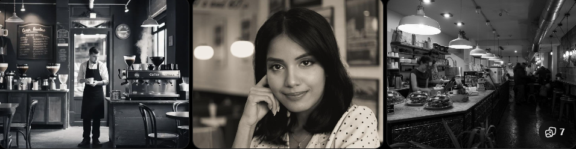

> 黑白攝影

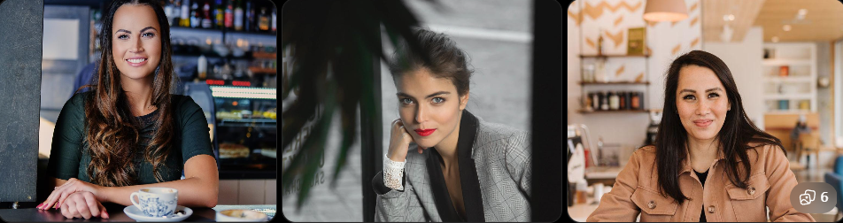

> 沙龍攝影

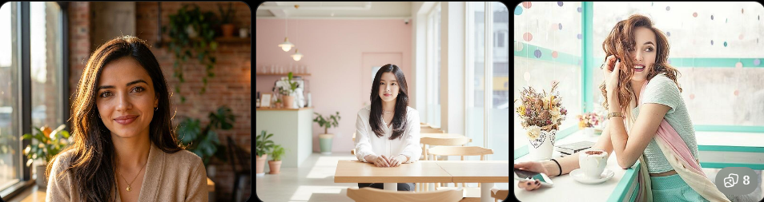

> 柔和人像

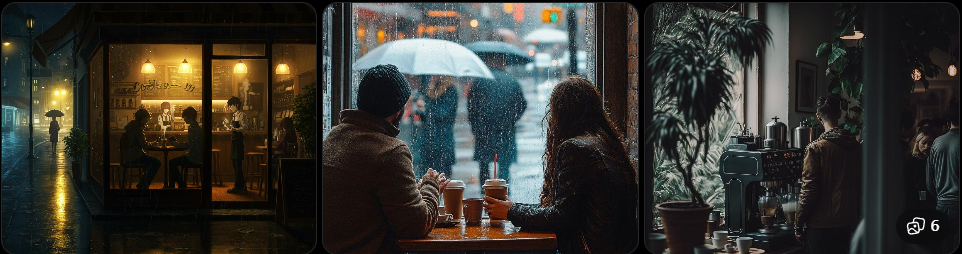

> 電影氛圍

適用情境：

- 品牌主視覺。
- 商品圖。
- 社群貼文。
- 書封設計。
- 人像形象照。

若創作目標是穩定、專業、質感、容易成功，這一類通常最安全。

### 第二類：設計、插畫、手作表現類

這一類偏向平面設計、插畫感或工藝質感，不追求真實攝影，而是強調視覺表現。

相關風格包含：色塊、特藝彩色、素描、油畫、復古印刷、珐瑯別針、歌德陶土。

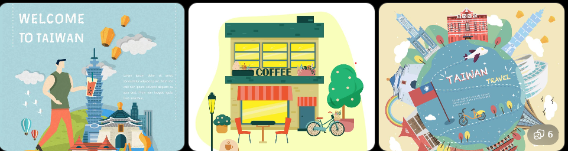

> 色塊

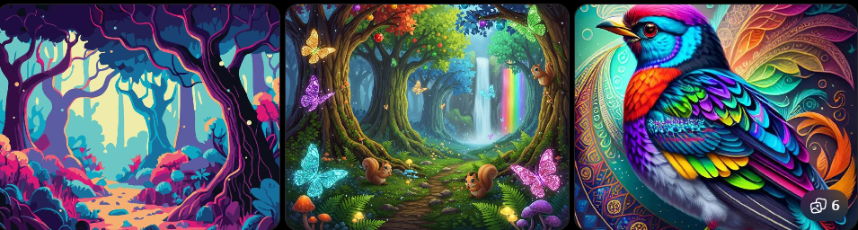

> 特藝彩色

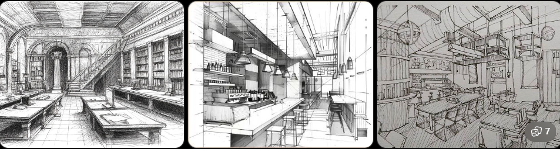

> 素描

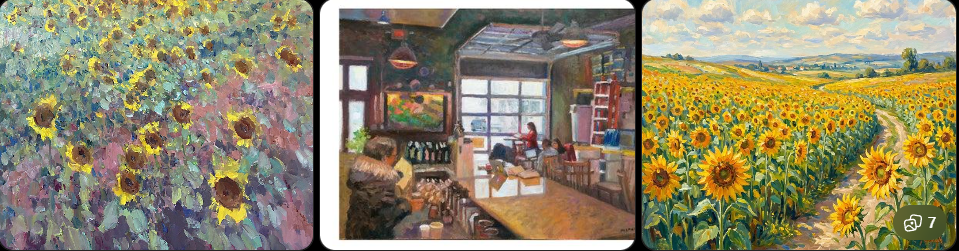

> 油畫

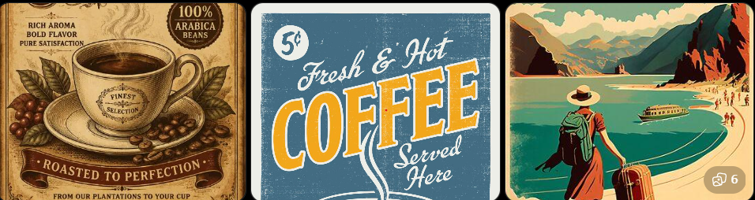

> 復古印刷

共同特點：

- 具有明顯設計感或材質感。
- 帶有手作、插畫或藝術表現。
- 較不追求真實攝影效果。

適用情境：

- 插圖。
- 海報。
- 書籍配圖。
- 設計提案。
- 文創商品概念圖。

若想讓畫面更有設計感、插畫感、工藝感或材質特色，可以考慮這一類。

### 第三類：奇幻、世界觀、強風格創作類

這類風格辨識度高、想像力強，適合角色設定、故事世界觀與創作型內容。

相關風格包含：蒸氣龐克、神話戰士、超現實、生化人、Dynamite、Anyma's world。

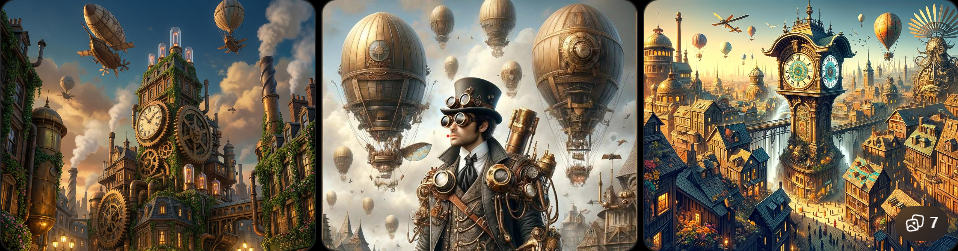

> 蒸氣龐克

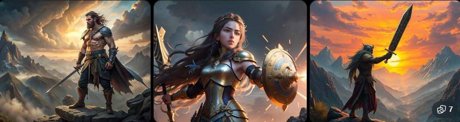

> 神話戰士


> 復古印刷

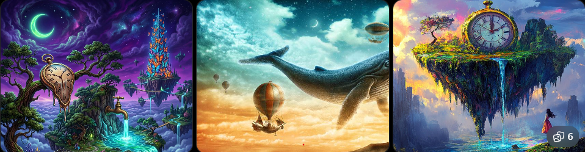

> 超現實

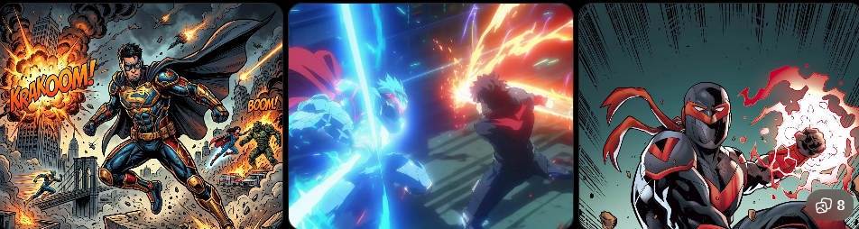

> Dynamite


> Anyma's World

共同特點：

- 風格鮮明。
- 世界觀強烈。
- 想像成分高。
- 視覺衝擊力明顯。

適用情境：

- 角色設計。
- 奇幻創作。
- 科幻題材。
- 視覺小說。
- 概念藝術。

若目標是讓畫面具有故事感、設定感、未來感或強烈個性，這一類很適合。不過品牌主視覺若沒有世界觀需求，過強的風格也可能搶走品牌本身。

### 第四類：情境、氛圍、主題感類

這類風格不一定改變材質，而是加強畫面的感覺。

相關風格包含：日出，也可以用 Prompt 指定溫暖、安靜、懷舊、孤獨、夢幻、專注。

共同特點：

- 強調情感。
- 畫面主題明確。
- 容易帶出特定時間、情緒或氛圍。

適用情境：

- 情緒型圖像。
- 文案配圖。
- 氣氛主題圖。
- 社群視覺內容。

### 四類風格整理

| 類型                     | 適合用途                   | 常用關鍵詞                                                                       | 特色                                 |
| ------------------------ | -------------------------- | -------------------------------------------------------------------------------- | ------------------------------------ |
| 寫實攝影(Photorealistic) | 商品、品牌形象、廣告、人像 | `photorealistic`、`professional photography`、`DSLR`、`85mm lens`、`high detail` | 接近真實照片，光影自然，適合商業應用 |
| 插畫設計(Illustration)   | 社群、海報、角色、書封     | `illustration`、`flat design`、`minimal`、`vector`、`watercolor`、`oil painting` | 不追求真實，可塑性高，容易建立特色   |
| 幻想世界(Fantasy)        | RPG、小說、世界觀、角色    | `fantasy`、`magic`、`steampunk`、`cyberpunk`、`dark fantasy`                     | 故事性與想像力強，視覺衝擊鮮明       |
| 氛圍類(Mood／Atmosphere) | 情境插圖、品牌、電影海報   | `peaceful`、`cozy`、`warm`、`nostalgic`、`lonely`、`dreamy`                      | 以情緒和感受帶動畫面                 |

## 套用基本案例：同一間咖啡館的不同風格

共用描述：

```text
請幫我生成一張圖：
一間現代風格的咖啡館外觀，位於安靜的城市街道夜晚，大面玻璃窗透出溫暖燈光，木質外觀設計，整體風格簡約，氛圍安靜且具有質感，光影層次明顯，高細節。
```

### 電影氛圍(商業質感)

```
請幫我生成一張圖：
一間現代風格的咖啡館外觀，位於安靜的城市街道夜晚，大面玻璃窗透出溫暖燈光，木質外觀設計，整體風格簡約，氛圍安靜且具有質感，光影層次明顯，高細節。

## 電影氛圍(商業質感)
- 接近真實攝影。
- 光影明顯。
- 高端品牌感。
- 畫面帶敘事性。
```

### 蒸氣龐克(世界觀風格)

```
請幫我生成一張圖：
一間現代風格的咖啡館外觀，位於安靜的城市街道夜晚，大面玻璃窗透出溫暖燈光，木質外觀設計，整體風格簡約，氛圍安靜且具有質感，光影層次明顯，高細節。

### 蒸氣龐克(世界觀風格)
- 暖銅色調。
- 機械或復古工業元素。
- 世界觀強烈。
- 咖啡館不再只是品牌空間，而像故事場景。
```

### 油畫風格(藝術表現)

```
請幫我生成一張圖：
一間現代風格的咖啡館外觀，位於安靜的城市街道夜晚，大面玻璃窗透出溫暖燈光，木質外觀設計，整體風格簡約，氛圍安靜且具有質感，光影層次明顯，高細節。

### 油畫風格(藝術表現)
- 明顯筆觸。
- 色彩較濃。
- 材質與藝術感強。
- 適合插畫、書封或展覽概念，不一定適合真實商業空間展示。
```

## 建立圖像的基本流程

在圖像創作初期，重點不是做出完美畫面，而是建立一個穩定、可重複的操作流程。

### 步驟 1：確認創作方向

生成前先回答：

```
- 是什麼場景？
- 想傳達什麼感覺？
- 整體氛圍是什麼？
- 圖片要拿來做什麼？
```

```text
**本節案例：**
場景：專注工作的個人桌面。
時間：夜晚。
情緒：安靜、沉穩、專注。
品牌感：科技、專業、高端。
用途：品牌網站 Hero Banner。
```

這一步的重點是先確定方向，不是急著生成。

### 步驟 2：選擇圖像風格

依創作方向選擇能支援畫面情緒的風格。風格要服務畫面情緒，而不是單純覺得名稱很酷。

### 步驟 3：撰寫圖像描述

先用簡潔描述建立方向：

## 生成結果的基本判斷

圖像生成後，真正影響能不能繼續進步的能力是判斷結果，而不是只說「好不好看」。

### 三個基本判斷標準

1. 主體是否清楚。畫面中最重要的東西，有沒有被明確呈現？

例子：

- 工作桌面 → 是否清楚看到桌面與電腦？
- 咖啡館 → 是否能辨識為咖啡館？
- 品牌商品 → 商品是否成為視覺焦點？

若主體不清楚，通常代表描述不夠精準。

2. 場景是否合理。畫面是否符合設定的情境？

例子：

- 夜晚 → 是否真的呈現夜晚光線？
- 室內 → 是否出現不合理的戶外元素？
- 高樓辦公室 → 是否具有城市高樓視野？

若場景不合理，通常代表描述或風格產生偏差。

3. 氛圍是否一致。圖片帶出的感覺是否符合預期？

例子：

- 專注 → 是否安靜、沉穩？
- 溫暖 → 是否有柔和光線？
- 高端 → 是否具有質感？

若氣氛不對，通常需要調整風格或情緒描述詞。

# 2-3 從創作藍圖到圖像：關鍵轉換

Design Brief 能幫我們釐清主題、訊息與風格，但若只寫「高級感、溫暖氣氛、科技感」，AI 仍只能猜測畫面。

因此，創作藍圖必須轉換成可以被視覺化的語言。

> 把抽象概念，轉成清楚的畫面元素。

## 2-3-1 將藍圖轉換為圖像描述

最基本的圖像描述結構是：

```text
主體 + 場景 + 氛圍
```

### 1. 主體

畫面最重要的物件或人物，例如：

- 一間咖啡館外觀。
- 一個工作桌面。
- 一台筆記型電腦。
- 一杯咖啡。

### 2. 場景

主體所在的環境與空間，例如：

- 夜晚的城市街道。
- 室內工作空間。
- 窗邊位置。
- 木質風格空間。

### 3. 氛圍與風格

畫面要傳達的感覺，例如：

- 安靜。
- 專注。
- 溫暖。
- 高質感。
- 電影氛圍。

## 套用範例：現代高樓辦公室

假設 Design Brief 是：

```text
主題：現代化辦公環境。
訊息：專業、高效、城市視野。
風格：高質感、沉穩、電影氛圍。
```

如果只寫：

```text
一個很高級的辦公室。
一個可以看到風景的工作環境。
```

描述過於抽象，畫面資訊不足。可以改成：

```text
一間位於台北高樓層的現代辦公室空間，大面落地窗設計，窗外可遠眺台北 101 大樓、基隆河與陽明山景色。室內為簡約高質感設計，包含辦公桌與雙電腦設備，白天自然光從窗外灑入。整體氛圍專業、安靜且高效率，電影氛圍風格，高細節。
```

這段描述具有：

- 明確主體：現代辦公室。
- 清楚場景：台北高樓、101、基隆河、陽明山。
- 一致氛圍：專業、高效、高質感。

相較原本的抽象描述，這種轉換能讓 AI 產出具有地點辨識度與一致氣氛的畫面。

## 完整生圖 Prompt 公式

當基本結構能穩定生成後，可擴充為：

```text
主體 + 場景 + 風格 + 光線 + 鏡頭／構圖 + 細節 + 用途／比例
```

### Problem. 一間咖啡店

任務：請畫一張「一間咖啡店」。不要立刻輸入 AI，先完成：

| 問題     | 我的設定 |
| -------- | -------- |
| 主題     |          |
| 場景     |          |
| 氣氛     |          |
| 風格     |          |
| 用途     |          |
| 圖片比例 |          |

完成後，寫出第一版 Prompt。

### Problem. 科技咖啡品牌方向圖

第一版 Prompt：

```text
一家現代科技感咖啡店，大片落地窗，深色木質，夜晚，暖黃燈光，安靜，電影感，高細節，真實攝影。
```

操作要求：先用這段簡短描述生成，不要一次加入太多內容。使用診斷表判斷：

- 方向是否正確？
- 哪一項最需要修改？
- 第二輪只增加哪一項描述？

### Problem. Prompt Coffee Hero Banner

需求：

- 品牌：Prompt Coffee。
- 對象：工程師、設計師。
- 氣氛：沉穩、高級。
- 色彩：黑色、深灰、暖黃。
- 時間：夜晚。
- 用途：品牌官網首頁。

```text
### 參考 Prompt
Prompt Coffee 品牌官網首頁 Hero Banner。一位工程師在夜晚的現代工作空間中專注工作，前景是一杯曜石黑咖啡，桌上有高階機械鍵盤、筆記本與筆記型電腦，背景雙螢幕顯示失焦的程式碼。黑色與深灰為主色，暖黃桌燈照亮咖啡杯與木質桌面，冷色螢幕光形成輪廓。沉穩、高級、專注的電影感商業攝影，真實材質，淺景深，高細節，16:9 橫式構圖，左側保留品牌標題與 CTA 空間。避免卡通、雜亂背景、過亮色彩與生成文字。
```

### Problem. 同一 Prompt，不同風格

固定內容：

```text
一位女孩坐在窗邊閱讀。
```

請分別生成：

- 寫實攝影。
- 油畫。
- 水彩。
- 日系動漫。

比較四張圖的光線、材質、人物、情緒與用途。
