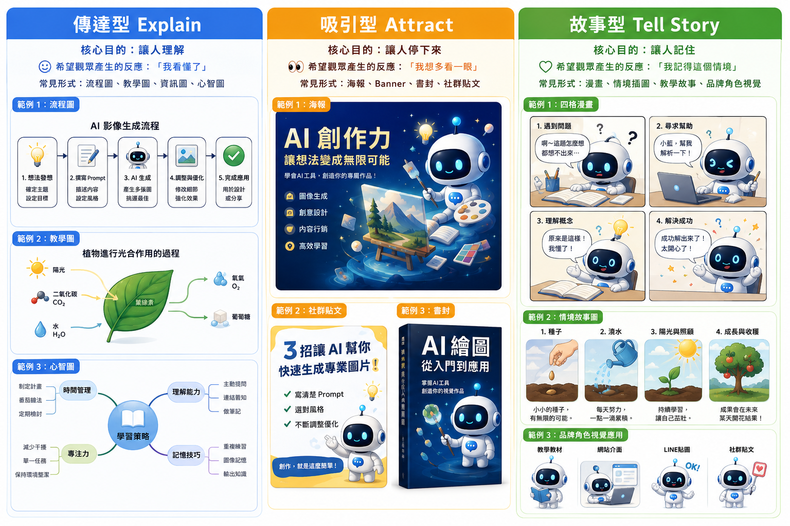
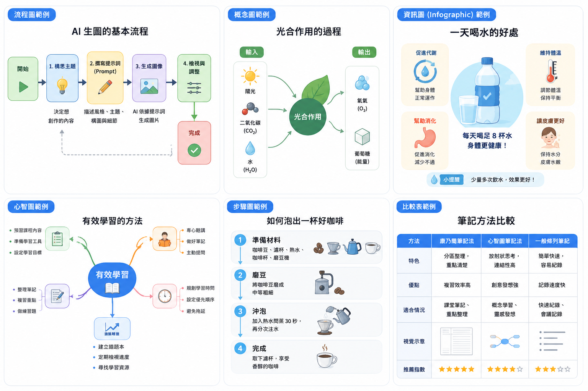

# 讓圖變有用：情境化圖像創作與提示詞設計

## 圖像不是作品，而是「用途」

在前面的 AI 創作經驗中，我們通常先學會兩件事：想清楚要做什麼，以及生成第一張看得見的圖。接下來會遇到一個新問題：為什麼有些圖可以用，有些圖卻只能當作測試？差別不只在工具，而在於我們是否知道這張圖要用在哪裡。

有些圖片看起來很精緻，卻無法放進書封；有些圖片細節豐富，卻不適合教學；有些圖片很有氣氛，卻無法用於行銷。問題往往不在畫質，而在它是否符合用途。

在傳統創作中，圖片常被視為作品本身；在 AI 時代，圖像也可能是：

- 書籍封面的主視覺
- 教學內容的輔助說明
- 行銷素材中的吸引元素
- 簡報中的重點強化
- 品牌長期使用的角色資產

所以，一張圖的價值不只在於能否獨立成立，更在於它能否在特定情境中發揮作用。

### 為什麼同一張圖在不同情境會失效？

常見情況包括：

- 圖片放在社群貼文很好看，但縮成手機尺寸後資訊擠成一團。
- 圖片放在簡報很清楚，拿去做廣告卻沒有足夠吸引力。
- 圖片細節很多，但讀者第一眼不知道該看哪裡。
- 畫面很完整，卻沒有留出標題、按鈕或說明文字的位置。

原因是不同情境需要不同的設計。圖像不是「越完整越好」，而是「越符合用途越好」。

## 三大圖像用途

為了快速判斷圖像應如何設計，可以把常見圖像分成三類：

| 類型              | 核心目的   | 希望觀眾產生的反應 | 常見形式                               |
| ----------------- | ---------- | ------------------ | -------------------------------------- |
| 傳達型 Explain    | 讓人理解   | 「我看懂了」       | 流程圖、教學圖、資訊圖、心智圖         |
| 吸引型 Attract    | 讓人停下來 | 「我想多看一眼」   | 海報、Banner、書封、社群貼文           |
| 故事型 Tell Story | 讓人記住   | 「我記得這個情境」 | 漫畫、情境插圖、教學故事、品牌角色視覺 |



### 傳達型圖像創作：讓人看懂

傳達型圖像的目的不是吸引目光，而是幫助理解。當內容涉及流程、概念或結構時，單靠文字不容易掌握重點，圖像可以大幅降低閱讀與思考負擔。

適用情境：

- 書內插圖
- 教學圖解
- 流程圖
- 資訊圖（Infographic）
- 心智圖
- 簡報中的概念整理

設計特點：

- 結構清楚
- 重點明確
- 不強調裝飾
- 以理解為優先
- 資訊越多，視覺越要簡單

很多資訊圖失敗，是因為想把所有內容一次放上去。內容越多，AI 越容易做出混亂的圖。因此流程圖不要塞進大量人物、場景和背景；若主要流程只有「開始 → 步驟一 → 步驟二 → 完成」，就讓這四個節點清楚出現。



```text
### 傳達型 Prompt 基本模板
主題：__________
目的：教學／說明／整理
版面：流程圖／資訊圖／心智圖
色彩：__________
元素：icon、箭頭、流程框、留白
閱讀方向：由左到右／由上到下／中心向外
資訊層級：主標題、主要節點、簡短標籤
風格：簡約、扁平、易讀、背景乾淨
```

```text
### AI 工作流程資訊圖 -- 提示詞
請設計一張 AI 工作流程資訊圖。
內容包含：資料 -> 模型 -> 推論 -> 結果。
風格：簡約扁平設計、資訊圖、白底、藍色系、容易閱讀。
```

```text
### AI 工作流程資訊圖 -- 提示詞補強版：

請設計一張橫式 AI 工作流程資訊圖，供課堂投影片使用。
流程由左至右排列：資料 → 模型 → 推論 → 結果。
每個階段使用一個簡潔 icon、一個短標籤，節點之間以清楚箭頭連接。
白色背景、藍色為主色、少量青綠色作重點，Flat Design，線條一致，大量留白。
資訊層級清楚，縮小後仍可辨識，16:9，不要複雜背景，不要多餘人物，不要裝飾性小字。
```

#### 書內插圖：概念轉具體

書內插圖的目的，是把抽象內容轉換為具體畫面，讓讀者在閱讀時不必自行想像。

```text
### 書內插圖提示詞 -- AI 資料處理流程

請生成一張書內插圖，主題為「AI 資料處理流程」。
畫面以簡潔圖解呈現，由左至右依序顯示：原始資料、資料清理、模型訓練、結果輸出。
每個階段使用清楚的圖示與箭頭連接，背景簡單不干擾閱讀，整體風格適合書籍內頁使用。
```

判斷成功的標準：讀者不需要反覆閱讀文字，就能透過圖像理解主要流程。

#### 教學圖解：流程與步驟

教學圖解必須清楚呈現流程邏輯。重點不在畫面細節，而在讀者能否一眼看出「從哪裡開始，到哪裡結束」。

```text
### 教學圖解提示詞 -- Google AI 創作整合術

請生成一張教學圖解，主題為「Google AI 創作整合術」。
畫面以流程方式呈現四個主要階段：
發想（Gemini）→ 視覺生成（Nano Banana Pro）→ 設計與版面（Stitch）→ 影片與輸出（Veo／Flow）。
每個階段以清楚的區塊呈現，搭配簡單圖示，例如燈泡、圖片、設計版面、影片圖示，並以箭頭連接整體流程。
畫面結構清晰、閱讀容易，適合教學與書籍說明使用。
```

#### 資訊圖：整體理解

資訊圖的目的，是讓讀者在短時間內掌握重點，而不是深入閱讀所有細節。

```text
### 資訊圖提示詞 -- 企業導入 AI 的三大效益

請生成一張資訊圖，主題為「企業導入 AI 的三大效益」。
畫面分為三個區塊：提升效率、降低成本、優化決策。
每個區塊包含圖示與簡短標題，版面整齊，適合簡報與書籍使用。
```

#### 心智圖：結構化思考

心智圖適合呈現層級與關係，幫助讀者建立整體架構。

```text
### 心智圖提示詞 -- AI 學習架構

請生成一張心智圖，主題為「AI 學習架構」。
中心為「AI 學習」，向外延伸：基礎概念、資料處理、模型訓練、應用實作、倫理風險。
各分支清楚呈現層級關係，使用一致的色彩邏輯與短標籤，避免文字過長。
```

### 吸引型圖像創作：讓人停下來

> 吸引型圖像不是要解釋，而是要讓人願意多看一眼。

吸引型圖像的目的不是完整解釋內容，而是在短時間內抓住目光。適用於書籍封面、行銷海報、社群貼文、網站 Banner 與廣告素材。

設計特點：

- 視覺焦點強
- 色彩與光線對比明顯
- 氛圍鮮明
- 可快速抓住注意力
- 大標題越少越好
- 畫面只有一個主要焦點，而不是十個焦點

常用對比方式：

- 黑底與亮色
- 大字與小字
- 人物與留白
- 冷色與暖色
- 靜態主體與速度感背景

```text
### 吸引圖提示詞 -- AI 工作坊 Banner／海報
設計一張 AI 工作坊 Banner。
中央一位創作者，周圍漂浮 AI 工具。
大量留白、科技感、高對比、電影光影，16:9。
```

```text
請設計一張 AI 工作坊海報。
科技感、紫藍色。
中央放一位使用 AI 的創作者。
畫面具有速度感。
留白放標題。
版型 16:9。
```

#### 書籍封面：建立第一印象

書籍封面的任務不是說明全部內容，而是讓讀者在短時間內產生興趣，因此需要明確的視覺焦點與整體氛圍。

```text
### 書籍封面提示詞 -- Google AI 創作整合術

請設計一張書籍封面，主題為「Google AI 創作整合術」。
畫面中央為一個發光的 AI 核心，周圍延伸出數據流與未來城市輪廓，呈現科技感與創作能量。
整體構圖集中，畫面上方保留空間放書名，下方預留作者名稱位置。
```

```text
### 書籍封面提示詞 -- Google AI 創作整合術 -- 補強版：

直式商業書封主視覺，主題「Google AI 創作整合術」。
中央單一焦點：發光的抽象 AI 核心；能量線向外延伸並連接未來城市輪廓。
深藍黑背景，電光藍與橙金作高對比，專業、前瞻、具出版品質感。
上方約 25% 乾淨留白供主標題，下方保留作者資訊區，視覺動線由標題區進入中央核心再落到城市。
不要生成小字、假出版社標誌或過多介面圖示。
```

#### 行銷海報：快速抓住注意

行銷海報的重點，是在短時間內吸引目光，並傳達活動或產品主題。

```text
### 行銷海報提示詞 -- AI 創作工作坊

請生成一張行銷海報，主題為「AI 創作工作坊」。
畫面中央為一位正在操作電腦的創作者，周圍浮現 AI 圖像生成、影片、設計等元素。
畫面上方保留標題區，下方預留時間與地點資訊，整體風格吸引人且具有科技感。
```

#### 社群貼文：建立情緒與互動

社群圖像的重點在於情緒與親近感，而不只是完整資訊。

```text
### 社群貼文提示詞 -- AI 創作工具比較

請生成一張社群貼文圖像，主題為「AI 創作工具比較」。
畫面使用強對比色彩，中央為醒目的標題區，周圍搭配多個 AI 工具圖示與動態光效，整體視覺具有衝擊力與科技感。
```

#### 網頁 Banner：引導視線與行動

Banner 的任務是引導視線並支援文字內容，因此版面配置通常比細節更重要。

```text
### 網頁 Banner提示詞 -- Google AI 創作整合術

請生成一張 16:9 網頁 Banner，主題為「Google AI 創作整合術」。
畫面左側為 AI 視覺元素，例如數據流、圖像生成、影片符號；右側保留大片留白區域，用於放置標題與說明文字。
整體風格簡潔、現代且具科技感。
```

### 故事型圖像創作：讓人記住

單純說明往往難以留下深刻印象；圖像若結合情境、角色與變化，內容更容易被理解並長時間記住。故事型圖像的目的不只是呈現資訊，而是建立故事感。

適用情境：

- 漫畫
- 情境插圖
- 教學故事圖
- 品牌角色視覺

設計特點：

- 有情境
- 有角色
- 有動作或情緒
- 能傳遞故事或概念
- 重點不在單一畫面，而在整體感受與前後變化

故事型最小結構：「困難 → 協助／行動 → 理解／改變 → 結果」

#### 四格漫畫：用角色呈現概念

```text
### 四格漫畫提示詞 -- AI 幫助學生完成作業

四格漫畫。
主題：AI 幫助學生完成作業。
第一格：學生很困擾。
第二格：AI 協助分析。
第三格：學生開始理解。
第四格：成功完成。
```

```text
### 四格漫畫提示詞 -- 使用 AI 提升學習效率

請生成一張四格漫畫，主題為「使用 AI 提升學習效率」。
第一格：學生面對問題感到困惑。
第二格：AI 助手出現並提供建議。
第三格：學生與 AI 一起分析問題。
第四格：學生理解並露出開心表情。
對話簡潔清楚，畫面易讀，適合教學與社群分享。
```

#### 情境插圖：讓讀者進入畫面

情境插圖建立具體場景，讓讀者能「看見」內容，而不只閱讀文字。它會透過環境、光線、角色姿勢與表情形成氛圍。

```text
### 情境插圖提示詞 -- 使用 AI 提升學習效率

請生成一張情境插圖，主題為「AI 創作工作情境」。
畫面為一位創作者在夜晚使用筆電，螢幕散發光線，周圍浮現 AI 圖像生成、設計與影片元素。
整體氛圍安靜、專注且具有科技感。
```

#### 教學故事圖：呈現過程與轉變

當內容含有過程或轉變，可以用連續畫面呈現，讓讀者理解從問題到解決的歷程。

```text
### 教學故事圖提示詞 -- 使用 AI 提升學習效率

請生成一張教學故事圖，主題為「使用 AI 完成任務」。
畫面分為三個階段：
第一階段：使用者面對問題感到困難。
第二階段：AI 提供分析與建議。
第三階段：任務完成，成果呈現。
整體畫面具有連續性，讓讀者清楚理解變化過程。
```

## 品牌角色：建立記憶與辨識

### 品牌角色的三個功能

1. 辨識：讀者一看到角色，就知道內容來自誰。
2. 陪伴：角色能降低距離感，形成親切的溝通者。
3. 記憶：一致且反覆出現的角色，比單次精美圖片更容易被記住。

品牌角色不是一張單獨圖片，而是長期可重複使用的視覺元素。當角色持續出現在不同內容中，讀者會逐漸產生熟悉感與記憶。

### 基礎實例：AI 助手

```text
一隻小機器人。
白色。
藍色發光眼睛。
圓角。
可愛。
科技感。
簡單線條。
```

那我們可以去進一步延伸：

```
角色名稱：「AI 創作助手」。角色為白色小型機器人，搭配藍色發光眼睛、圓角造型與簡單線條，外型可愛並具有科技感。角色可以延伸至：

- 教學：與學生一起看書、解釋概念。
- 提示：提供燈泡、便利貼或步驟卡。
- 互動使用：陪伴使用者操作工具。
- 角色介紹：展示角色的功能、特徵與個性。
- 網站、貼圖、簡報、教學教材與社群內容。
```

在品牌角色圖像中，重點不在細節是否精緻，而在是否容易辨識。當讀者看到角色，就能聯想到內容與主題，角色設計就成功了。

### 品牌角色 Prompt 模板

```text
建立品牌 Mascot。
角色名稱：__________
角色類型：__________
個性：__________
主色：__________
辨識特徵：__________
線條與造型：__________
可用於：網站、貼圖、簡報、教學、社群
希望帶給讀者的感受：__________
```

```text
### AI 助手 -- 補強版 Prompt：
設計一個名為「小藍」的 AI 學習助手品牌角色。
小型白色圓角機器人，頭身比約 1:1，臉部是一塊深藍圓角螢幕，兩顆青藍發光眼睛；左側天線頂端為小燈泡造型，胸前固定有藍色對話框符號。
個性耐心、好奇、可靠，動作活潑但不幼稚。
主色為白色與科技藍，少量暖黃色作情緒亮點；簡單線條、扁平 2.5D 插畫、輪廓清楚，縮小為貼圖仍可辨識。
角色將用於網站、簡報、教材、社群貼文與通訊貼圖，希望帶給讀者「AI 很容易親近，而且有人陪我學習」的感受。
先製作角色設定圖：正面、側面、背面，以及開心、思考、鼓勵、提醒四種表情，白色乾淨背景，不要文字。
```

### 角色一致性的實務方法

- 固定不可改變的 3–5 個辨識特徵，例如眼睛、天線、胸前符號、主色與輪廓。
- 先做角色設定圖，再延伸不同姿勢與場景。
- 每次 Prompt 重複寫入固定設定，不只寫角色名稱。
- 保留同一張角色參考圖供後續圖片生成使用。
- 讓服裝、比例、材質與配色保持一致，只改動表情、動作與情境。

### 練習：角色五件事

請完成一個 AI 助手設定：

1. 外觀：輪廓、比例、材質、固定特徵。
2. 個性：三個形容詞。
3. 色彩：主色、輔色、重點色。
4. 用途：至少三個使用場景。
5. 感受：希望讀者看到它時產生什麼感受？

##　一張圖的五步驟設計流程

很多人從 Prompt 開始想，所以畫面容易混亂，也容易陷入一直重抽。

錯的流程：「想到什麼 → 直接叫 AI 畫 → 不符合期待 → 一直重抽」

較有效的流程：「用途 → 目標 → 類型 → 版面 → Prompt」

1. 步驟一：用途。這張圖要放在哪裡、拿來做什麼？

可能答案：招生廣告、教科書、網站首頁、簡報、社群貼文、書封、貼圖。

2. 步驟二：目標。要讓誰看？希望對方理解什麼、感受什麼或採取什麼行動？
3. 步驟三：類型。主要目的是讓人看懂、停下或記住？因此應選流程圖、Banner、教學圖、漫畫、情境圖或品牌角色？
4. 步驟四：版面。畫面怎麼排最清楚？包含：

- 比例：1:1、4:5、16:9、直式書封等
- 主體位置：左、右、中央
- 文字留白：標題、副標、CTA、作者資訊
- 閱讀方向：左到右、上到下、中心向外
- 視覺層級：第一眼、第二眼、第三眼各看什麼

5. 步驟五：Prompt。把前四步的結論翻成 AI 能執行的具體描述。

```text
### 範例：AI 課程招生
我要賣 AI 課程。
用途是招生，目標是讓人想報名。
所以類型是 Banner，版面要左圖右字，重點放右邊的文案。
想完這些，最後再去寫 Prompt。
```

```text
### 範例：AI 課程招生 -> 完成版提示詞
設計一張 16:9 AI 課程招生 Banner 的無字主視覺。
目標觀眾是第一次接觸 AI 的成人學習者；希望畫面讓人感到 AI 容易上手、實用且值得報名。
左側放一位正在筆電上完成 AI 作品、露出驚喜笑容的學習者，搭配少量圖像、文字與影片創作符號。
右側保留約 40% 乾淨留白供後製加入課名、三項賣點與報名按鈕。
紫藍主色、暖黃點綴、現代科技感、親切明亮、高對比、縮圖清楚。
不要文字、不要 logo、不要多人、不要複雜介面與密集背景。
```

## 通用 Prompt 結構與模板

一個可執行的圖像 Prompt，通常可以包含：

1. 用途：圖要用在哪裡。
2. 受眾與目標：給誰看，希望產生什麼反應。
3. 圖像類型：流程圖、Banner、書封、漫畫等。
4. 主體與內容：畫什麼，不畫什麼。
5. 構圖：位置、焦點、比例、閱讀方向。
6. 視覺風格：扁平、寫實、電影感、日系漫畫等。
7. 色彩與光線：主色、對比、氣氛。
8. 限制條件：留白、避免元素、是否無字。

```text
### 通用公式：

請設計一張【圖像類型】，用途是【使用情境】，目標觀眾為【受眾】，希望觀眾【理解／停留／記住／行動】。
主題是【主題】，畫面包含【必要內容】。
構圖採【版面與閱讀方向】，主要焦點是【焦點】，並在【位置】保留【比例】留白。
使用【風格】、【主色與輔色】、【光線與氣氛】，輸出比例為【比例】。
避免【不需要的元素】，文字將【由 AI 生成／後製加入】。
```

```text
### 流程圖

請設計一張流程圖。
主題：__________
風格：資訊圖、Flat Design、箭頭、Icon、白底、藍色。
```

```text
### Banner

設計一張 Banner。
主題：__________
16:9、左側圖片、右側留白。
科技感、電影光影、品牌感。
```

```text
### 書封

設計一本書封。
主標題：__________
副標：__________
中央主視覺、上下留白、高辨識度、出版社風格。
```

```text
### 四格漫畫

四格漫畫。
角色：__________
故事：__________
日系漫畫、彩色、對話框。
閱讀方向：左到右。
```

```text
### 品牌角色

建立品牌 Mascot。
角色名稱：__________
個性：__________
顏色：__________
特色：__________
可用於：網站、貼圖、簡報、教學。
```

### Problem. AI 課程介紹圖

請做一張 AI 課程介紹圖，並思考用途、版面、色彩、元素與閱讀方向。

- 用途：
- 目標觀眾：
- 希望觀眾反應：
- 圖像類型：
- 版面比例：
- 主體位置：
- 文字留白：
- 主色／輔色：
- 必要元素：
- 閱讀方向：
- 完整 Prompt：

```text
### 參考答案 A：課程內容介紹（傳達型）

設計一張直式 4:5 AI 課程介紹資訊圖，供社群招生貼文第二張使用。
目標觀眾為零基礎成人；目的是讓人快速看懂課程會學到什麼。
由上至下分成四個階段：認識 AI → 學會提問 → 圖文創作 → 完成專題。
每階段使用一個簡潔 icon、一行標題與極短說明，以垂直箭頭連接。
白底、深藍主色、紫色與青綠作分類色，扁平資訊圖風格，保留充足留白。
主標題區置頂，底部預留報名資訊區；不要人物場景、不要密集文字、不要多餘裝飾。
```

```text
### 參考答案 B：課程招生首圖（吸引型）

設計一張 16:9 AI 課程招生 Banner 無字主視覺，目的是讓零基礎成人願意點擊了解。
左側是一位使用筆電生成圖文作品的創作者，臉上有驚喜與成就感；少量圖像、文字、影片符號環繞主體。
右側保留 40% 乾淨留白供後製加入課名、賣點與 CTA。
紫藍科技色、暖橙輪廓光、高對比但親切，電影式光影，視覺動線由人物看向右側文案。
不要生成文字、logo、多人或複雜背景，16:9。
```

### Problem. AI 書封

請做一本 AI 書封，並加入書名、主視覺、配色、構圖與留白設計。

```text
### 參考答案

書名：《讓 AI 成為你的創作搭檔》
副標：從提示詞、圖像到內容整合的實戰方法
主視覺：人類手掌與發光 AI 核心之間形成一條創作能量線。
配色：深靛藍、電光藍與暖金。
構圖：中央單一焦點，視覺由上方書名進入核心，再落到下方作者區。
留白：上方 25%、下方 12%，左右避免高密度細節。

設計一本直式商業書封的無字主視覺，書名將後製為《讓 AI 成為你的創作搭檔》，副標為「從提示詞、圖像到內容整合的實戰方法」。
中央單一主視覺：一隻自然的人類手掌伸向抽象、圓潤、發光的 AI 核心，兩者之間形成一條由文字、圖像與影片符號組成的創作能量線。
深靛藍背景，電光藍為主，暖金點亮人與 AI 合作的感覺；現代、專業、具有出版品質感，不要恐怖或冰冷。
上方保留約 25% 乾淨區域放書名與副標，下方保留作者資訊，中央焦點縮成縮圖仍清楚。
不要文字、不要 logo、不要密集介面、不要多個機器人、不要雜亂城市背景。
```

### Problem. AI 助手角色

請畫一個 AI 助手，並描述角色外觀、個性、色彩、用途，以及希望帶給讀者的感受。

```
### 參考答案

- 名稱：小光
- 外觀：圓角白色小機器人，深藍面罩、青藍眼睛、燈泡形天線。
- 個性：耐心、好奇、可靠。
- 色彩：白與科技藍為主，暖黃點綴。
- 用途：教材引導、簡報提示、網站客服、社群貼圖。
- 感受：親切、不害怕科技、有人陪伴學習。

建立一個名為「小光」的 AI 教學助手 Mascot。
外觀為圓角白色小機器人，頭身比 1:1，深藍面罩、青藍發光眼睛，頭頂有暖黃色燈泡形天線，胸口固定一個書本與對話框結合的符號。
個性耐心、好奇、可靠；姿勢友善而有精神，不幼稚。
主色白與科技藍，暖黃色作提示重點；簡潔 2.5D 插畫、線條乾淨、縮小仍易辨識。
用於教材引導、簡報提示、網站客服與社群貼圖，希望帶給讀者親切、安心、願意開始學 AI 的感受。
生成角色設定表：正面、側面、背面，以及講解、思考、鼓勵、提醒四個動作，白底、無文字，造型比例與配色一致。
```
