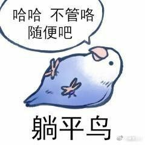
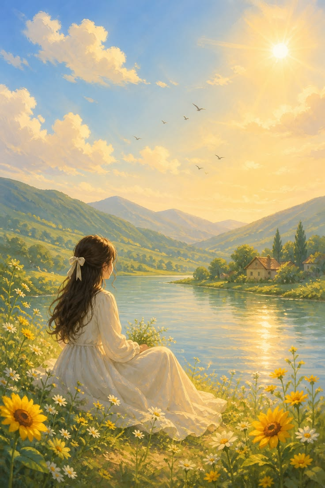
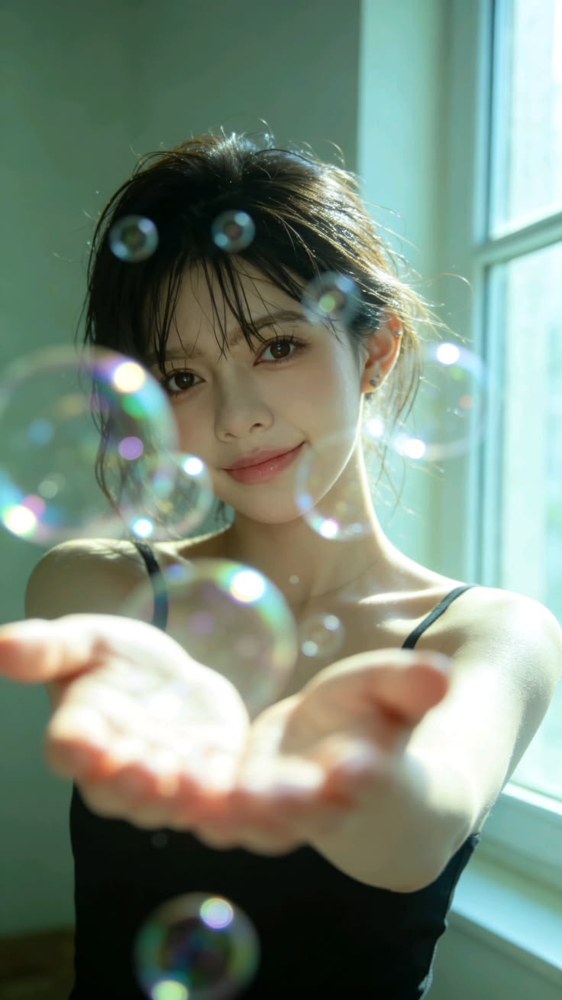
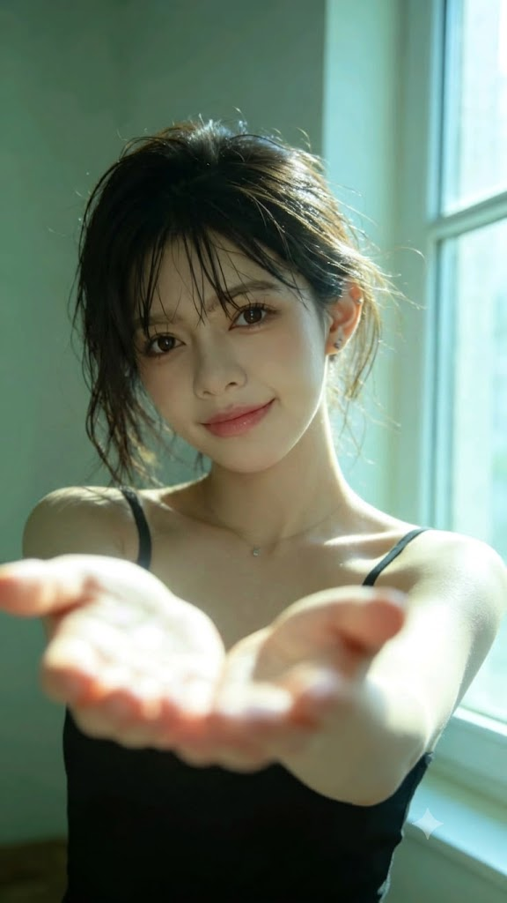
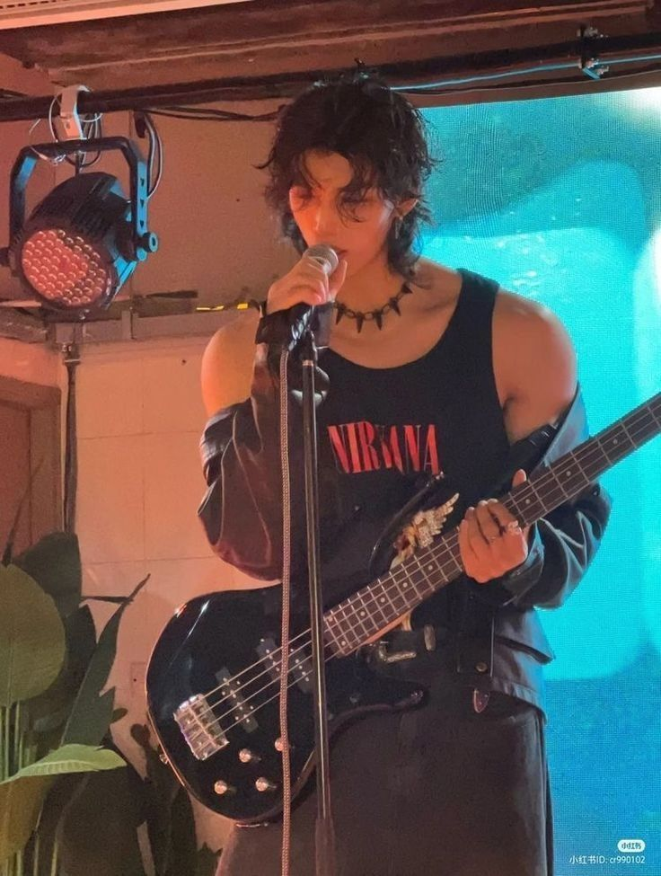
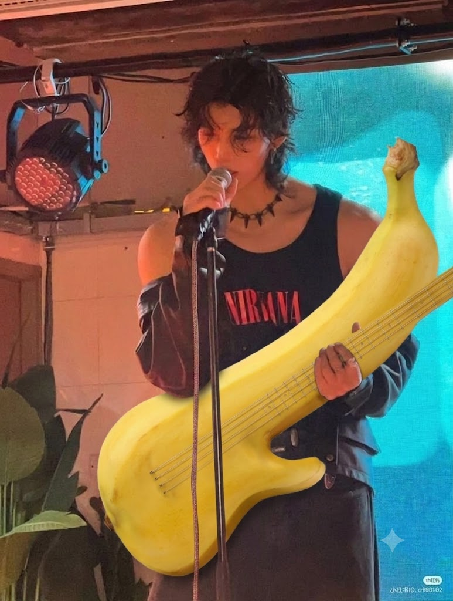
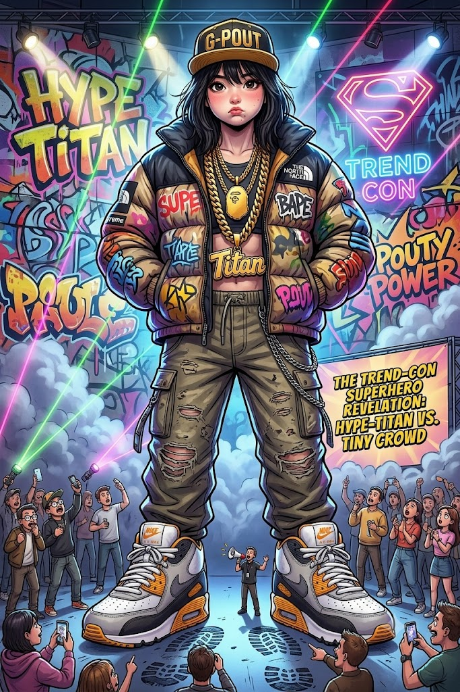

# 進階圖像創作：風格 × 編修 × 控制

剛接觸 AI 圖像時，我們很容易把「生成圖片」當成完整創作：打一段描述，取得一張看起來不錯的圖，工作似乎就結束了。

但當圖片真的要用在教材、廣告、品牌或故事中，我們會發現，多數生成圖不能直接使用。真正的進階能力，不是一次生成更多圖片，而是知道如何讓圖像一步一步接近自己的想法。

這代表三個轉變：

- 從一次性生成，轉為持續性優化。
- 從結果導向，轉為過程導向。
- 從依賴運氣，轉為掌握控制。

```
### 兩種創作流程比較

錯誤但常見的流程：輸入 Prompt → 生成 → 不滿意 → 整張重來
-> 不斷重置。

較成熟的流程：生成 → 篩選 → 修改 → 檢查 → 優化
-> 累積成果。
```

## 三大核心控制能力

第一種，風格控制（Style）：決定圖像的感覺。風格是觀眾第一眼感受到的元素。同一主題可以呈現為：

- 寫實攝影
- 商業廣告
- 教學插畫
- 動漫角色
- 品牌視覺
- 電影劇照

風格差異不只在「畫法」，還包括色彩、材質、光線、構圖、鏡頭與情緒。

第二種，編修能力（Image-to-Image）：決定圖像的穩定性。Image-to-Image 以現有圖片為基礎進行修改。它可以：

- 保留人物與場景的一致性。
- 在原圖上調整，不必整張重做。
- 累積每次編修成果。
- 將一張基礎圖延伸成多個版本。

第三種，細節控制（Detail）：決定圖像的專業度。當風格與構圖大致正確後，真正拉開品質差距的是：

- 光線是否自然。
- 構圖是否清楚。
- 氣氛是否符合主題。
- 人物姿勢、視線與手部是否合理。
- 文字與版面是否正確。
- 物件比例、透視、陰影與接觸關係是否自然。

## 風格控制

接到圖像任務時，不要先堆疊形容詞，而要先問：「這張圖要拿來做什麼？」

例如招生廣告可以使用寫實品牌風；課堂流程適合插畫圖解風；社群角色經營適合固定 IP 的品牌插畫。

### 寫實風：讓人相信

適合商業廣告、產品形象與專業內容。

```text
[主體]，寫實攝影風格，[鏡頭與構圖]，[光線]，[材質細節]，
自然膚質，商業攝影，高解析度。
```


### 插畫風：讓人理解

適合教材、圖解、簡報與說明內容。

```text
[主題]的教學插畫，清楚分區，扁平化構圖，柔和配色，
資訊層級明確，元素簡潔，適合課堂投影。
```


### 品牌風：讓人記住

適合社群貼文、品牌角色與長期行銷素材。

```text
為[品牌／主題]建立一致的品牌視覺，主色為[色彩]，
固定[角色或符號]，整體風格[形容詞]，
保留可放置標題與 Logo 的空間。
```


### Problem. 固定主題：「一位女孩在咖啡店使用 AI 完成工作」。

```text
### 寫實商業攝影版 -- 提示詞

一位年輕女性在現代咖啡店使用筆電完成 AI 創作工作，
半身中景，人物位於畫面左側，右側保留文案空間。
窗邊自然光與暖色室內燈混合，真實膚質、木質桌面與咖啡細節清楚，
專業商業攝影，親切可信，16:9。
```

```text
### 教材插畫版 -- 提示詞

「一位女孩在咖啡店使用 AI 完成工作」的教學插畫，
清楚呈現人物、筆電、AI 協助與完成作品四個資訊元素。
扁平化構圖、柔和藍橙配色、背景簡潔、資訊層級清楚，
適合課堂投影與教材說明，16:9。
```

```text
### 品牌社群貼文版 -- 提示詞

為 AI 學習品牌製作正方形社群貼文。
固定一位短髮、圓框眼鏡、藍色上衣的女性角色，在咖啡店使用 AI 完成工作。
品牌主色為深藍與亮青色，暖黃色作重點，使用一致的圓角圖形與對話框符號。
畫面活潑但不雜亂，上方保留標題區，1:1。
```

##　Image-to-Image：從「重來」到「延續」

Image-to-Image（圖生圖）是以上傳圖片為基礎，透過指令修改、延伸或優化。

| 方法           | 操作方式           | 結果                           |
| -------------- | ------------------ | ------------------------------ |
| 重新生成       | 每次重新計算整張圖 | 結果不穩定，人物與構圖容易改變 |
| Image-to-Image | 在既有圖片上修改   | 保留基礎，只調整指定內容       |

三個核心價值：

1. 一致性：人物、場景與構圖可以保留下來。
2. 可控性：只指定需要修改的地方。
3. 累積性：每次修改都建立在前一版本上。

### 標準操作流程

```text
1. 生成或挑選最接近需求的圖片。
2. 列出「必須保留」與「需要修改」。
3. 每次只處理一至兩個明確問題。
4. 檢查人物、構圖、色彩、文字是否漂移。
5. 以目前最佳版本繼續修改，直到符合需求。

> 第一張圖不再是成品，而是起點；修改不是補救，而是主要創作流程。
```

## 局部修改：精準調整，不全部重來

圖片通常不是整張都錯，而是：

- 背景不理想。
- 色調不符合品牌。
- 多了不必要的人或物件。
- 少了關鍵元素。
- 標題錯誤或位置不對。

因此，保留正確的部分，只修改有問題的地方。

### 四種常見操作

1. 背景替換：室內改戶外、白天改夜晚。
2. 元素新增：桌上增加咖啡、加入裝飾。
3. 元素移除：刪除路人、移除干擾物或錯誤文字。
4. 色彩與材質調整：改服裝色、整體色調或物件材質。

```text
### 局部修改 Prompt 公式

將[指定區域／物件]改成[目標內容]，
保留[人物／構圖／背景／光線／其他內容]不變，
使修改後的光線、比例、透視、色溫、陰影與原圖自然一致。
```

### Problem. 修正圖卡標題

<!-- 兩張 -->
<div style="display: flex; flex-wrap: wrap; gap: 20px;">
    
    
</div>

```text
將文字「躺平鳥」改為「chill bird」，
保持其他人物、插圖、色彩、版面配置與文字內容完全不變。
中文字體清楚可讀，置於原標題位置。
```

### Problem. 湖邊少女更換背景

```text
將上傳人物照片的背景改為油畫風森林景色，
整體呈現厚塗與筆觸質感，光線方向與人物一致，畫面具有藝術氛圍。
保留人物臉部、髮型、服裝、姿勢和身體比例不變。
```

<!-- 兩張 -->
<div style="display: flex; flex-wrap: wrap; gap: 20px;">
    
    
</div>

### Problem. 移除女子照中的泡泡

```text
移除泡泡，其餘維持不變
維持原圖的光線、透視和景深，不留下模糊或重複痕跡。
```

<!-- 兩張 -->
<div style="display: flex; flex-wrap: wrap; gap: 20px;">
    
    
</div>

### Problem. 演唱會更換樂器與文字

```text
請將舞歌手手中樂器替換成一根巨型香蕉，
保留演奏姿勢自然，看起來像真的在彈奏香蕉。
其餘部分保持不變，不留下模糊、重複與修改痕跡。
```

<!-- 兩張 -->
<div style="display: flex; flex-wrap: wrap; gap: 20px;">
    
    
</div>

### Problem. 原教材連續編修練習

挑選一張自己有權使用的照片，完成三次連續修改：

1. 移除一個干擾物件。
2. 新增一個合理物件。
3. 將整體色調改成指定品牌配色。

## 角色一致性：讓同一人物持續存在

同一人物跨圖片時，常出現：

- 臉部改變。
- 五官、膚色或髮型漂移。
- 氣質不穩定。
- 看起來不像同一角色。

這會直接影響可信度與可用性。需要角色一致性的情境包括：

- 行銷素材中的固定模特兒。
- 品牌角色與 IP。
- 教學內容中的固定引導者。
- 故事與漫畫中的連續人物。

```text
### 角色一致性 Prompt 公式

以參考圖中的同一位人物為主角，
保持臉部輪廓、五官比例、膚色、髮色與整體辨識特徵一致。
只改變[服裝／姿勢／場景／髮型]，
其他人物核心特徵不變。
```

### Problem. 潮流搞笑版巨人

```text
將人物改造成潮流搞笑版的巨人，有高大壯碩的肌肉，
但臉部與髮型保持和原圖一致。
穿著潮牌風格服飾，腳踩超大球鞋，戴上金項鍊或潮帽。
城市中有許多小人物仰望或拍照，畫面有趣、帶搞笑氛圍。
背景為潮流派對舞台，有霓虹燈、塗鴉牆、閃爍燈光與煙霧，
呈現「潮流展覽 × 超級英雄」的跨界場景，融合寫實與漫畫趣味。
```

<!-- 兩張 -->
<div style="display: flex; flex-wrap: wrap; gap: 20px;">
    
    
</div>

### Problem. 同一人物進入咖啡廳

```text
保持參考人物的臉部輪廓、五官、膚色、髮型與自然氣質一致，
將她放置在咖啡廳場景中。
人物坐姿自然，光線柔和，表情帶自然微笑；
桌上擺有咖啡與書本，背景為溫暖燈光與木質裝潢，
臉部特徵與參考圖一致，整體真實自然。
```

### Problem. 未來科技城市海報

```text
以參考圖像中的女性為主角，生成她身處未來科技城市的海報。
她站在充滿霓虹與全息投影的街道，
背景有高科技摩天樓、漂浮載具與電子看板。
她穿著黑色皮衣與帶發光線條的科技外套。
以藍、紫、粉紅為主色，具有強烈霓虹反射與金屬質感。
保持臉部特徵、五官比例、膚色與髮型一致，
整體風格充滿賽博龐克氣息，視覺震撼。
```

### Problem. 太空艙海報

```text
請將參考圖像中的女性放入太空艙場景。
背景為高科技太空艙內部，有控制面板與觀景窗，
窗外可見星空或地球。
人物穿著現代太空服，保留臉部特徵、髮型與人物辨識度，
光線呈現冷色金屬質感，畫面真實自然，帶有未來科幻氛圍。
```

### Problem. 髮型九宮格

```text
生成一張正方形九宮格影像（3×3），主題為「髮型變化美感展示」。
使用同一位女性人物，臉部特徵、膚色、五官比例與光線保持一致。
每格展示不同髮型，例如短髮、長直髮、長捲髮、馬尾、包頭、編髮、瀏海造型等。
整體構圖平衡，背景簡潔，乾淨明亮。
```

### Problem. 年齡變化九宮格

```text
生成一張正方形九宮格影像（3×3），主題為「年齡變化時光九宮格」。
以上傳的女性人物照片為基礎，保持臉部比例、髮型輪廓與光線一致。
依序呈現 10、20、30、40、50、60、70、80、90 歲。
每格維持相同姿勢與構圖，
只透過皮膚、輪廓、髮色與細節自然呈現年齡差異。
背景保持柔和白灰色，光線均勻，構圖整齊。
```

提醒：年齡、族群與外貌推演只是模型生成，不應被當成真實預測，也不宜用於身份判斷、醫療或就業決策。

## 多圖融合：從單一素材到創意組合

多圖融合（Image Fusion）是把不同圖片中的主體、場景、產品或風格整合成新畫面。

| 類型     | 特點                       |
| -------- | -------------------------- |
| 局部修改 | 在同一張圖片中調整         |
| 多圖融合 | 整合多張圖片，重新組成內容 |

三個價值：

1. 創作自由度提升。
2. 抽象靈感可以直接具體化。
3. 現有素材可以重新組合，產生新價值。

```text
### 多圖融合 Prompt 公式

以圖片 A 的[人物／物件]為來源主體，放入圖片 B 的[場景／背景]。
保留[來源主體的核心特徵]，
調整人物比例、站位、透視、光線方向、色溫、陰影、景深與接觸關係，
使兩者自然融合，像原本就在同一場景中。
```

### Problem. 南極旅行紀念照

使用「南極.jpg」與「女學生.jpg」：

```text
將上傳的女學生自然地融合進南極雪景中，
站在紅色小屋旁的雪地上，身體微微左轉，面向海面。
服裝改為適合極地氣候的探險服：
紅色羽絨外套、毛邊帽、黑色防寒褲、手套與雪靴。
光線方向與背景一致，色溫偏冷，約 5500K，雪地呈現柔和陰影。
調整人物比例、腳底接觸與景深，
使畫面像在南極現場拍攝的電影感旅行照。
```

### Problem. 懷舊合成

使用 40 年前人物照「Hung.jpg」與「澳門巴黎人酒店.jpg」：

```text
將上傳的舊照片人物自然融合進現代澳門巴黎人酒店夜景中。
讓人物站在酒店前方步道中央，穿白色襯衫，
雙手自然在身前交握，帶著溫和微笑。
保留人物原本外貌特徵，但提升畫質清晰度、光線與色調，
使其與現場照明一致。
服裝光影與酒店暖金色燈光相符，去除老照片底片顆粒，
調整地面陰影與透視，
呈現「人物穿越時空，40 年後造訪澳門巴黎人」的真實感。
```

### Problem. 白雪公主故事融合

使用「現代公主.jpg」與「Kwei.jpg」：

```text
將上傳的王子照片自然融合進現代公主插畫中，
讓他站在公主身後略偏左的位置，
帶著溫柔、保護的神情注視公主。
服裝轉換為現代王子風格，穿深藍色長外套並帶銀色刺繡，內搭白襯衫。
周圍森林、燈籠、柔霧和光暈保持原插畫風格，
人物光線方向一致，
整體呈現溫暖、夢幻又浪漫的童話氛圍。
```

### Problem. 車站大廳品牌牆

使用「車站大廳品牌牆.jpg」、「辦公族.jpg」與「book.jpg」：

```text
以車站大廳品牌牆照片為主要場景，
將辦公室模特兒自然融合進中央廣告牆預留的空白位置。
人物微笑面向鏡頭，手中拿著《NotebookLM筆記術》一書，
服裝改為白色襯衫搭配深藍色西裝外套，呈現專業形象。
將書封清楚放入畫面，
調整人物與書本比例、光線、陰影與透視，使其符合大廳環境。
畫面加入輕微景深，營造明亮、乾淨、專業的宣傳氛圍。
```

教學提醒：產品圖與書封必須使用有權使用的素材；精確產品文字與標誌建議後製置入。

## 世界知識加成：AI 的隱藏能力

AI 在生成或編修時，可能結合對現實世界的理解，自動補足合理的：

- 地理環境
- 文化背景
- 歷史情境
- 日常常識

例如：

- 北極熊可能搭配冰川與雪地。
- 和服人物可能搭配櫻花、日式建築或庭園。
- 科學家可能搭配實驗室、黑板、公式與儀器。

三個核心價值：

1. 自動補合理背景。
2. 提升畫面的真實脈絡。
3. 降低 Prompt 描述成本。

但模型可能過時、刻板或出錯。涉及歷史、地圖、品牌標誌、文化服飾、科學與公共安全時，必須人工核對。

### Problem. 歷史人物 × 時代場景

```text
將這張愛因斯坦的照片轉換成插畫風格，
背景自動生成 1920 年代的物理實驗室，
加入黑板、粉筆科學公式、書架、玻璃實驗器材與暖色檯燈。
保留人物可辨識的臉部、髮型與沉思姿勢，
整體帶有歷史感與學術氛圍。
```

### Problem. Google Map 繪製旅遊畫面

```text
用上傳的 Google Map 截圖作為地理位置參考，
繪製紅色圈選地點的寫實旅遊畫面。
呈現哈爾斯塔特湖畔、阿爾卑斯山、傳統木造房屋、
湖面倒影與晴朗天空，構圖自然，像專業旅遊攝影。
```

### Problem. 地圖轉藝術資訊圖

```text
以上傳的 Google Map 截圖為基礎，
生成「101 大樓區域的手繪具藝術感地圖」。
模擬立體地形與俯視透視，
保持主要道路、街廓、水域與重要位置清晰。
以手繪水彩風格上色，使用漸層綠、藍與棕色調，
加入台北 101 與周邊建築的簡化立體圖示。
背景保持乾淨明亮，呈現具藝術感又可辨識的地理資訊地圖。
```

## 七格 Prompt 控制框架

當圖片需要修改或融合時，使用以下框架：

```text
【任務】要新增、移除、替換、改風格或融合？
【來源主體】要保留哪張圖中的人物或物件？
【目標內容】要改成什麼？
【保留項目】哪些人物、構圖、文字或背景不可改？
【視覺條件】風格、色彩、光線、鏡頭、材質與氣氛。
【融合條件】比例、透視、陰影、色溫、景深與接觸關係。
【輸出規格】比例、尺寸、版面、留白與用途。
```
