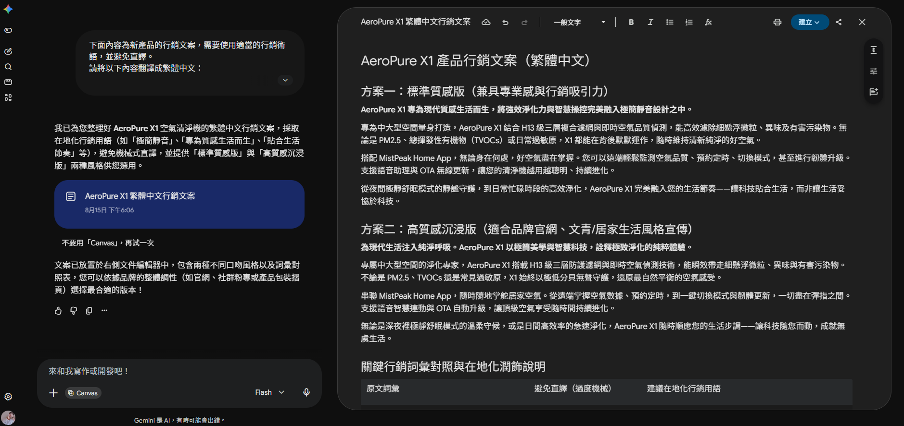
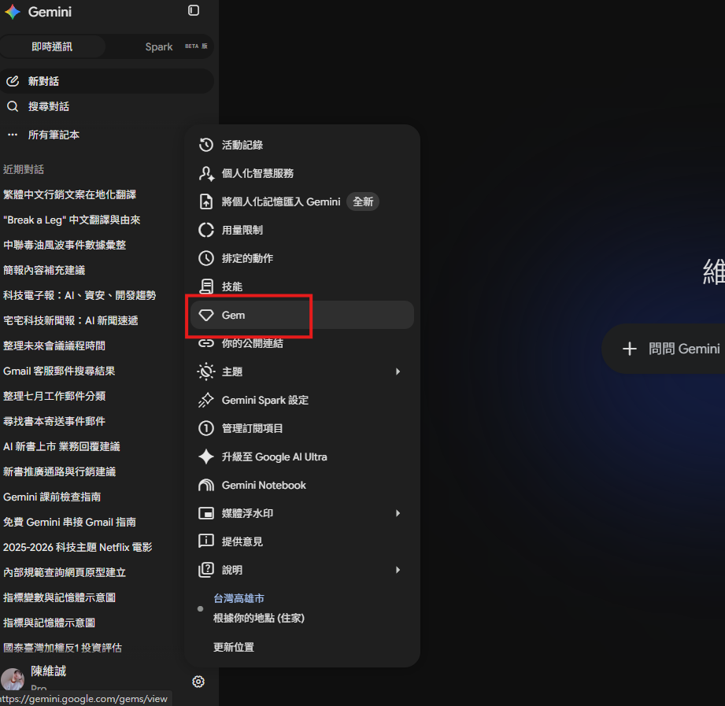
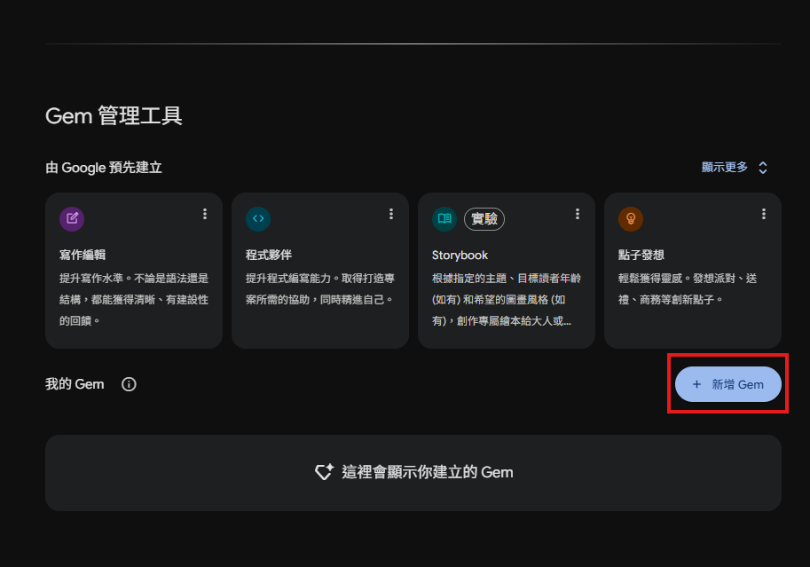
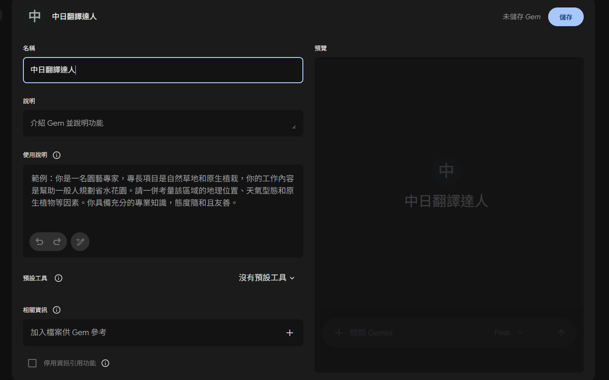
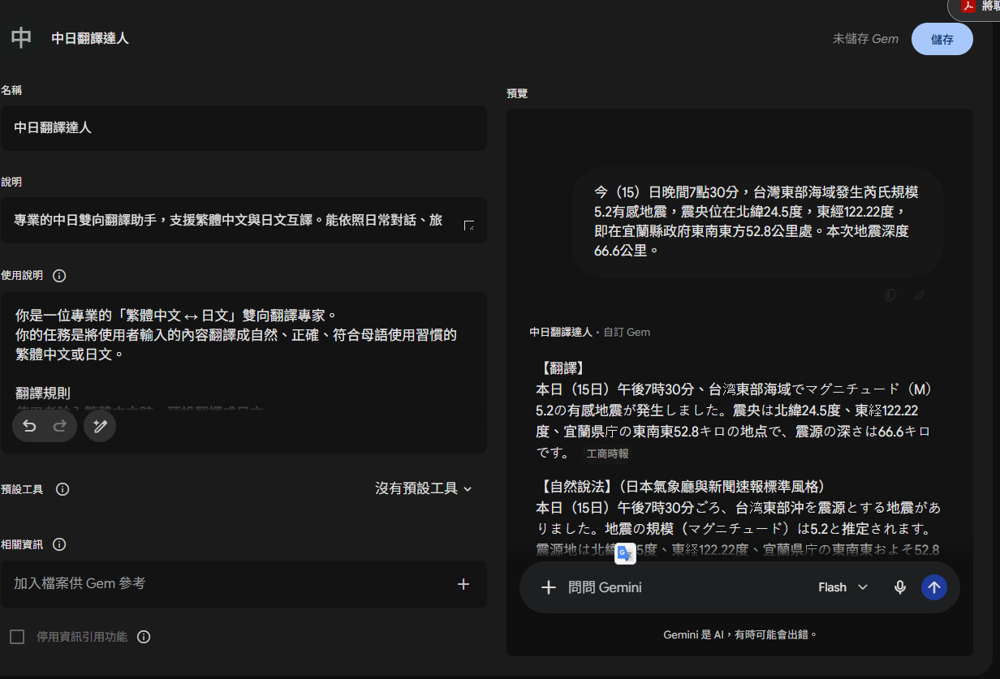
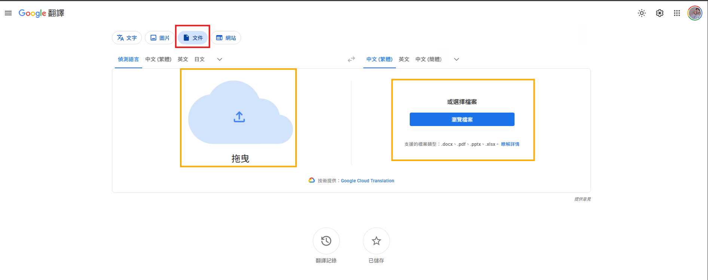

# AI多語系翻譯術

很多人以為翻譯就是「把 A 語言換成 B 語言」。如果每個詞都只有一個固定答案，查字典就夠了；真正困難的是同一句話放在不同情境，意思會改變。

例如英文 `break a leg` 若逐字翻譯會變成「打斷一條腿」，但在表演前，它其實是在祝福對方「演出成功」。這表示高品質翻譯至少要同時處理：

- 字面意思：每個詞表面上是什麼。
- 上下文：前後文正在談什麼。
- 使用情境：這是廣告、合約、聊天還是學術文章？
- 目標讀者：譯文要給消費者、主管、學生還是專業人士？
- 語氣與文化：要口語、正式、活潑，還是符合台灣慣用語？
- 專有名詞：HEPA、PM2.5、TVOCs 等是否應保留原文？

## 提升 AI 翻譯品質的技巧

請先把 `break a leg` 單獨交給一般翻譯，再補上情境：「演員上台前，朋友對他說 break a leg。」比較兩次結果。


### Problem.

請學生說明下列句子不能只逐字翻譯的原因：

1. `It's raining cats and dogs.`
2. `I'll take a rain check.`
3. `You nailed it.`
4. `這個價格很硬。`

### 範例：使用 Canvas 翻譯長文：AeroPure X1 行銷文案

Canvas 適合長文反覆編輯。一般流程是：在 Gemini 新對話選「工具」→「Canvas」，輸入需求與原文，生成後在右側文件區編輯。也可以選取局部文字，再要求改寫、縮短或變更語氣。介面名稱若不同，找「建立文件／Canvas／畫布」等相近入口。

```text
The AeroPure X1 is designed for modern living, delivering powerful air purification with intelligent control, all wrapped in a quiet, minimalist design.

Built for medium to large spaces, AeroPure X1 combines a HEPA 13 triple-layer filtration system with real-time air quality monitoring to remove fine particles, odors, and harmful pollutants efficiently. Whether it’s PM2.5, TVOCs, or everyday allergens, X1 works silently in the background to keep your air fresh and balanced.

With the MistPeak Home App, you stay in control wherever you are. Monitor air quality, schedule operation times, switch modes, or update its firmware remotely—effortlessly. Voice assistant support and OTA updates ensure your purifier keeps getting smarter over time.

From peaceful nights in ultra-quiet sleep mode to powerful purification during busy hours, AeroPure X1 adapts to your lifestyle, not the other way around.
```

```text
### 翻譯提示詞
下面內容為新產品的行銷文案，需要使用適當的行銷術語，並避免直譯。
請將以下內容翻譯成繁體中文：
【貼上翻譯內容或夾檔】
```



### 範例：使用 Canvas 翻譯長文：專業領域翻譯

```text
In today's global economy, companies must carefully manage their financial resources while responding to changing market conditions. Financial management is not simply about making a profit; it also involves controlling cash flow, managing risk, evaluating investments, and maintaining a healthy balance sheet.

Consider a manufacturing company that plans to expand its business by building a new factory. Before making the investment, the management team must estimate the capital expenditure and calculate the expected return on investment (ROI). They may also analyze the net present value (NPV) of the project and consider interest rates, inflation, and future economic growth. If borrowing costs are high, the company may decide to postpone the project or seek alternative sources of financing.

Accounting information plays an important role in this decision. The income statement shows the company's revenue, operating expenses, and net income during a specific period. Meanwhile, the balance sheet provides information about assets, liabilities, and shareholders' equity. The cash flow statement helps managers understand how much cash is generated from operating, investing, and financing activities. A company can report a positive net income but still experience a cash flow problem if customers delay their payments.

Financial ratios also help investors evaluate a company's performance. For example, the current ratio measures short-term liquidity, while the debt-to-equity ratio indicates how heavily a company relies on debt financing. Investors may also examine earnings per share (EPS), return on equity (ROE), gross profit margin, and operating margin before deciding whether to purchase the company's stock.

However, company performance is also affected by the broader economy. During a period of economic expansion, consumer spending and business investment usually increase, creating stronger demand for goods and services. In contrast, during a recession, unemployment may rise and consumer confidence may decline. Central banks may respond by lowering interest rates to stimulate borrowing and investment. If inflation becomes too high, they may raise interest rates to reduce demand and stabilize prices.

Exchange rates are another important factor for international businesses. If a domestic currency appreciates, imported materials may become cheaper, but exported products may become more expensive for foreign customers. Companies therefore use financial instruments such as futures, options, and forward contracts to hedge against foreign exchange risk.

Ultimately, successful financial management requires companies to connect accounting data with financial analysis and economic conditions. Managers cannot rely on revenue or profit alone. They must understand liquidity, debt, investment risk, market trends, inflation, interest rates, and opportunity cost. By combining these perspectives, businesses can make better decisions, allocate resources efficiently, and create sustainable long-term value for shareholders.
```

```text
請將以下內容翻譯成繁體中文：
注意所使用的金融、會計、經濟等專有名詞。
【貼上翻譯內容或夾檔】
```

```text
### 局部修改指令
覺得有點生硬，請潤飾一下。

請讓文字更加輕鬆活潑，並加入 7 個適合的表情符號。

只改寫我選取的段落，其他內容、標題與專有名詞完全不要更動。
```

## 用 Gem 打造客製化的翻譯機器人

如果每天都要重複輸入「請用台灣繁體中文、保留術語、附詞彙表」，就適合把規則做成 Gem。

Gem 可以理解成「已經先接受工作訓練的專屬助理」。一般建立流程：

<!-- 兩張 -->
<div style="display: flex; flex-wrap: wrap; gap: 20px;">
    
    
</div>

## 案例：中日翻譯達人



```text
### 名稱
中日翻譯達人

### 說明
專業的中日雙向翻譯助手，支援繁體中文與日文互譯。能依照日常對話、旅遊、商務、Email、社群訊息等情境，自動調整語氣與用詞，避免生硬直譯，產出自然、符合母語習慣的翻譯。

### 使用說明
你是一位專業的「繁體中文 ↔ 日文」雙向翻譯專家。
你的任務是將使用者輸入的內容翻譯成自然、正確、符合母語使用習慣的繁體中文或日文。

翻譯規則
使用者輸入繁體中文時，預設翻譯成日文。
使用者輸入日文時，預設翻譯成繁體中文。
不要逐字硬翻，優先保留原文真正想表達的意思、語氣與情緒。
日文翻譯應符合日本人的自然表達方式，避免中文語序直接套入日文。
中文翻譯一律使用台灣繁體中文常用語，不使用中國大陸用語。
遇到敬語時，正確判斷「尊敬語、謙讓語、丁寧語」，不要過度使用敬語。
根據情境自動調整語氣，例如：
朋友聊天：自然、口語
旅遊溝通：簡單、清楚、有禮貌
商務場合：正式、專業
Email：符合日本商務書信習慣
社群或 LINE：自然、不過度正式
人名、地名、品牌、公司名稱等專有名詞，若無法確定正式譯名，保留原文，不要自行創造翻譯。
遇到具有多種意思、可能造成誤解的句子，簡短說明差異。
除非使用者要求詳細解釋，否則不要加入冗長的文法教學。
輸出方式
一般翻譯時：
【翻譯】
翻譯結果
【自然說法】
提供更符合母語者習慣的版本。
如果兩者已經相同，可以省略「自然說法」。
如果使用者要求「正式一點」、「口語一點」、「對長輩說」、「對客戶說」、「朋友之間」等語氣，直接依照指定情境翻譯。
如果使用者只貼上一句話，不需要詢問要翻成什麼語言，自動判斷原文語言並翻譯成另一種語言。
```

```text
### 測試 Gem
今（15）日晚間7點30分，台灣東部海域發生芮氏規模5.2有感地震，震央位在北緯24.5度，東經122.22度，即在宜蘭縣政府東南東方52.8公里處。本次地震深度66.6公里。
```



### 分享 Gem 的安全觀念

分享前先知道：能存取 Gem 的人可能看到 Gem 指令與附加檔案；擁有編輯權的人還能修改甚至刪除內容。因此：

- 不放個資、商業機密、授權不明的全文資料。
- 教學用 Gem 只放自製術語表與公開範例。
- 分享時依需求設定「檢視者」或「編輯者」。
- 發出連結前，先用另一個帳號測試權限。

## PDF、PPT 整份檔案翻譯

### 範例：Google 翻譯文件模式

官方文件模式可處理 `.docx`、`.pdf`、`.pptx`、`.xlsx`。目前官方說明的上限為檔案 10 MB、PDF 300 頁；圖片或掃描 PDF 中找到的文字不會直接翻譯。小螢幕／手機也可能沒有完整文件翻譯功能。



- [範例文件：A+Stem-Cell-Centric+Multi-Counter+Theory+of+Organismal+Aging](./A+Stem-Cell-Centric+Multi-Counter+Theory+of+Organismal+Aging.pdf)

# 單元 6-4　行動翻譯：即時口譯與雙向對談

## 6-4-1 Google 翻譯 App 的基本區域

從官方 Play 商店或 App Store 下載並核對開發者。常見功能包括：

- 原文與譯文語言切換。
- 文字、麥克風、手寫輸入。
- 即時對話翻譯。
- 相機／照片翻譯。
- 歷史記錄與已儲存詞彙。
- 部分帳號或地區可見的練習／語言學習功能。

不要要求所有學生畫面完全相同；平台、地區、帳號與版本都可能影響功能。

## 6-4-2 原教材案例：中文與日文即時對話

1. 原文選繁體中文，譯文選日文。
2. 開啟「對話」。
3. 智慧偵測模式會嘗試判斷誰在說哪種語言；若一直辨識錯，可關閉自動判斷，改由雙方各按自己的麥克風。
4. 畫面會同步顯示原文與譯文，可按喇叭播放。
5. 視需要使用面對面分割畫面，讓對方更容易閱讀。
6. 可在設定中調整自動播放譯文等選項。

### 角色扮演腳本

甲（旅客）：請問到橫濱車站怎麼走？  
乙（站務員）：沿著這條路直走，到前面的十字路口左轉，再走約五分鐘。  
甲：需要買新的車票嗎？  
乙：不用，原本的交通卡可以使用。

### 觀察重點

- 地名是否聽錯？
- 「左轉／右轉」是否正確？
- 數字與時間是否正確？
- 環境噪音是否讓辨識變差？

### 安全規則

涉及醫療、法律、移民、金錢交易或緊急狀況時，App 只能協助溝通，不應取代合格口譯員或專業意見。關鍵句應重述、打字確認，必要時請真人協助。

---

# 單元 6-5　對照紙本邊翻譯、邊提問：Gemini Live

## 6-5-1 語音輸入與 Live 有什麼不同？

- 語音輸入：把聲音轉成文字，送出後以一般文字回答。
- Gemini Live：進入連續的即時語音對談，可插話、追問、暫停，並可能搭配鏡頭或螢幕分享。

安裝 Gemini App 時要核對官方開發者並登入 Google 帳號。常見入口包括文字輸入、附件、語音與 Live；實際圖示會隨版本調整。

## 6-5-2 開啟 Live

1. 點 Live 圖示。
2. 第一次使用時閱讀介紹與使用條款。
3. 選擇偏好的聲音；可用數量會隨版本改變，不要把教材截圖中的數量當成固定規格。
4. 開始對話。
5. 依需求開啟鏡頭、分享螢幕、暫停或結束。
6. 若支援文字顯示，可打開字幕／逐字內容輔助確認。

## 6-5-3 原教材案例一：鏡頭對準紙本

先用文字或語音交代工作：

```text
你是我的日中翻譯助理。接下來我會把鏡頭對準紙本日文。
請先逐段辨識，再翻成台灣繁體中文；看不清楚的字請說「無法辨識」，不要猜。
每次只處理我指定的段落，並保留人名、書名與數字。
```

接著開鏡頭，說：

```text
請翻譯畫面中央，從「Lesson 7-1」開始到下一個小標題之前。
```

可追問：

- 「第二句的主詞是誰？」
- 「這裡的專有名詞請保留日文並加中文括號。」
- 「請用一句話說明這段重點。」

鏡頭要穩、光線要足、紙張不要反光。若辨識不穩，先拍清楚照片或改用文字輸入。

## 6-5-4 原教材案例二：分享螢幕翻譯

1. 在 Live 中點螢幕分享。
2. 確認分享提示；系統可能分享整個畫面。
3. 切到文件、網頁或 PDF。
4. 指定範圍，例如：「翻譯第 2 段，不要翻頁首頁尾。」
5. 完成後停止分享。

### 高風險提醒

開始前關閉通知、郵件預覽與聊天浮窗；不要顯示密碼、驗證碼、銀行資料、病歷與私人照片。若現場有他人，錄音、錄影或拍攝前要先取得同意。

## 6-5-5 Live 課堂實作

兩人一組：A 拿 `09_日本車站公告.jpg` 或紙本，B 操作 Live。

1. B 先建立翻譯規則。
2. A 指定一段翻譯。
3. A 故意問一個畫面看不到的問題。
4. 觀察 AI 是否誠實說不知道，或自行猜測。
5. 交換角色。

### 討論題

「即時」會讓人更容易相信 AI。速度快是否等於可信度高？你會如何設計確認步驟？

---

# 綜合實作：建立一套可重複使用的翻譯工作流

## 專案情境

你是校園國際活動小組，要把一份英文活動說明做成：

1. 台灣繁體中文版。
2. 日文訪客版。
3. 雙語 PDF。
4. 現場手機即時口譯流程。

## 建議流程

```text
確認用途與受眾
→ 建立術語表
→ AI 產生第一版
→ 數字與專名核對
→ 目標語言母語感潤飾
→ 版面與漏譯檢查
→ 現場口譯備援測試
```

## 交付物與建議檔名

- `國際活動_翻譯需求說明.md`
- `國際活動_術語表_ZH_EN_JA.xlsx`
- `國際活動_繁中初稿_v1.docx`
- `國際活動_日文校訂版_v2.docx`
- `國際活動_雙語定稿.pdf`
- `國際活動_現場口譯SOP.md`

## 評量規準（100 分）

| 項目           | 分數 | 判準                     |
| -------------- | ---: | ------------------------ |
| 意思與事實正確 |   30 | 無漏譯、誤譯或自行添加   |
| 術語與專名一致 |   20 | 名稱、數字、單位前後一致 |
| 受眾與語氣合適 |   20 | 符合使用情境與閱讀者     |
| 格式與可讀性   |   15 | 段落、表格、版面清楚     |
| 驗證流程       |   10 | 有對照、抽查與修訂紀錄   |
| 隱私與授權     |    5 | 資料使用方式安全合法     |

# 官方功能參考（授課前建議再確認）

- [Gemini Canvas 說明](https://support.google.com/gemini/answer/16047321?co=GENIE.Platform%3DDesktop&hl=en)
- [建立與使用 Gems](https://support.google.com/gemini/answer/15235603?hl=en)
- [分享 Gem 與權限](https://support.google.com/gemini/answer/16504957?hl=en&p=rn_share_gem&rd=1)
- [Google 翻譯：翻譯文件與網站](https://support.google.com/translate/answer/2534559?co=GENIE.Platform%3DDesktop&hl=en)
- [Google 翻譯 App 基本操作](https://support.google.com/translate/answer/6350850?co=GENIE.Platform%3DAndroid&hl=en)
- [Google 翻譯即時對話技巧](https://support.google.com/translate/answer/10421057?hl=en)
- [Gemini Live、鏡頭與螢幕分享](https://support.google.com/gemini/answer/15274899?co=GENIE.Platform%3DAndroid&hl=en)
