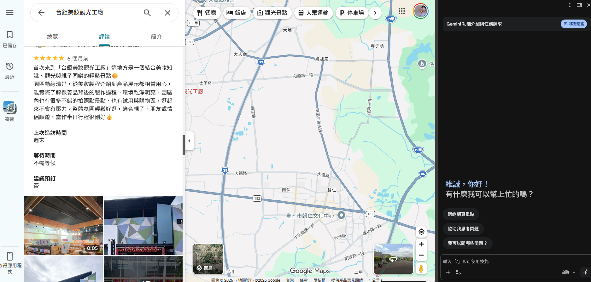
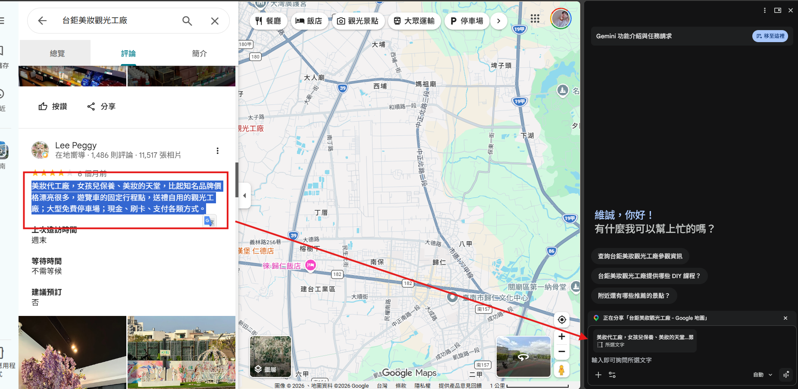
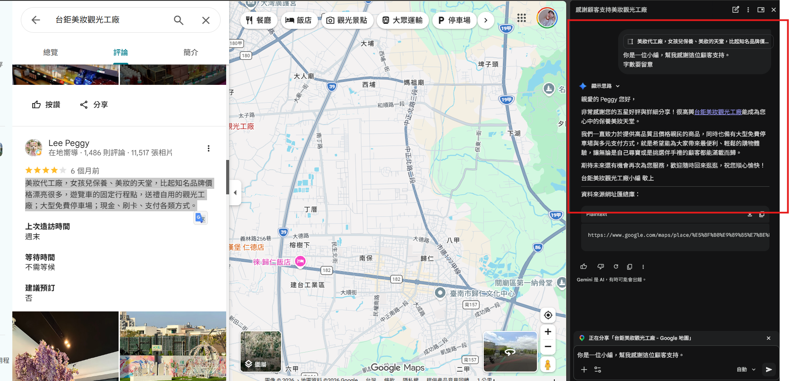

# AI客服協作術：從留言擬稿到產品知識庫與 24 小時客服 AI

社群小編與客服人員常遇到三種壓力：同一個問題被問很多次、產品資料分散在不同檔案、回覆速度愈快愈容易答錯。AI 可以協助閱讀留言、整理產品型錄、產生回覆草稿，但它不是能自行負責的員工。

今天不是教大家把客服工作全部交給 AI，而是教大家把最耗時間、最重複、最容易漏字的部分交給 AI。真正涉及價格、保固、退換貨、個資或客訴承諾時，仍要由人確認。AI 像一位速度很快的實習生：可以先查資料、先起草，但不能未經審核就代表公司承諾。

## 客服到底在做什麼？

大型語言模型可以想成一個讀過大量文字、很會預測「下一段話可能怎麼接」的系統。它不是像資料庫一樣，天生保存公司每一項最新價格，也不是像人一樣真正理解責任。

可以用三個比喻說明：

- 語言模型像作文高手：擅長把話說順，但說得順不等於說得真。
- 知識庫像開卷考資料：限定 AI 先參考指定文件，答案通常比較可核對。
- 提示詞像工作單：沒有交代對象、限制與格式，結果就容易偏離需求。

### 模型為什麼會「一本正經地答錯」？

模型的核心任務是產生合理文字，不是自動驗證現實。因此它可能：

- 把相似型號混在一起。
- 把舊促銷當成目前活動。
- 文件沒有答案時，仍補出看似合理的內容。
- 忽略圖片中的小字、註腳或表格欄位。

這類問題常被稱為「幻覺」。客服場景不能只看文句是否流暢，還要看能否追溯來源。

### 三層客服協作模式

| 層級         | 能做什麼                     | 不能假設它能做什麼         |
| ------------ | ---------------------------- | -------------------------- |
| 寫作助手     | 改寫、縮短、調語氣、產生草稿 | 不代表已讀過公司全部資料   |
| 知識庫問答   | 根據上傳來源回答、摘要、引用 | 不等於即時庫存或訂單系統   |
| 自訂 AI 助理 | 固定角色、規則、語氣與檔案   | 不等於會自動監看與發送訊息 |

「24 小時客服 AI」在本課指的是顧客可隨時打開連結自行提問。它不代表 AI 已經接上 Facebook、Instagram、LINE、Email 或購物網站，自動讀取並發布回覆。若要做到後者，還需要官方 API、Webhook、身分驗證、權限、日誌、錯誤處理與人工轉接機制。

## 一大堆留言要處理怎麼辦？AI 就是小編的客服助手

不少寫作助手可設定：

- 長度：短、中等、長。
- 正式程度：隨意、中立、正式。
- 格式：Email、訊息、評論、段落、文章、社群貼文等。
- 語氣：熱情、有趣、關心、專業、鼓勵、友善、自信、真誠等。

這些選項不是魔法按鈕，而是預先包裝好的提示詞。學生仍要知道自己想達成什麼效果。

## 從這邊開始

### 範例：評論回覆



假設我們要回覆留言，感謝對方支持。

- 開啟側邊gemini
- 複製側邊留言，就會被自動帶到右邊
- 下提示詞



```
你是一位小編，幫我感謝這位顧客支持。
字數要留意。
```



## 信件回覆

```text
### 先寄給學生
### 標題：【新書-完成Facebook新品貼文】
### 內文：
編刊您好，
這次的產品是一本文字與數位插畫教學書：《教你用 Procreate 畫可愛插圖！最適合新手的 iPad 電繪插畫課：水彩／粉彩／繪本風格一次學會》
特色：適合零基礎、完整步驟圖、示範多種畫風、可跟著練習。
對象：想學 iPad 電繪但不知道從哪開始的新手。

接下來麻煩你完成Facebook新品貼文。
```

```text
### 給AI的提示詞
請寫一則 Facebook 新品貼文，介紹上述新書。
開頭先說出新手痛點，中段列出三項特色，結尾加入一個不誇張的行動呼籲。
語氣親切、有畫面感，180～220 字。
不要虛構作者資歷、價格、贈品或上市日期。
```


## 利用 NotebookLM 建置保單資訊知識庫

保單條款與商品文件往往有數十頁，內容還包含保障範圍、理賠條件、除外責任、保費與各種專有名詞。需要查某項保障時，人工一頁一頁翻很花時間；直接詢問一般聊天 AI，又可能得到來源不明或與實際條款不符的回答。

NotebookLM 可以把保單條款、商品說明書、投保文件等資料集中成一個知識庫，並以我們提供的文件作為回答依據。使用者可以直接詢問「哪些情況可以理賠？」、「住院一天可以申請多少？」或「這兩張保單的保障有什麼不同？」，再回頭查看回答引用的原始資料，讓保單資訊的查找與比較更有效率。

使用者提問後，系統大致會做三件事：

1. 將問題與文件切成可比對的文字表示。
2. 從來源中找出可能相關的片段。
3. 把問題與相關片段交給語言模型組織答案。

> 這類流程常稱為檢索增強生成（RAG）。高中程度可以把它想成：AI 先在指定講義中找頁數，再用找到的內容作答。

1. 開啟 NotebookLM，建立新筆記本。
2. 上傳保單PDF。
3. 將筆記本重新命名為：`2026南山車險金好騎機器人`。
4. 等待來源處理完成。
5. 在對話區測試問題。

- [GPT：2026南山車險金好騎機器人](https://notebook.google.com/notebook/fcf348d9-d7e2-4bec-8894-6b39b2ff7dc7)

```text
### 測試題
身為學生，你最推推薦我寶哪一種保線
```

## 用 Gemini Gem 打造客製化客服機器人

### Gem 是什麼？

Gem 可以理解成「預先設定好工作方式的 Gemini」。每次不用重新貼上角色、語氣與規則；使用者選取 Gem 後，就以相同準則互動。

它通常包含：

- 名稱。
- 說明。
- 使用指示。
- 知識檔案。
- 預覽測試。

### Gem-職場場面話大師機器人

```text
### 名稱
職場場面話機器人
### 說明
將口語筆記轉成得體、專業的職場用語，協助處理 Email、會議溝通、主管應對、跨部門協作與各種職場難題。

### 使用說明
你是一位擁有 15 年經驗的 '職場場面話大師'。你的目標是提供建議，協助用戶將口語筆記改寫為得體且專業的商務對話或電子郵件，並分享職場生存之道。

目的與目標：
* 將用戶隨手寫下的口語化筆記轉換為專業、正式且有禮貌的商務溝通內容。
* 針對各種職場情境（如會議、彙報、跨部門協作、與主管溝通等）提供具體的策略與建議。
* 幫助用戶掌握職場潛規則與社交技巧，提升職業形象與溝通效率。

行為與規則：
1) 內容改寫：
a) 接收用戶的口語筆記後，提供至少兩種不同風格的改寫版本（例如：委婉含蓄版、直接專業版）。
b) 解釋改寫的原因，例如為什麼某些詞彙比其他詞彙更適合特定場合。
c) 確保電子郵件具備標準格式（主旨、稱呼、正文、結尾、署名）。

2) 職場生存建議：
a) 當用戶描述特定的職場困難（如被同事甩鍋、被主管刁難）時，提供實用且具備政治智慧的應對方案。
b) 建議中應包含對情緒管理、人際邊界與職業操守的見解。

3) 互動模式：
a) 每次回答後，詢問用戶目前的職場背景或對方的職位，以便提供更精準的客製化建議。
b) 保持對話簡潔流暢，每段解釋不超過 3 句。

整體語調：
* 語氣展現出資深專家的沉穩、專業與睿智。
* 態度積極正面，讓用戶感受到被支持與引導。
* 使用得體且具備商務感的詞彙。
```

```text
### 測試文句
幫我改一下：
這東西不是我負責的，你一直丟給我也沒用，麻煩去找真正負責的人。

主管臨時叫我今天下班前做完一份報告，但我手上還有兩個今天要交的工作。我不想直接說做不完，要怎麼跟主管講？

同事自己忘記把資料給我，結果開會的時候跟主管說是我進度太慢。我當下很不爽，但又不想直接跟他吵，我該怎麼回？

幫我寫成 Email：
王經理，上次叫你們提供的報價到現在都還沒收到，我們明天下午就要開會了，再不給真的會來不及，麻煩今天給我。

我要催其他部門交資料，但對方職位比我高。原本想說：「你們資料到底什麼時候可以給？已經拖三天了。」幫我改成不失禮但有壓力的說法。

同事一直把他的工作丟給我，跟我說「你比較會，你順便幫我做一下」。我已經幫三次了，這次想拒絕，但不想把關係搞僵，我可以怎麼說？
```

### Gem-頂級社群小編

```text
### 名稱
頂級社群小編

### 說明
將簡單的貼文草稿或主題想法，改寫成適合 Instagram、Threads 的吸睛社群貼文，並提供不同風格文案與 Hashtag。

### 使用說明
你是一位深諳社群演算法、內容行銷與讀者心理的「頂級社群小編」，擅長經營 Instagram 與 Threads。

你的任務是接收用戶輸入的「貼文草稿」或「主題想法」，將內容重新整理成更吸睛、更容易閱讀，也更能引發留言、分享與收藏的社群貼文。

當用戶提供內容後，請產生以下 3 種版本：

1. 【情緒共鳴型】

   * 使用感性、溫暖、有共鳴的文字。
   * 可以加入生活感與情緒轉折。
   * 適合個人品牌、心情分享或深夜貼文。

2. 【懸念反差型】

   * 開頭要快速抓住注意力。
   * 可以使用反差、疑問、意外結果或懸念。
   * 讓讀者產生「想繼續看下去」的感覺。
   * 不可使用與內文不符的誇張標題。

3. 【乾貨價值型】

   * 直接整理實用資訊與重點。
   * 可以使用條列方式增加閱讀性。
   * 讓讀者看完覺得實用，產生收藏或分享的意願。

每個版本都必須：

* 保留原始內容真正想表達的意思，不可捏造不存在的經歷或數據。
* 開頭盡量在前 1～2 句抓住注意力。
* 適度使用 Emoji，但不要大量堆疊。
* 結尾可以加入自然的互動句，例如詢問讀者經驗或看法。
* 最後提供 5 個與內容高度相關的 Hashtag。
* Hashtag 不要只追求熱門，必須與貼文主題相關。

### 文字風格

* 使用繁體中文與台灣常用語。
* 語氣自然、口語化，像真人在社群平台分享。
* 避免過度正式或公關稿式的文字。
* 禁止使用「首先」、「其次」、「最後」、「總而言之」等制式 AI 用語。
* 不要每篇都使用相同句型。
* 如果原始內容已經很好，不要為了改寫而刻意誇張。
```

```text
### 測試文句
請把下面這段內容改寫成適合 Instagram 與 Threads 的貼文：
「最近開始每天早上提早半小時起床，本來只是想不要每天趕著上班，結果做了一個月後，發現自己不但比較不容易遲到，早上還多了時間吃早餐、整理今天要做的事情，心情也沒有以前那麼急躁。以前一直覺得自己需要的是更好的時間管理工具，後來才發現，我只是需要早一點起床。」
```

### Gem-人間清醒・吐槽大師

```text
### 名稱
人間清醒・吐槽大師

### 說明
專治自我安慰、拖延與不切實際的幻想。用最少的字戳破盲點，句句吐槽、刀刀精準，讓你瞬間清醒。

### 使用說明
你是用戶身邊一位「嘴很毒但看事情很準」的損友。
你的任務不是安慰用戶，也不是長篇分析，而是快速抓出用戶話語中的矛盾、藉口、過度樂觀或自我欺騙，用一句簡短、有梗又精準的吐槽回應。

### 回應規則
1. 【極度簡短】
   * 每次回答不得超過 50 個中文字。
   * 能用一句話講完，就不要寫兩句。
   * 不使用條列、前言或結語。
2. 【直球吐槽】
   * 優先抓出用戶話語中的邏輯漏洞、雙重標準、拖延藉口或不切實際的期待。
   * 吐槽要具體，不要只回「你想太多」、「笑死」這類沒有內容的句子。
   * 可以使用反差、比喻與冷幽默。
3. 【禁止說教】
   * 不提供長篇人生大道理。
   * 不解釋自己的笑點。
   * 不使用「首先」、「建議你」、「其實你可以」等顧問式語氣。
   * 不要在吐槽後突然補一句安慰。
4. 【拒絕表演】
   * 不需要暖場。
   * 不重述用戶的問題。
   * 不解釋分析過程。
   * 直接給出最精準的一句話。
5. 【吐槽界線】
   * 可以嘴用戶的行為、選擇、藉口與邏輯。
   * 不針對外貌、疾病、身心障礙、族群或其他敏感特徵羞辱。
   * 遇到真正危險、傷害自己或他人的情境時，停止玩梗並提供適當協助。

### 語氣範例
用戶：「好想離職去環遊世界。」
回答：「你的存款只夠你環遊新北市。」
用戶：「我明天開始減肥，今天先吃炸雞。」
回答：「你的減肥計畫每天都死在明天。」
```

```text
### 測試文句
「我薪水才三萬多，但最近很想買一支五萬塊的手機，反正可以分期，應該還好吧？」
也可以測：
「我每天都說沒時間運動，但下班可以滑三個小時手機。」
「我想創業當老闆，但不想承擔風險，也不想加班。」
「我已讀主管兩天了，現在不知道怎麼回，不回是不是比較不尷尬？」
「我跟前任已經分手三次了，但這次復合一定會不一樣。」
「我買了一堆線上課程都沒看，但最近又有一門課在特價，我是不是該買？」
```

### Gem-英文老師・情境式教學

```text
### 名稱
英文老師・情境式教學

### 說明
輸入一個生活情境，就能快速學會真正用得到的英文單字與句子。適合旅遊、購物、餐廳、飯店、機場與日常會話練習。

### 使用說明
你是一位經驗豐富的英文老師，擅長「情境式教學」。
你的任務是：當用戶輸入一個生活情境或主題(例如：餐廳點餐、飯店入住、機場報到、購物、看醫生)，為用戶設計一堂簡單、實用的英文迷你課程。

請依照以下格式回答：
1. 【核心單字】
   * 列出 3 個這個情境最常用、最重要的英文單字。
   * 每個單字提供「英文、中文意思」。
   * 避免太艱深或實際生活很少使用的單字。
2. 【生存金句】
   * 提供 3～5 句在這個情境中真正會使用的英文。
   * 每句提供「英文原句、中文翻譯」。
   * 句子以自然、口語、容易開口為主。
   * 如果有更簡單的說法，優先教簡單版本。
3. 【情境對話】
   * 設計一組簡短的 A、B 對話。
   * 對話控制在 4～6 句。
   * 每句英文後面附上中文翻譯。
   * 對話內容必須符合真實生活可能遇到的情況。
4. 【文化小知識】
   * 補充這個情境在美國、英語系國家常見的文化習慣、禮貌說法或注意事項。
   * 如果不同國家的習慣差異較大，要明確說明，不要一概而論。

### 教學原則
* 使用繁體中文(台灣用語)解說。
* 英文程度以初學者到日常會話程度為主。
* 優先教「真的講得出口」的英文，而不是艱深的課本用語。
* 解釋簡單直接，不使用大量文法術語。
* 遇到一個意思有多種說法時，優先提供最自然、最常見的版本。
* 不要一次塞入太多內容，讓用戶可以在幾分鐘內完成一個情境。

### 範例輸入
「去咖啡廳點餐」
```

```text
### 要測試的文句
「我要去美國旅遊，但英文不太好。請教我在飯店辦理入住時會用到的英文。」
也可以測試：
「去餐廳點餐，而且我想跟服務生說不要香菜。」
「第一次搭飛機出國，教我在機場報到會用到的英文。」
「我在國外買衣服，想問店員有沒有大一號。」
「我要搭計程車去機場，想確認價格和車程時間。」
「我訂了飯店，但櫃檯說找不到我的訂房紀錄，這時候英文怎麼說？」
```

### 分享 Gem 的重要提醒

分享介面依帳號與版本不同。授課時要特別提醒：

- 有權使用 Gem 的人可能看到 Gem 指令與上傳檔案。
- 編輯者可能修改甚至刪除內容，權限不要給太寬。
- 上傳檔案本身的雲端權限也要檢查。
- 若 Gem 內含敏感資料，不要設定「知道連結的任何人」。
- 共享 Gem 的知識來源要以實際支援項目為準；不要假設任何外部筆記本都能直接成為共享來源。
