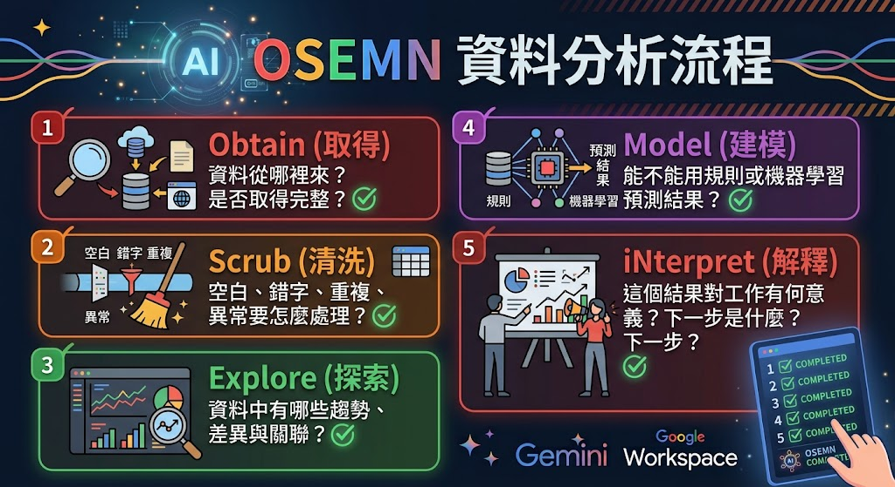

# AI資料分析術：從資料清洗、流失預測到互動儀表板

各位今天不是來背統計公式，也不是要在一堂課內變成資料科學家。我們要學的是一套能在工作上立即使用的分析流程：拿到資料後，先確認資料代表什麼，再清理錯誤、觀察規律、建立預測，最後把結果講成主管聽得懂、同事做得到的建議。

AI 可以幫我們加速，但它不是「按一下就永遠正確」的魔法。資料如果錯，AI 只會更快地產生錯誤結論。今天最重要的一句話就是：先驗證資料，再相信圖表；先理解問題，再要求模型。

1. 公司有一萬筆會員資料時，你會從哪裡開始看？
2. 空白欄位應該刪掉、填 0，還是保留？三種做法會有何差異？
3. 「年長客戶流失率較高」能不能直接推論「年齡造成流失」？
4. 主管真正想聽的是演算法名稱，還是下一步該做什麼？

## 先懂 OSEMN，不要一拿到資料就畫圖

OSEMN 是一套資料分析流程，可記成：

1. **Obtain（取得）**：資料從哪裡來？是否取得完整？
2. **Scrub（清洗）**：空白、錯字、重複、異常要怎麼處理？
3. **Explore（探索）**：資料中有哪些趨勢、差異與關聯？
4. **Model（建模）**：能不能用規則或機器學習預測結果？
5. **iNterpret（解釋）**：這個結果對工作有何意義？下一步是什麼？

以高中程度比喻：

- Obtain：收齊報名表。
- Scrub：補齊姓名、移除重複報名、修正錯誤電話。
- Explore：看看大家偏好哪個地點、哪個年級參加最多。
- Model：預估需要幾台遊覽車、哪些人可能臨時取消。
- iNterpret：把結果整理成老師能決策的行程與預算。



### 原教材工具對照

| 階段      | 核心任務             | 傳統工具例                        |
| --------- | -------------------- | --------------------------------- |
| Obtain    | 蒐集、抓取資料       | SQL、Python Requests、Scrapy      |
| Scrub     | 清洗、預處理         | Pandas、OpenRefine                |
| Explore   | 尋找模式、視覺化     | Matplotlib、Seaborn、Tableau      |
| Model     | 機器學習、預測       | scikit-learn、TensorFlow、PyTorch |
| iNterpret | 洞察、敘事、決策呈現 | PowerPoint、Dashboard             |

生成式 AI 能協助每一步，但不會替你承擔資料正確性與決策責任。

### 示範提示詞 1：說明流程

```text
請用高中生能理解的方式說明 OSEMN 資料分析架構。
每個階段請包含：目的、常見工作、輸入、輸出、常見錯誤，以及一個校園或購物案例。
最後用表格整理五個階段。
```

## 2. CRM 案例：先認識每一欄在說什麼

原教材使用 `crm.csv` 作為客戶管理資料。欄位如下：

| 欄位                    | 中文名稱       | 意義／計算                      |
| ----------------------- | -------------- | ------------------------------- |
| `CustomerID`            | 客戶編號       | 每位客戶的唯一識別碼            |
| `Age`                   | 年齡           | 客戶年齡                        |
| `Gender`                | 性別           | 可能同時出現 Male、Female、M、F |
| `JoinDate`              | 加入日期       | 註冊或成為會員日期              |
| `LastPurchaseDate`      | 最後購買日期   | 最近一次完成交易的日期          |
| `TotalOrders`           | 總訂單數       | 加入以來累計購買次數            |
| `TotalSpent`            | 總消費金額     | 累計消費金額                    |
| `Churn`                 | 流失狀態       | 0 代表仍活躍；1 代表已流失      |
| `AvgOrderValue`         | 平均訂單價值   | `TotalSpent / TotalOrders`      |
| `DaysSinceLastPurchase` | 距上次購買天數 | 數值越大，通常越久未回購        |

### 示範提示詞 2：欄位解讀與分析方向

```text
我會上傳一份 CRM CSV。請先不要建立模型。
請依序完成：
1. 列出每個欄位的資料型態、商業意義、合法範圍與可能問題。
2. 指出哪些欄位是識別碼、特徵、目標欄位或衍生欄位。
3. 提出至少 8 個可回答的商業問題。
4. 列出分析前需要向資料擁有者確認的事項。
5. 將推測與資料中可直接確認的事實分開標示。
```

### 課堂提問

1. `CustomerID` 可以直接拿來預測流失嗎？為什麼？
2. `DaysSinceLastPurchase` 為何可能比 `Age` 更有行動價值？
3. `Churn` 是由誰、用什麼規則定義？若定義不清會發生什麼事？

### 參考答案

- CustomerID 通常只是識別碼，不代表客戶行為；直接放入模型可能學到無意義規律。
- 距上次購買天數可直接連結召回活動；年齡通常不能被企業改變。
- 流失定義會影響全部標籤，例如 30 天未購買與 180 天未購買是完全不同的問題。

---

# 8-2 各種資料分析與視覺化，都請 AI 協助做

## 1. Scrub：資料清洗與 GIGO

**Garbage In, Garbage Out（垃圾進，垃圾出）**：輸入資料若錯誤，畫面再漂亮、模型再複雜也不可信。

### 五種常見問題

| 問題                 | 高中程度解釋       | CRM 例子                           |
| -------------------- | ------------------ | ---------------------------------- |
| 缺失值 Missing Value | 格子沒有資料       | `Age` 空白、`Gender` 為 NaN        |
| 異常值 Outlier       | 和大多數資料差太遠 | 年齡 300、消費金額突然高百倍       |
| 無效值 Invalid Value | 不符合規則         | 性別填 `X123`、日期為 `2023-02-30` |
| 重複值 Duplicate     | 同一筆被輸入多次   | 同一 CustomerID 重複               |
| 不一致 Inconsistent  | 同一概念有多種寫法 | M、Male、male；NT$、TWD、$         |

### 示範提示詞 3：先規劃再清洗

```text
請協助進行資料清洗，但先不要改資料。
請先列出這份資料可能有哪些問題、如何偵測、預計怎麼處理、處理風險與替代方案。
請將結果整理成「欄位、問題、判定規則、建議處理、理由、需人工確認」六欄表格。
```

### 示範提示詞 4：執行清洗

```text
請幫我做資料清洗，檢查並處理缺失值和不合理值。
規則如下：
- 重複 CustomerID：保留最後更新日期較新的紀錄，但先列出被刪除的資料。
- Gender：M/Male/male 統一為 Male；F/Female/female 統一為 Female；無法判斷則 Unknown。
- Age：空值使用中位數僅作示範，並新增 AgeWasImputed 欄位；小於 15 或大於 100 先標記，不自行刪除。
- 日期：統一為 YYYY-MM-DD，無效日期列入錯誤清單。
- TotalOrders、TotalSpent：不得為負數；除以 0 時 AvgOrderValue 留空並標記。
請輸出：清洗摘要、變更筆數、例外清單、清洗後資料預覽，以及人工覆核事項。
```

### 原教材清洗案例結果

- 缺失性別補為 `Unknown`。
- 缺失年齡以中位數補值，避免極端值影響。
- 檢查 `TotalOrders`、`TotalSpent` 是否合理。
- 刪除重複 `CustomerID`，保留最新紀錄。
- 性別統一為 Female、Male、Unknown。
- 異常年齡修正或標記。
- 日期統一成標準格式。

> 教師補充：AI 建議「補中位數」不代表永遠正確。若缺失不是隨機發生，補值仍可能造成偏誤。正式專案應保留原始檔、清洗程式、規則版本及變更紀錄。

## 2. Explore：從資料找模式

探索的目的不是證明原本的猜測，而是找出值得進一步查證的現象。

### 原教材探索案例

- 年齡層與流失率。
- `TotalSpent` 與流失的關係。
- 高價值客戶是否更容易留存。
- RFM 分群與核心客戶。
- 特徵重要性。

### 示範提示詞 5：流失率預測圖表

```text
請以清洗後的 CRM 資料進行探索分析，暫時不要下因果結論。
請分析：
1. 不同年齡層的客戶數與流失率。
2. TotalSpent、TotalOrders、AvgOrderValue、DaysSinceLastPurchase 與 Churn 的關係。
3. 高消費客戶的流失情形與離群值。
4. 使用 RFM 概念找出高價值、沉睡、可能流失客戶。
5. 為每一項提供合適圖表、觀察、限制與下一步驗證方法。
請明確標示「資料事實」「合理推測」「不可由資料判斷」。
```

### 原教材數字案例（教學用，不代表真實市場）

| 年齡層    | 流失率 | 教材中的解讀方向                     |
| --------- | -----: | ------------------------------------ |
| 18–30 歲  |  40.0% | 相對穩定，產品可能符合數位原住民偏好 |
| 31–50 歲  |  50.0% | 可能受時間、便利性或可支配收入影響   |
| 51 歲以上 | 51.85% | 可能反映介面友善度或服務支持不足     |

> 一定要說：以上只是示範資料中的關聯。不能只靠三個百分比證明年齡造成流失；還需檢查樣本數、信賴區間、產品差異與其他變數。

### 特徵重要性範例

| 排名 | 特徵                  | 教材示例重要性               |
| ---: | --------------------- | ---------------------------- |
|    1 | DaysSinceLastPurchase | 極高，主要預測指標           |
|    2 | TotalOrders           | 高，消費頻率與流失有關       |
|    3 | Age                   | 中，特定年齡層表現較差       |
|    4 | TotalSpent            | 中，貢獻較低者忠誠度可能較差 |

## 3. Model：建立流失預測模型

### Random Forest 的高中程度解釋

想像班上有很多位同學，各自根據不同線索投票判斷某人是否會缺席：有人看過去出席率，有人看遲到次數，有人看請假紀錄。單一同學可能誤判，但許多人用不同線索投票，通常更穩定。Random Forest 就像很多棵「決策樹」共同投票。

### 原教材建模流程

1. `Gender` 轉成數值（One-hot Encoding）。
2. 選用 `Age`、`TotalOrders`、`TotalSpent`、`AvgOrderValue`、`DaysSinceLastPurchase`。
3. 80% 資料訓練，20% 資料測試。
4. 以特徵重要性解讀影響因素。
5. 為每位客戶輸出流失機率與建議行動。

### 示範提示詞 6：建立模型

```text
請用這份清洗後的 CRM 資料建立「流失風險」教學模型。
先檢查樣本數、類別比例、資料洩漏與日期切分問題，再決定是否適合 Random Forest。
請說明：
1. 特徵與目標欄位。
2. 類別編碼及衍生欄位。
3. 訓練／測試切分方式及理由。
4. Accuracy、Precision、Recall、F1、混淆矩陣。
5. 特徵重要性，但不得解釋為因果。
6. 高風險名單及可執行行動。
7. 模型限制、偏誤與人工覆核流程。
如果資料不足，請停止建模並說明還缺什麼。
```

### 原教材預測輸出示例

| CustomerID | 風險 | 流失機率 | 建議行動               |
| ---------- | ---- | -------: | ---------------------- |
| 10986      | 高   |      89% | 立即發送專屬優惠券挽回 |
| 10987      | 高   |      75% | 進行推播提醒           |

這些是示範格式，不可拿來對真實顧客做自動處置。

## 4. iNterpret：把模型翻譯成商業語言

### Precision 與 Recall 的捕魚比喻

- **Recall（召回率）**：真正會流失的 100 人中，抓到幾人。像漁網網眼夠不夠密。
- **Precision（精確率）**：被模型警示的 100 人中，真的會流失的有幾人。像撈上來的有多少真的是目標魚。
- **F1-score**：在 Precision 和 Recall 間取得平衡。

### 原教材主管版說法

> 我們分析了 1,000 位客戶的行為，發現「距離上次消費時間」與「年齡」是判斷離開風險的重要線索。目前找出 50 位高風險 VIP，他們過去貢獻營收 20%，目前預測流失風險高達 80%。建議本週啟動針對這 50 人的專屬挽回計畫。

### 提示詞 7：解釋結果

```text
我要向不懂機器學習的主管說明結果。
請不要從演算法開始，而要依序說明：商業問題、資料範圍、主要發現、可信程度、風險限制、建議行動、驗證指標。
把 Precision、Recall 與 F1 各用一個生活比喻解釋。
所有百分比都標示分母與樣本數；推測不得寫成事實。
最後提供 60 秒口頭版與一頁主管摘要版。
```

---

# 8-3 AI 幫你完成專業又深入的資料分析報告

## 1. Deep Research 工作法

Deep Research 適合需要蒐集多個來源、比較資料、產生有來源報告的任務。它不是「真相按鈕」；研究範圍若沒寫清楚，結果可能偏題。

### 操作示範

1. 上傳 `01_crm_raw.csv` 或小型 `03_crm50.csv`。
2. 輸入分析目的與限制。
3. 選擇 Deep Research／研究模式；若介面沒有此功能，就用一般模式分段執行。
4. 檢查 AI 提出的研究計畫，必要時修改。
5. 產生報告後逐段核對資料、來源與計算。
6. 匯出 Google 文件，保留版本與查核紀錄。

### 提示詞 8：CRM 深度研究

```text
請針對附件 CRM 資料建立一份管理決策研究報告。
研究問題：哪些客戶最可能流失？哪些特徵最有行動價值？
限制：不得搜尋或推測個人身分；不得把相關性寫成因果；不得虛構缺失資料。
請先提出研究計畫，經我確認後再執行。
報告需包含資料品質、描述統計、分群、流失模型、模型評估、商業建議、限制、後續實驗與引用來源。
```

## 2. 用 NotebookLM 讓報告有來源依據

### 流程

1. 在 NotebookLM 建立新筆記本，例如「CRM 客戶流失研究」。
2. 匯入剛才的 Google 文件、CSV 說明、政策或研究資料。
3. 只勾選本次報告需要的來源。
4. 先請它產出摘要與來源對照，再建立報告。
5. 點擊引用回到來源核對，不能只看摘要。

### 提示詞 9：來源限定報告

```text
只根據目前勾選的來源，製作「CRM 客戶流失案例分析」。
每項數字與關鍵結論都附來源標記。
若來源沒有答案，請寫「來源未提供」，不得自行補寫。
結構：問題背景、資料範圍、清洗方法、主要發現、模型結果、建議、限制、待補資料。
```

### 教師提醒

- 來源導向工具可降低幻覺，但不等於零幻覺。
- AI 的引用可能只支持句子的一部分，仍需點回原文。
- 同一份報告可依場合生成主管摘要、技術附錄或會議版本。

---

# 8-4 報告缺圖？把文字一鍵轉成圖解

## 1. NotebookLM 資訊圖表

### 操作流程

1. 在工作室選擇「資訊圖表」或相近功能。
2. 選繁體中文。
3. 設定資訊密度：精簡、標準、詳細或完整。
4. 補充目的、受眾、必須呈現的數字與禁用內容。
5. 生成後逐字校對數字、標籤、錯字與圖例。

### 提示詞 10：原教材 CRM 圖表題材

```text
請製作一張繁體中文資訊圖表，標題為：
「CRM 數據警訊：我們正在失去最有價值的客戶」。
對象是行銷與客服主管。
內容包含：資料範圍、三個主要發現、高風險客群、重要特徵、三項本週行動。
所有數字必須來自來源，沒有數字就不要補。
版面採深色商務風格，數字優先、文字簡短，頁尾加上「示範分析，需人工覆核」。
```

## 2. 用圖像模型生成資料圖解

原教材使用 Nano Banana Pro 將文字變成圖解。實際教學也可使用當下可用的圖像生成工具；重點是提供正確資料、圖表型態與校對規則。

### 原教材年齡層文字

```text
18–30 歲：流失率 40.0%，年輕族群相對穩定。
31–50 歲：流失率 50.0%，可能受時間與便利性影響。
51 歲以上：流失率 51.85%，可能與介面友善度或服務支持有關。
```

### 提示詞 11：年齡層圖解

```text
請根據上述三組資料生成一張 16:9 繁體中文資訊圖表。
每組同時顯示流失率與保留率，三組使用完全相同的尺度。
不得改寫任何百分比，不得添加未提供的結論。
標題為「各年齡層客戶流失與保留比較」。
底部註明：「相關不等於因果；此為教學示範資料」。
生成前先以文字列出你將使用的數字供我確認。
```

### 提示詞 12：產品開發流程圖

```text
展示產品開發流程：需求分析 → 設計 → 開發 → 測試 → 上線。
請生成一張 16:9 繁體中文流程圖，每一步有一致風格的圖示與編號，箭頭由左至右。
背景乾淨、現代、適合內部簡報，不加入其他步驟。
```

### 圖像驗收四問

1. 數字是否完全一致？
2. 圖形面積是否誤導？
3. 顏色是否暗示不必要的好壞？
4. 中文文字是否錯字、亂碼或被截斷？

> 圖像生成模型擅長「視覺草稿」，不適合充當精密統計軟體。重要圖表應回到試算表或程式重新繪製。

---

# 8-5 互動式的動態檢視

Dynamic View 是生成式互動介面實驗功能；是否可用、名稱與方案會改變。若沒有此功能，可改用 Gemini 產生 HTML 儀表板、Google 試算表篩選器或 Looker Studio。

## 操作示範

1. 準備只有 50 筆的 `03_crm50.csv`，降低瀏覽器負擔。
2. 在 Gemini 工具選單選動態檢視／視覺版面／可互動介面。
3. 選適合分析的模型。
4. 上傳檔案並輸入提示詞。
5. 生成時保持頁面開啟，避免切換或重新整理。
6. 測試篩選器、圖表聯動、資料筆數與空值處理。
7. 分享前確認是否會公開原始資料。

### 提示詞 13：互動式動態檢視報告

```text
請使用附件 crm50.csv 建立繁體中文互動式 CRM 儀表板。
必須包含：
- KPI：客戶數、總消費、平均客單價、流失率。
- 篩選器：年齡層、性別、流失狀態。
- 圖表：年齡分布、性別流失率、消費金額與流失、距上次購買天數。
- 明細表：高風險客戶、風險原因、建議行動。
所有圖表需隨篩選器同步更新。
顯示目前篩選後筆數，若資料不足須警告，不得虛構資料。
頁尾顯示資料更新時間、資料來源與「僅供教學」聲明。
```

### 動態儀表板驗收

- 篩選後 KPI 與明細表是否同步？
- 50 筆資料是否仍為 50 筆，是否有重複計算？
- 空值是否被隱藏或誤算為 0？
- 分享連結是否暴露原始資料？
- 匯出表格能否重現畫面數字？

---

# 四、綜合課堂實作：CRM 流失預警專案

## 任務情境

你是電商公司的資料助理。主管發現會員回購下降，希望你在 90 分鐘內提出初步分析。你只能使用去識別 CRM 資料，不可以自行補造銷售紀錄。

## 任務步驟

1. 建立欄位字典，列出不確定的定義。
2. 產出資料品質報告與清洗計畫。
3. 建立至少 3 張探索圖表。
4. 建立教學用流失模型並報告 Precision、Recall、F1。
5. 輸出高風險名單，但不得自動發送優惠。
6. 寫一頁主管摘要。
7. 將摘要轉成一張資訊圖表。
8. 說明三項限制與下一步實驗。

## 驗收配分

| 項目       | 配分 | 標準                                 |
| ---------- | ---: | ------------------------------------ |
| 問題定義   |   10 | 有目標、範圍、受眾與流失定義         |
| 資料清洗   |   20 | 有規則、紀錄、例外與原始檔保留       |
| 探索分析   |   15 | 圖表正確，區分事實與推測             |
| 模型與評估 |   20 | 無明顯洩漏，能解釋 Precision／Recall |
| 商業解讀   |   15 | 有具體行動、驗證指標與限制           |
| 視覺呈現   |   10 | 數字一致、圖例清楚、不誤導           |
| 隱私與覆核 |   10 | 去識別、權限、人工覆核皆有說明       |
