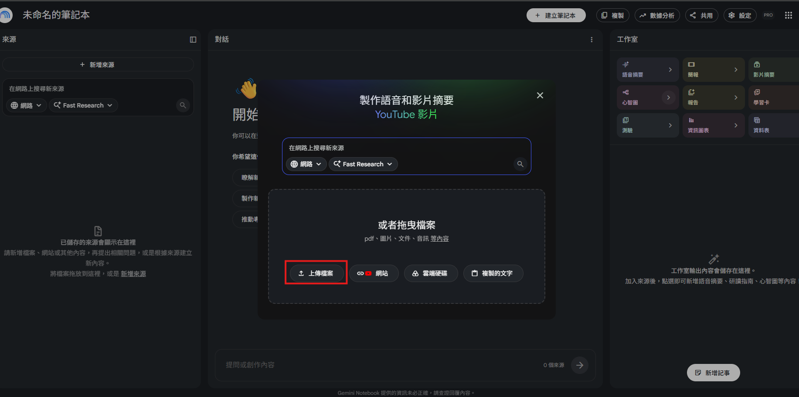
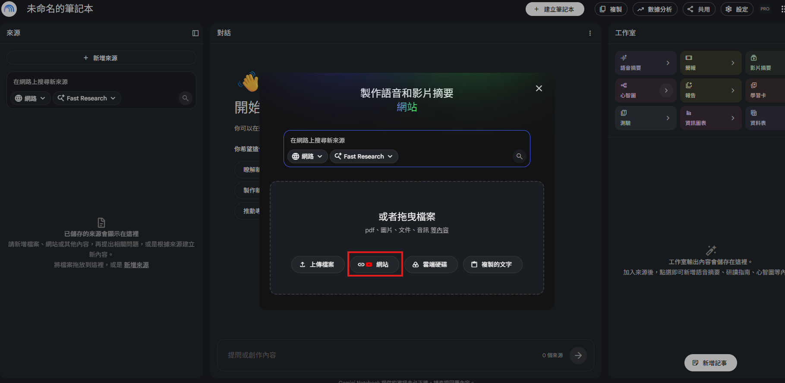

# AI 資料整理術：免手工整理表格、網頁與會議逐字稿

## 用 AI 處理複雜的表格資料

傳統做法可能要使用篩選、樞紐分析、SUMIFS 或 Excel 函數；本單元先用 Gemini 快速整理，再把結果貼回 Excel 或匯出到 Google Sheets。

「AI 的價值不是代替我們理解數據，而是先做第一輪彙整。請注意：『賣最多』可能指數量最多，也可能指營收最高。如果提示詞沒有把指標講清楚，AI 即使算對，也可能答錯我們真正想問的問題。」

- [檔案：三個月銷售紀錄.csv](./三個月銷售紀錄.csv)

1. 開啟 Gemini。
2. 將 Excel 檔拖曳至對話框。
3. 輸入提示詞：
4. 檢查 AI 回傳的月統計、商品統計與排序。
5. 使用結果旁的複製功能貼回 Excel，或匯出至 Google Sheets。
6. 抽查至少一個月份與一項商品的計算。

```text
### 基礎版提示詞
你是一位資料分析助理。請僅根據我上傳的銷售明細檔進行分析：

1. 統計每個月份的總銷售額。
2. 統計每項商品的總銷售數量與總銷售金額。
3. 分別指出「銷售數量最高」及「銷售金額最高」的商品。
4. 製作 Markdown 表格，金額加上千分位。
5. 說明你的分組欄位與計算方式。
6. 若資料有空白、重複列或格式異常，請先列出，不要自行猜測或補值。
```

```text
### 進階版提示詞
請只使用我上傳的銷售資料，先做資料品質檢查，再完成：

- 依月份彙總銷售額，計算月增減金額與月增減率。
- 依商品彙總數量、金額、平均單價。
- 各做一份「依數量排名」與「依金額排名」。
- 找出數量排名和金額排名差異最大的商品，說明可能原因。
- 最後提出 3 個可以由資料支持的營運觀察。

所有觀察都要附對應數字；資料未提供的原因不可寫成事實。
```

### Problem.

請學員改寫提示詞，找出：

- 哪個月銷售額最低？
- 各商品平均每筆銷售數量。
- 如果以「營收」規劃促銷，優先關注哪個商品？如果以「出貨量」規劃呢？

## NotebookLM從複雜 PDF 抓數據、彙整成表格

資料常分散在多份 PDF 的不同頁面與表格中。原教材以台北市道路交通事故統計為例，將三份不同年度的 PDF 匯入 NotebookLM，請 AI 單獨抓出台北市資料並製成表格。

### 為什麼使用 NotebookLM？

- 回答可限定於匯入來源。
- 適合跨多份文件比較。
- 可追溯引用來源，較方便人工核查。
- 比一般聊天機器人更不容易混入未提供的外部資料，但仍非絕對正確。

- [檔案：臺北市道路交通事故時間數列統計資料](https://tsis.dbas.gov.taipei/statis/webMain.aspx?sys=220&ymf=5700&kind=21&type=0&funid=a05029601&cycle=4&outmode=12&compmode=0&outkind=1&deflst=2&nzo=1)
- [連結：臺北市各行政區里交通事故統計表(死傷人數)](https://www.roadsafety.taipei/News_Content.aspx?n=4F733E48A5ADF724&sms=9B0165E4E41434FF&s=C911309E2C57319E)

1. 進入 NotebookLM：https://notebooklm.google/
2. 建立新筆記本。
3. 在「新增來源」選擇上傳檔案。
4. 上傳三份 PDF（原教材示例為 Y32.pdf、Y34.pdf、Y47.pdf）。
5. 等系統完成來源摘要；此摘要不是本次主要任務，可先略過。
6. 在對話框貼上提示詞並送出。
7. 檢查表格內每個數字的引用標記。
8. 將結果儲存為記事，方便後續使用。



```text
### 提示詞
你是一位政府統計資料整理員。請僅使用這三份 PDF，分別抓出「台北市」資料，
不要混入新北市或全國統計。

請按年度製作表格，欄位包含：
1. 肇事件數
2. 死亡人數
3. 受傷人數
4. 主要肇事原因及件數
5. 資料來源檔名與頁碼

規則：
- 保留原始單位與定義。
- 若不同年度定義不同，請不要硬合併，另加「口徑差異」說明。
- 找不到的欄位填「來源未提供」，不可自行推估。
- 表格後列出 3 點趨勢，但每點必須附數據依據。
```

### Problem.

請把提示詞改成「比較三年趨勢」，並要求：

- 計算肇事件數增減率。
- 標出死亡人數最高的年度。
- 若統計口徑不同，停止計算增減率並說明原因。

```text
### 參考提示詞
請比較三份來源中的台北市道路交通事故資料。先檢查三年的統計定義與單位是否一致；
只有一致時才計算年增減率。請輸出年度比較表、兩點趨勢與一段資料限制說明。
每個數字都要附來源引用；不確定時明確標示，不要推估。
```

## 全自動抓網頁資料並即時找出洞見

這邊以網路書店暢銷榜為例：把多個來源網址貼入 NotebookLM，請 AI 比較榜單、找閱讀趨勢或整理排名。

1. 新建 NotebookLM 筆記本。
2. 選擇「網站」來源。
3. 貼入書店暢銷榜網址；多個網址通常以空格或換行分隔。
4. 插入來源並等候處理完成。
5. 查看 AI 自動摘要，但不要把摘要當作唯一答案。
6. 發問做比較、排序或趨勢分析。

```text
### 書店暢銷榜
博客來-暢銷榜：https://www.books.com.tw/web/sys_saletopb/books/?gad_source=1&gad_campaignid=24030455903&gbraid=0AAAAAD4DKPxCmLso3quUK9N6uoUKSRWbp&gclid=CjwKCAjwvsvTBhBaEiwAmf-3nrUOysTQQlm92lhNqruIuPRcjxys_hvDg3fnNxyR0TG43STViGVfnBoCNAsQAvD_BwE
成品線上-暢銷榜：https://www.eslite.com/best-sellers/bookstore?srsltid=AfmBOopP7bBt0iZiqkVl-OG4L1TyxrpZZy4xs_2X8p6L-7kAIBfkgRRW
金石堂－網路門市暢銷榜：https://www.kingstone.com.tw/bestseller/shop/book/?srsltid=AfmBOopS8pxLAJGBZsZRXk5X4APHfnDBDBSqI1995QdE2LH-Qn72lI19
```



```text
### 提示詞--趨勢分析
請只根據已加入的三個中文書暢銷榜來源，分析目前閱讀趨勢。

請輸出：
1. 各榜單前 10 名（書名、作者、名次、來源）。
2. 跨榜重複出現的書籍，依出現次數排序。
3. 可由榜單支持的 3 項閱讀趨勢。
4. 各來源的資料缺漏或擷取限制。

書名請做最小幅度標準化，但套書、續集、限定版不得擅自視為同一本。
找不到第 9、10 名時填「來源未擷取」，不可臆測。
```

```text
### 提示詞--暢銷榜做成表格
請將博客來與誠品線上的榜單並排比較。每列為排名 1～10，
欄位為「排名、博客來書名／作者、誠品書名／作者」。
請移除網頁中的 <br> 等標記。資料缺漏要寫「來源未提供」。
表格後另列：
- 兩榜皆出現的作品
- 系列作與不同版本的判定說明
- 資料擷取時間與限制
```

### Problem. 比較三家超商的最新活動

比較7-ELEVEN、全家、萊爾富：

- 整理各家目前活動。
- 比較優惠方式(折扣、第二件優惠、會員限定等)。
- 找出三家共同推出的活動類型。

### Problem. 比較三家航空公司的行李規定

比較長榮航空、中華航空、星宇航空：

- 整理各家目前活動。
- 比較優惠方式(折扣、第二件優惠、會員限定等)。
- 找出三家共同推出的活動類型。

### Problem. 比較三家銀行的數位帳戶

請加入三家銀行官方介紹頁。

```text
王道數位帳戶：https://myppt.cc/zLwJYo
台企Hokii數位帳戶：https://www.tbb.com.tw/zh-tw/digital/hokii/digital-account/intro
永豐DAWHO：https://myppt.cc/Bjb0Ub
```

請 AI：

- 比較活存利率。
- 提款優惠。
- 轉帳優惠。
- 適合哪些使用情境。
- 缺少資料請標示「來源未提供」。

## 會議、訪談語音檔轉成逐字稿

會議記錄耗時，人工邊聽邊記也容易漏掉內容。

- [連結：健保屬會議實錄錄音檔-111年11月 13報告事項第5案](https://www.nhi.gov.tw/ch/dl-22021-ff3cf97acfad477da2531e57951bedbb-1.mp3)

1. 建立筆記本並上傳會議錄音。
2. 選取該音檔來源。
3. 提示 AI 產生完整逐字稿，而非摘要。
4. 若需要，要求標示「發話者 A／B」。
5. 複製結果到記事本或儲存為記事。

```text
### 提示詞
請只根據這份會議錄音製作逐字稿，不要摘要或改寫。

要求：
- 依發言順序分段。
- 能辨識時標示「發言者 A、發言者 B」；無法確定時標「發言者不明」。
- 保留專有名詞、數字、日期與決策語句。
- 聽不清楚處標示 [聽不清楚 00:00]，不要猜測。
- 每 30 秒或每次換人時加入時間戳。

> NotebookLM 可能會替逐字稿做少量潤飾，更適合理解內容，不一定是「原汁原味」的法務級逐字稿。
```

```text
### 提示詞
請把這份錄音轉成逐字稿並標示發話者。先忠實轉錄，再於文末列出：
1. 決策事項
2. 待辦事項（負責人、期限）
3. 尚未解決的問題
無法從錄音確認的負責人或期限請填「未指定」。
```

## EchoScript AI

雖然 NotebookLM 和Gemini 在整理摘要與潤飾內容上表現卓越,但有時我們需要的是「最原始、無刪減」的逐字稿,例如在法務存證、學術、訪談…等需要精確標註時間戳記(Timestamp)與發話者的場合。這時候改用Google專門為轉錄設計的EchoScript Al會更為適合。

- [連結：EchoScript AI](https://aistudio.google.com/apps/bundled/echoscript)

1. 開啟網站並允許麥克風權限。
2. 可選擇直接錄音，或上傳 mp3、wav、m4a 等錄音檔。
3. 點擊產生逐字稿。
4. 系統分析音訊並區分 Speaker 0、Speaker 1 等發話者。
5. 檢查說話時間、語言、語調、逐字稿與英文翻譯。

> 原教材以約 60 分鐘錄音為例，處理約需 5 分鐘；此為當時示例，不是固定效能保證。

### EchoScript 畫面特色

- 顯示說話者。
- 顯示時間區間。
- 偵測語言。
- 判斷 Happy／Neutral 等語調。
- 提供英文翻譯。
- 原教材指出其傾向保留較口語、較接近原始發言的內容。

### 提醒

- 語調辨識是模型推測，不能當成員工情緒、態度或績效的客觀證據。
- 說話者標籤只是分群，不會自動知道真實姓名。
- 法務、醫療、研究訪談等高風險情境必須人工逐段校對。
- 若工具沒有一鍵匯出，可選取結果複製到文字編輯器，再交給 AI 做第二階段整理。

### Problem. 找出會議重點

請上傳一段約 3～10 分鐘的錄音(可自行錄製或使用公開音訊)。

請 AI：

- 整理逐字稿內容。
- 標示每位發話者主要討論內容。
- 找出 5 個重要結論。
- 列出仍未解決的問題。
- 不要修改原本逐字稿內容。

### Problem. 整理訪談內容

請上傳一段兩人以上的訪談錄音。請 AI：

- 整理每位發話者提出的重點。
- 找出彼此意見相同與不同之處。
- 將內容整理成條列式摘要。
- 保留重要時間戳記。

## 逐字稿太亂？交給 AI 摘要整理

漫長會議常有偏題、插話、贅詞與語音辨識錯誤。原教材展示一份由 EchoScript 產生、看起來不太能直接使用的技術討論逐字稿，再交給 NotebookLM 做最後整理。

逐字稿主題涵蓋：

- 神經網路資料預處理
- 把英文單字轉成一連串數字
- 正面評價與負面評價的標記
- 從高頻字詞中篩選
- 程式碼不同方法執行結果不一致的疑問
- 字典還原與資料結構轉換

「這個案例最重要的不是 AI 把文字變漂亮，而是它建立了可追蹤的結構：誰說了什麼、用了什麼方法、哪裡有疑問。好的摘要不只是縮短，而是讓讀者快速找到決策、分歧與下一步。」

- [連結：健保署 會議實錄錄音檔-115年7月](https://www.nhi.gov.tw/ch/cp-20301-29ab0-4137-1.html)
- [文字檔：健保署 會議實錄錄音檔-115年7月 臨時動議 錄音文字檔](./健保署會議實錄錄音檔115年7月臨時動議錄音文字檔.txt)

1. 將完整逐字稿貼入 NotebookLM 或上傳成文字檔。
2. 在對話中明確要求「整理」，不要只說「摘要」。
3. 指定要保留的結構：說話者、主題、重點、疑問、待辦。
4. 要求保留原始引文或時間戳，以便追溯。
5. 檢查 AI 是否把不同人的話錯誤合併。

```text
### 提示詞-結構化整理版
你是一位技術會議紀錄員。請僅根據這份逐字稿整理內容，
不要加入外部知識，也不要替發言者補上未說過的結論。

請依「發言者」分組，每位發言者包含：
- 討論主題
- 核心觀點
- 使用的方法或流程
- 提出的疑問
- 待確認事項

最後再整理：
1. 全體共識
2. 尚未解決的分歧
3. 待辦事項（負責人／期限；未提及則寫未指定）
4. 可能的語音辨識錯字

每一項後面保留對應時間戳或一小段原句，方便人工核對。
```

```text
### 提示詞-保留原貌版
請整理這份逐字稿，但保留原始逐字稿內容。
輸出分成兩區：
A. 原始逐字稿：只修正明顯標點，不刪除內容。
B. 結構化摘要：按發言者與主題整理重點。
任何你推測的修正都要用〔可能是：___〕標示，不得直接覆蓋原文。
```

### Problem. 整理會議決議

從[彰化縣二水鄉第21屆大會召開會議錄音檔](https://www.chcg.gov.tw/TSO/ershui/07other/main.aspx?main_id=31211)中挑選一個音檔轉逐字稿後交給 AI。請 AI：

- 找出所有已做出的決議。
- 標示是哪位發言者提出。
- 若有人表示同意或反對，也請整理。
- 每項決議保留原始引文或時間戳。

### Problem. 找出討論分歧

從[彰化縣二水鄉第21屆大會召開會議錄音檔](https://www.chcg.gov.tw/TSO/ershui/07other/main.aspx?main_id=31211)中挑選一個音檔轉逐字稿後交給 AI。請 AI：

- 找出不同發言者意見不同的地方。
- 整理各自理由。
- 標示哪些問題最後沒有共識。
- 不要自行判斷哪一方正確。

## 工具選擇：什麼情境用什麼？

| 工作情境               | 優先工具           | 理由                   | 必做驗證                     |
| ---------------------- | ------------------ | ---------------------- | ---------------------------- |
| 單一 Excel 快速彙整    | Gemini             | 上傳後可直接分析與產表 | 重算抽樣、確認日期與金額格式 |
| 多份 PDF 跨文件比較    | NotebookLM         | 來源受控、方便看引用   | 核對頁碼、單位與統計口徑     |
| 多個公開網頁比較       | NotebookLM         | 多來源集中分析         | 檢查擷取完整度與時間         |
| 音檔快速理解           | Gemini／NotebookLM | 上傳後可轉錄與摘要     | 抽聽專有名詞、數字、說話者   |
| 需要時間戳與說話者分離 | EchoScript AI      | 專門的音訊轉錄介面     | 不把語調判斷當成事實         |
| 雜亂逐字稿重整         | NotebookLM         | 適合依來源重組、摘要   | 保留原稿與可追溯依據         |
