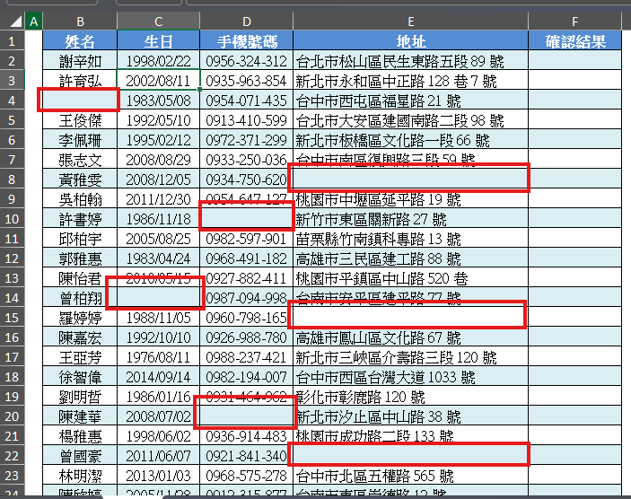
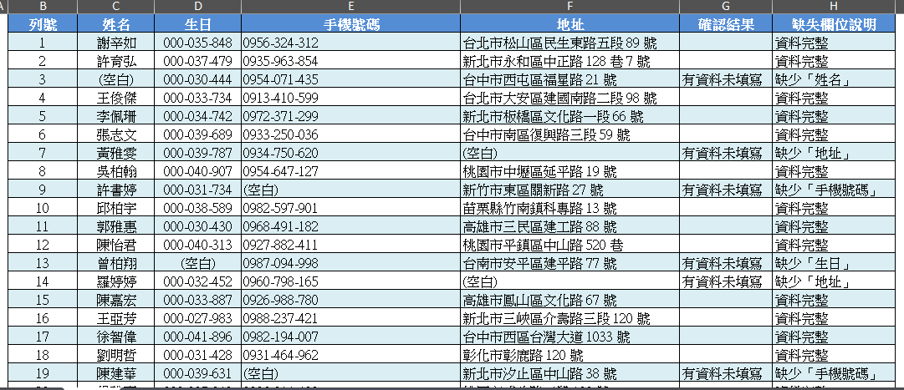

# Google Sheets 活用術：用 AI 生成函數與公式

## 複製 Google Sheets 資料，直接貼給 Gemini 產生答案

Gemini 擅長處理文字，因此可將 Google Sheets 中的資料複製成純文字，再請 AI 整理。適合的情況包括：

- **資料量不大**：幾十列至幾百列通常較適合；數千、數萬列不建議直接貼入聊天框。
- **欄位結構單純**：每列是一筆記錄，欄位間沒有複雜關聯。
- **原有表格格式不重要**：貼成純文字後，色彩、框線、欄寬及既有公式通常不會保留。
- **需求簡單明確**：例如檢查每列是否漏填、替每列加註記。

不適合的情況：

- 資料量很大，可能超過聊天輸入限制或造成瀏覽器負擔。
- 同一工作表內有多張表格，欄位間有複雜運算關係。
- 必須保留既有公式、格式、驗證規則或合併儲存格。
- 涉及跨表格合併、欄位比對與大量資料重組。
- 內容包含個資、機密或不得上傳的資料。

### Problem. 客戶資料缺漏檢查

任務是檢查每筆客戶資料的前四個欄位是否皆已填寫；若任一欄空白，就在欄位標示「有資料未填寫」。

- [檔案：客戶資料缺漏檢查.xlsx](./客戶資料缺漏檢查.xlsx)

1. 開啟 Gemini，在輸入框按 `Ctrl + V` 貼上資料。
1. 貼上需求提示詞。
1. 送出後檢查 Gemini 是否保留欄位順序。
1. 確認缺漏資料的列是否被標註。
1. 複製 AI 整理後的表格，貼回 Google Sheets，或使用「匯出到試算表」。



```text
### 提示詞
這是一份試算表資料，請檢查前四個欄位是否都有輸入資料，
若有空白的儲存格，請在「確認結果」欄標示「有資料未填寫」。

### 提示詞--建議改良版
你是一位資料品質檢查員。以下是從 Google Sheets 複製的客戶資料。

欄位依序為：姓名、生日、手機號碼、地址。
請逐列檢查這四個欄位：
- 四欄皆有資料：確認結果留白。
- 任一欄空白：確認結果填「有資料未填寫」。

請保留原資料，不要更改姓名、日期、電話或地址，也不要自行補值。
輸出完整表格，新增最後一欄「確認結果」。
```



### Problem. 員工聯絡資料完整性檢查

任務是檢查每位員工的重要聯絡資料是否完整，若有缺漏，請在最後一欄標示「資料不完整」。

- [員工聯絡資料.xlsx](./員工聯絡資料.xlsx)

## 請 AI 生成函數與公式，輔助整理資料

- [檔案：客戶資料缺漏檢查.xlsx](./客戶資料缺漏檢查.xlsx)

這是不請AI直接填寫，而是請他寫出公式讓我們帶入。

若很難用文字描述問題，可將含有欄號、列號、資料與目標欄位的截圖交給 Gemini。

```text
### 提示詞
請提供試算表的公式及函數，我想檢查 B2～E26 儲存格是否都有輸入資料。
如果有空白的儲存格，需要在 F2～F26 標示「有資料未填寫」。
```

```text
### 截圖提示詞
請分析附件中的 Google Sheets 截圖。
我要逐列檢查 B、C、D、E 四欄是否皆有資料，並在 F 欄顯示檢查結果。
請提供貼在 F2 的公式，向下填滿後要能逐列檢查。
請說明每個函數與範圍的作用。
```

## 不知道如何下手篩選資料？把檔案交給 AI

假設我們要將原資料中篩出各分類的最後一筆商品

- [檔案：人氣家電商品單價表.xlsx](./人氣家電商品單價表.xlsx)

1. 在 Gemini 對話上傳檔案。
1. 指定檔案名稱。
1. 描述來源工作表、資料範圍、分類欄與輸出位置。

```text
### 提示詞
從「人氣家電商品單價表」檔案，
篩選出每個「分類」最底下的那一筆資料，統整在 G3 儲存格，
並依照 G～I 欄的格式存放。

### 提示詞-改良版
請讀取「人氣家電商品表」。
資料範圍是 A3:C14，欄位依序為分類、商品編號、單價。

請找出每個分類在原表中最後出現的一筆資料，結果包含三欄，
並從 G3 開始輸出到 G:I。

請提供：
1. 預期結果表格。
2. 可放在 G3、會自動展開的 Google Sheets 公式。
3. 公式逐段說明。
不要改動原始資料。
```

- [GPT：篩選各分類最後一筆商品資料](https://gemini.google.com/app/6fad821ae54eb891)

### Problem.

---

# 單元 2-4　麻煩的資料篩選與排序，交給 AI 處理

## 2-4-1 原教材案例：北區、南區銷售額前五名

資料範圍為 `A3:C33`，主要欄位包括公司名稱、地區、銷售額。任務是：

- 篩選北區與南區。
- 各取銷售額最高的前五筆。
- 由大至小排序。
- 北區結果放 `G3:G7`，南區結果放 `H3:H7`。

原教材示例結果：

| 排名 | 北區銷售額 | 南區銷售額 |
| ---: | ---------: | ---------: |
|    1 |  6,419,300 |  5,431,200 |
|    2 |  6,008,400 |  4,812,900 |
|    3 |  5,936,200 |  4,793,800 |
|    4 |  5,431,500 |  4,527,600 |
|    5 |  5,410,600 |  4,527,300 |

## 2-4-2 文字＋截圖提示法

原教材建議，複雜表格很難用文字完整描述時，可附截圖，並清楚寫出來源範圍與目標儲存格。

### 原教材提示詞概念

```text
我有一份 Google 試算表，請從 A3:C33 資料中，
分別篩選出北區、南區銷售額前五名的資料並由大至小排序，填入 G3:H7。

G3 是北區排名第一、G4 是北區排名第二……G7 是北區排名第五；
H3 是南區排名第一、H4 是南區排名第二……H7 是南區排名第五。
```

### 建議完整提示詞

```text
請依附件中的 Google Sheets 截圖產生公式。
資料範圍 A3:C33，其中 B 欄是地區、C 欄是銷售額。

任務：
- 北區銷售額前五名，由大至小，從 G3 向下輸出。
- 南區銷售額前五名，由大至小，從 H3 向下輸出。
- 忽略空白列。
- 若不足五筆，僅顯示現有筆數，不要補 0。

請分別提供 G3、H3 的 Google Sheets 公式及函數說明。
```

## 2-4-3 公式

北區，貼在 `G3`：

```excel
=CHOOSEROWS(SORT(FILTER(C3:C33,B3:B33="北區"),1,FALSE),SEQUENCE(MIN(5,COUNTIF(B3:B33,"北區"))))
```

南區，貼在 `H3`：

```excel
=CHOOSEROWS(SORT(FILTER(C3:C33,B3:B33="南區"),1,FALSE),SEQUENCE(MIN(5,COUNTIF(B3:B33,"南區"))))
```

### 函數拆解

1. `FILTER`：只留下指定地區的銷售額。
2. `SORT(...,1,FALSE)`：依第一欄降冪排序。
3. `SEQUENCE`：產生要保留的前幾筆列號。
4. `CHOOSEROWS`：取出排序後的前五列。
5. `MIN(5,COUNTIF(...))`：資料不足五筆時避免索引超出。

### 若也要顯示公司名稱

```excel
=CHOOSEROWS(SORT(FILTER({A3:A33,C3:C33},B3:B33="北區"),2,FALSE),SEQUENCE(MIN(5,COUNTIF(B3:B33,"北區"))))
```

## 2-4-4 驗證方式

- 手動篩選北區，將銷售額由 Z→A 排序，核對前五筆。
- 確認公式中的地區欄與金額欄沒有對調。
- 檢查金額是否被當成文字；文字金額可能排序錯誤。
- 新增一筆更高銷售額，確認動態公式是否自動更新。

## 2-4-5 練習題

將公式改為：

1. 東區前三名。
2. 北區前五名，但同時顯示公司名稱與銷售額。
3. 銷售額最低的三筆，由小至大。

### 參考答案方向

- 地區條件改為 `"東區"`。
- 篩選範圍改成 `{A3:A33,C3:C33}`，排序欄改為第 2 欄。
- `FALSE` 改為 `TRUE`，保留前三筆。

---

# 單元 2-5　用 AI 解決跨工作表的彙總計算

## 2-5-1 原教材案例

銷售資料分別放在 `第1週`、`第2週`、`第3週`、`第4週`、`第5週` 工作表，每張表的 `E10` 是該週總金額。希望在 `統計` 工作表計算：

1. `B1`：第 1 週到第 5 週總銷售額。
2. `B2`：第 1 週到第 3 週，商品編號 `JAK001` 的總金額。

## 2-5-2 提示詞

```text
@Google 雲端硬碟 我有一個「銷售資料」檔案。
請替 Google Sheets 產生公式：

1. 加總「第1週」至「第5週」每張工作表的 E10，結果放在「統計」!B1。
2. 加總「第1週」至「第3週」中商品編號 JAK001 的金額，
   每張表商品編號在 A 欄、金額在 E 欄，結果放在「統計」!B2。

請提供可直接貼上的公式、公式說明，以及 #REF! 時的檢查方式。
```

## 2-5-3 任務一：加總五張週報的 E10

### 穩定、容易理解的公式

貼在 `統計!B1`：

```excel
='第1週'!E10+'第2週'!E10+'第3週'!E10+'第4週'!E10+'第5週'!E10
```

也可寫成：

```excel
=SUM('第1週'!E10,'第2週'!E10,'第3週'!E10,'第4週'!E10,'第5週'!E10)
```

原教材示例計算結果為：`1,453,656`。

### 為何原先可能出現 `#REF!`？

某些 AI 會產生類似：

```excel
=SUM('第1週:第5週'!E10)
```

這是 Excel 常見的 3D 參照思路，但 Google Sheets 不一定支援相同語法，因此可能出現 `#REF!`。此時應改成逐張工作表相加。

### `#REF!` 排錯清單

1. 工作表名稱是否一字不差？`第1週` 與 `第 1 週` 不相同。
2. 工作表順序是否合理？不要把 `統計` 放入循環範圍。
3. 名稱含空格或特殊字元時，是否使用單引號包住？
4. 每張週表的 `E10` 是否真的是總額，且為數值格式？
5. AI 是否使用了 Google Sheets 不支援的 Excel 語法？

## 2-5-4 任務二：跨三張工作表加總 JAK001

### 方法一：逐表 `SUMIF`，最容易教

貼在 `統計!B2`：

```excel
=SUMIF('第1週'!A:A,"JAK001",'第1週'!E:E)+SUMIF('第2週'!A:A,"JAK001",'第2週'!E:E)+SUMIF('第3週'!A:A,"JAK001",'第3週'!E:E)
```

### 方法二：垂直合併後統計

```excel
=SUM(QUERY({'第1週'!A:E;'第2週'!A:E;'第3週'!A:E},"select Col5 where Col1 = 'JAK001'",0))
```

公式概念：

- `{範圍1;範圍2;範圍3}`：把三張表垂直堆疊。
- `QUERY`：篩選第一欄為 `JAK001` 的資料，取第五欄金額。
- `SUM`：加總所有符合資料。

### 教師提醒

「若金額不是 E 欄，`Col5` 就必須改。假設金額在 B 欄，查詢欄位應改成 `Col2`。AI 不知道真實欄位時，很容易給出語法正確但欄位錯誤的公式。」

## 2-5-5 課堂題目

1. `#REF!` 是否一定代表函數名稱錯誤？
2. 為何跨表格計算前要先確認工作表名稱？
3. `SUMIF` 與 `QUERY` 兩種方法如何選擇？

### 參考答案

1. 不一定，也可能是工作表名稱、範圍或不支援的參照方式。
2. 公式引用必須完全符合名稱；空格、全形字元都可能造成錯誤。
3. 工作表少、需求簡單時 `SUMIF` 易懂；表多或還要做複雜篩選時，合併後用 `QUERY` 較有彈性。

---

# 四、提示詞寫法總整理

## 好提示詞的六個元素

| 元素     | 示例                          |
| -------- | ----------------------------- |
| 工具     | 請提供 Google Sheets 公式     |
| 來源     | 資料位於 A3:C33／指定雲端檔案 |
| 欄位     | B 欄是地區、C 欄是銷售額      |
| 條件     | 只取北區、由大至小            |
| 輸出位置 | 結果從 G3 開始                |
| 驗證     | 請解釋公式並提供測試方式      |

## 通用公式提示詞模板

```text
你是一位 Google Sheets 公式顧問。

資料位置：
- 工作表：【名稱】
- 資料範圍：【例如 A3:E100】
- 欄位定義：【A 欄是……，B 欄是……】

我要完成：【任務】。
判斷／篩選條件：【條件】。
排序方式：【方式】。
結果要放在：【目標儲存格】。

請提供：
1. 可直接貼入 Google Sheets 的公式。
2. 每個函數與範圍的解釋。
3. 一組預期結果或驗證方法。
4. 可能出現的錯誤與修正方式。

若資料資訊不足，請先指出缺少什麼，不要自行假設欄位。
```

---

# 五、AI 公式的五步驗證法

1. **看範圍**：逐列任務是否只檢查該列？
2. **看欄位**：條件欄、結果欄、加總欄是否正確？
3. **看方向**：排序是升冪還是降冪？
4. **做小測試**：準備一筆完整、一筆缺漏、一筆極端值。
5. **改動原資料**：新增或修改一筆，確認公式是否自動更新。

### 教師收尾句

「AI 最擅長快速提出第一版公式；使用者最重要的工作，是定義問題與驗證結果。公式可以不知道怎麼寫，但一定要知道自己想算什麼、資料在哪裡，以及答案應該長什麼樣子。」

---

# 六、綜合實作題

## 題目 A：客戶資料品質儀表

建立一份含姓名、生日、電話、地址的 20 筆資料，故意留下 5 筆缺漏。要求：

- 用公式逐列標示是否完整。
- 統計完整資料與缺漏資料各有幾筆。
- 將缺漏列篩選到另一區。

## 題目 B：區域銷售排行

使用公司、地區、銷售額資料：

- 找出北、南、東三區前 3 名。
- 同時顯示公司名稱與金額。
- 新增一筆資料後，排名自動更新。

## 題目 C：跨月份商品彙總

建立 1 月、2 月、3 月三張工作表：

- 加總每月總額。
- 加總指定商品三個月的金額。
- 故意將一張表改名，觀察並修正錯誤。

## 評量規準（100 分）

| 項目                               | 配分 |
| ---------------------------------- | ---: |
| 提示詞清楚描述範圍、欄位與輸出位置 |   20 |
| 公式能正確運算                     |   25 |
| 能解釋公式主要函數                 |   15 |
| 有建立測試案例並驗證               |   20 |
| 能辨識並修正常見錯誤               |   10 |
| 不洩漏個資且保留原始資料           |   10 |

---

# 七、課末快問快答

1. **逐列檢查 B～E 欄時，公式應使用 `B2:E2` 還是 `B2:E26`？**  
   答：放在 F2 並向下填滿時應使用 `B2:E2`。

2. **AI 公式可直接相信嗎？**  
   答：不可。必須檢查範圍、欄位、條件並以測試資料驗證。

3. **為什麼截圖要保留欄號與列號？**  
   答：AI 才能準確描述公式範圍及目標儲存格。

4. **Gemini 沒有把結果寫入 G3，是公式錯誤嗎？**  
   答：不一定，可能只是沒有雲端檔案寫入權限；可複製結果或公式貼回試算表。

5. **Google Sheets 出現 `#REF!` 時首先檢查什麼？**  
   答：工作表名稱、引用範圍及公式是否用了不支援的語法。

6. **要讓篩選結果隨原資料更新，應貼值還是貼公式？**  
   答：貼動態公式。
