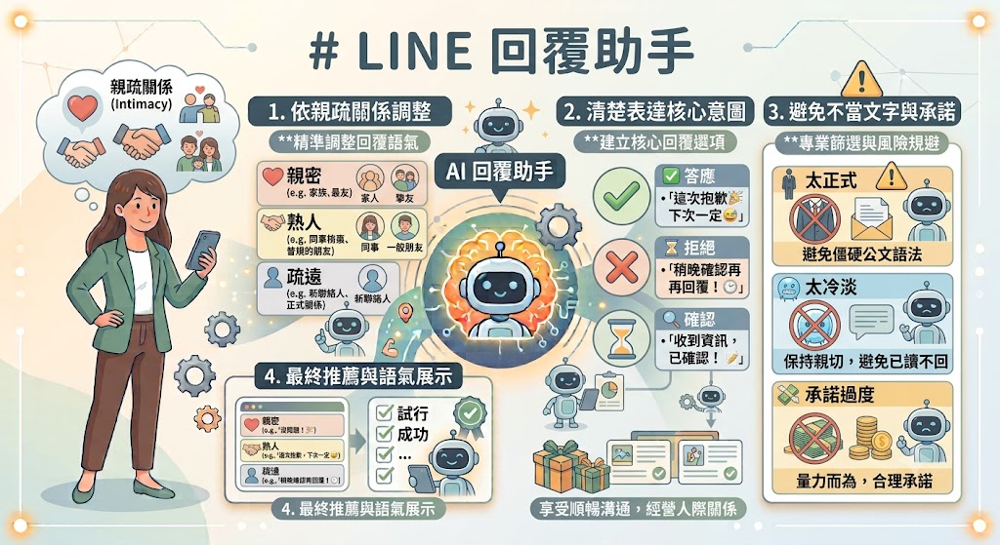
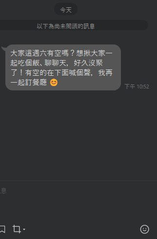
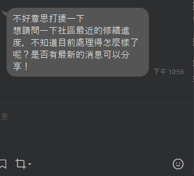
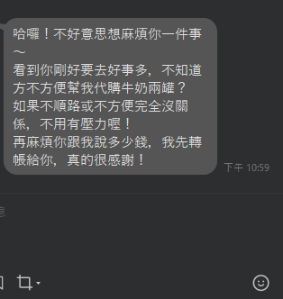
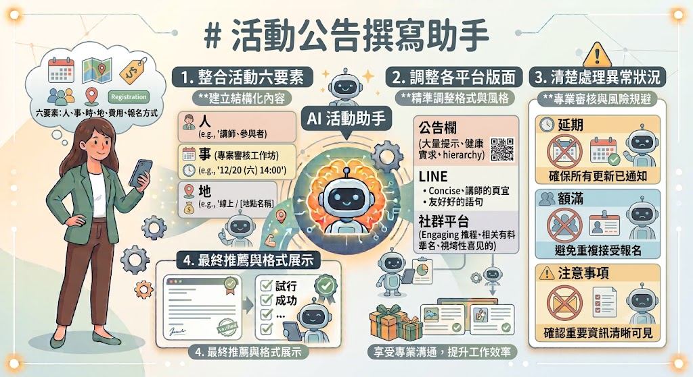
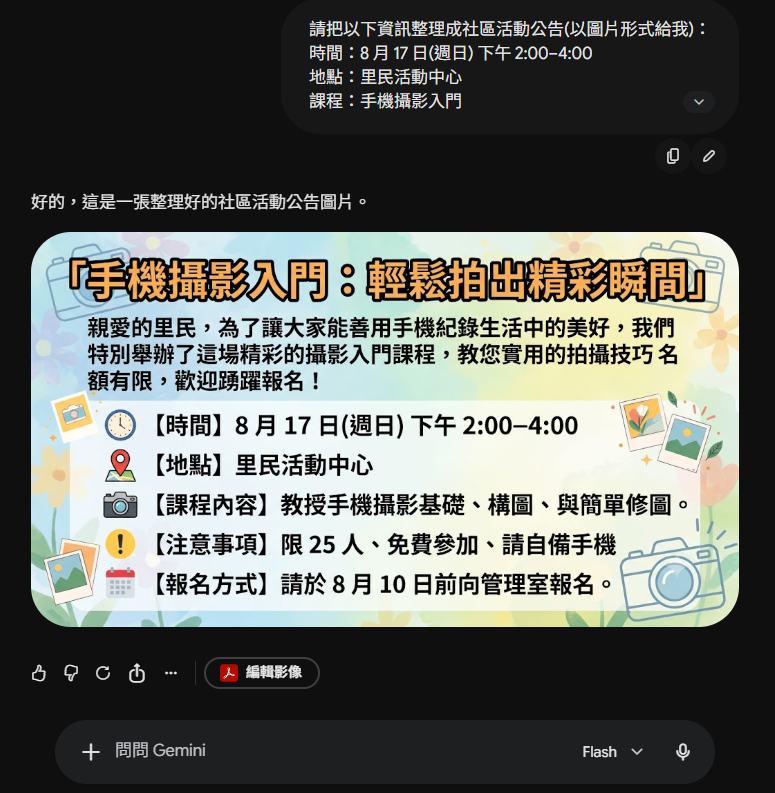
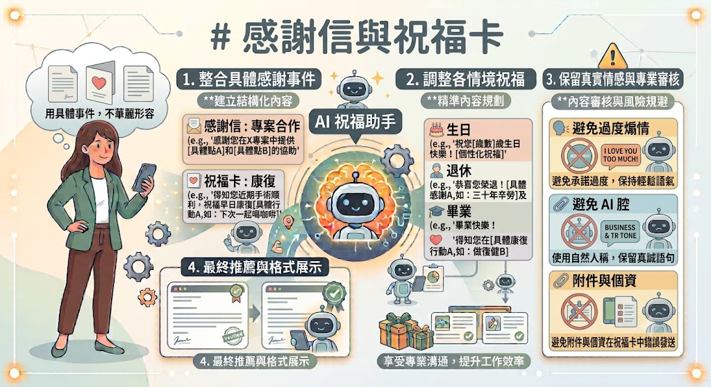
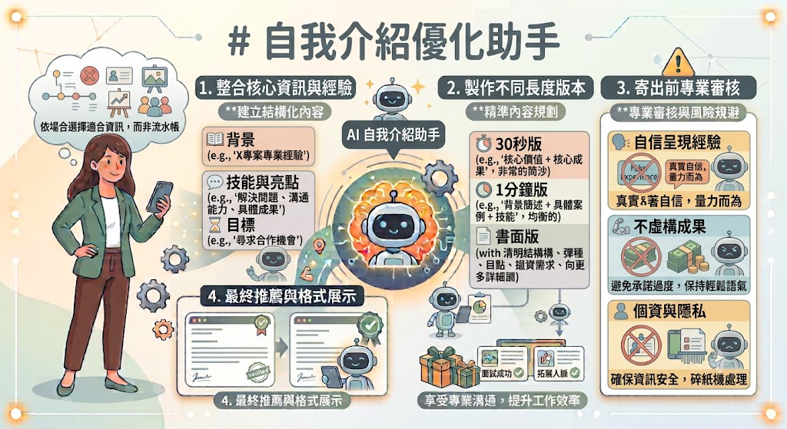
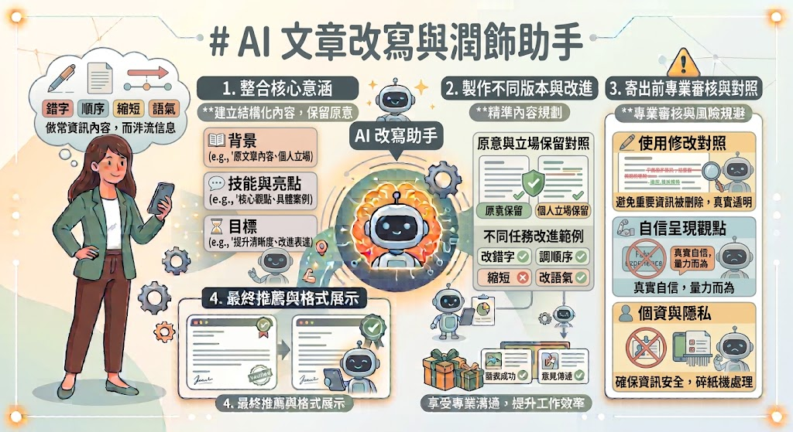
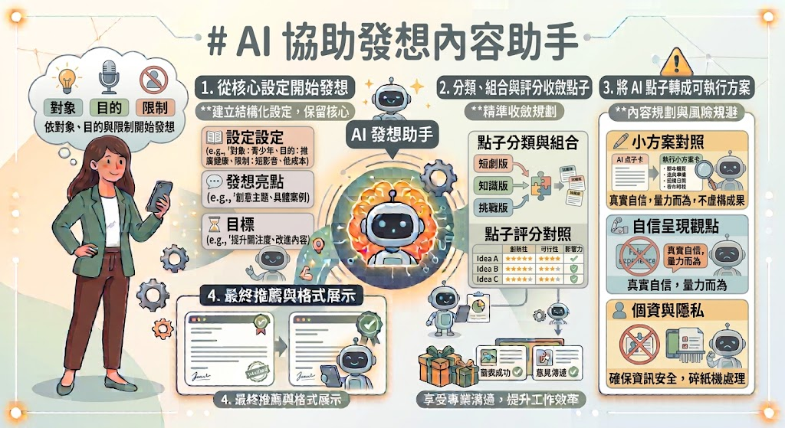

# 社區大學\_AI文字應用

## LINE回覆助手

「LINE 最難的常不是沒有字，而是不知道怎麼回才不失禮。AI 能提供草稿，但它不知道你和對方的關係，所以一定要告訴它：對方是家人、朋友、鄰居，還是工作夥伴。」

- 依親疏關係調整 LINE 回覆語氣。
- 清楚表達答應、拒絕、延後回覆與確認資訊。
- 避免 AI 寫出太正式、太冷淡或承諾過度的文字。



> Meta AI
> Android版本：https://play.google.com/store/apps/details?id=com.facebook.stella&hl=zh_TW
> IOS版本：https://apps.apple.com/tw/app/meta-ai/id1558240027

### Problem.



```text
朋友邀我本週六參加聚餐，但我已經有家庭行程。
請寫一則 LINE 回覆，先謝謝邀請，再簡短婉拒，不要編造理由，也不要承諾下次一定參加。語氣自然。
提供溫暖版與簡潔版。
```

### Problem.已讀但不能立刻處理

鄰居傳訊息詢問社區修繕，我現在正在上班，晚上才能查看。請寫一則 40 字內的回覆，讓對方知道我已收到，但不要讓人誤會我已答應處理。



### Problem. 家庭群組確認人數

請寫訊息詢問下週日聚餐人數、飲食限制及是否需要兒童座椅，設定週三為回覆期限；語氣親切，不像公文。

### Problem. 婉拒代購

親友請你代購商品，但你不熟悉規格，也不希望負責退換貨。請 AI 寫出有界線又不責怪對方的版本。



### Problem. 一句話三種關係

將「我今天會晚到 20 分鐘」分別寫給好友、社區課程老師與工作同事。全班比較哪些字詞顯示關係差異。

## Email撰寫

- 寫出清楚主旨、稱呼、正文與署名。
- 把背景、請求及期限分開表達。
- 附件和個資在寄出前再次確認。


```text
請幫我寫 Email 給社區大學承辦人，詢問秋季班報名是否成功。我在 7 月 25 日完成線上繳費，但尚未收到確認信。
語氣有禮、簡潔，提供主旨；
正文先說明情況，再請對方協助確認。
不要替我編造姓名、訂單號碼或電話，
以［請填寫］標示缺少資料。
```

### Problem. 預約改期

你原本和課程講師約好週二下午進行 1 小時的個別討論，但因家中臨時有重要事情需要處理，無法依原定時間出席。希望改約到本週四下午，若講師已有其他安排，也願意配合重新協調時間。

請 AI 撰寫一封 Email，並提供 兩個不同風格的信件主旨，內容需有禮貌地說明原因，同時保留讓講師婉拒或提出其他時間的空間。

### Problem. 詢問報價

你正在協助籌辦一場社區活動，預計約 40 人參加，希望租借場地於 週六下午使用。

除了基本場地外，還需要了解是否提供 投影設備、茶水服務，以及活動若臨時取消或延期時的退費與取消規定。

請 AI 撰寫一封詢價 Email，將所有想確認的事項整理成條列式問題，避免因資訊不足而需要來回寄送多封信件。

### Problem. 附件忘了放

你寄出一封工作 Email 後，才發現信中提到「請參閱附件」，但實際上忘記附上檔案。希望立即補寄附件，讓對方可以順利收到完整資料。

請 AI 撰寫一封簡短的補寄 Email，直接承認是自己疏忽即可，不需要過度道歉，也不要寫得太冗長，重點是讓對方快速知道附件已補上。

## 活動公告撰寫



- 寫齊活動六要素：人、事、時、地、費用、報名方式。
- 依公告欄、LINE、社群平台調整版面。
- 清楚處理延期、額滿與注意事項。

```text
請把以下資訊整理成社區活動公告(以圖片形式給我)：
時間：8 月 17 日(週日) 下午 2:00–4:00
地點：里民活動中心
課程：手機攝影入門
限 25 人、免費、自備手機
8 月 10 日前向管理室報名。

先給醒目標題，再用短段落及條列呈現。
不得增加我沒提供的講師姓名或聯絡電話。
```



### Problem. 健康講座公告

社區發展協會將舉辦一場健康講座，希望張貼於里民活動中心公告欄。

請依照以下資料撰寫一份 A4 活動公告：

- 活動名稱：銀髮健康保健講座
- 日期：9 月 20 日(六)
- 時間：上午 9:30–11:30
- 地點：幸福里民活動中心
- 對象：55 歲以上民眾
- 費用：免費
- 名額：40 人
- 報名期限：9 月 15 日
- 報名方式：向里辦公處登記
- 注意事項：請攜帶健保卡及環保杯。

請先設計醒目標題，再用短段落及條列方式呈現，最後列出公告中還有哪些資訊建議補充，但不得自行虛構。

### Problem. 同一活動，不同宣傳平台

以下是一則社區活動公告：

```text
🎉 秋季手作課程開始報名！
社區大學將於 10 月 4 日(六)下午 2:00–4:30，在文化活動中心舉辦「療癒乾燥花手作課」，邀請有興趣的民眾一起動手創作。
活動限額 30 人，材料費 200 元，請於 9 月 28 日前向服務台完成報名及繳費，額滿為止。活動當天請提前 10 分鐘報到。
```

請將以上內容改寫成：

1. 公布欄 A4 公告版。
2. 電梯公告版(80 字內)。
3. LINE 群組通知版(100 字內)。

### Problem. 颱風延期公告

原訂於 **8 月 24 日(日) 下午 2:00** 在 **永安里民活動中心** 舉辦的 **「親子桌遊體驗活動」**，因颱風來襲宣布延期。

目前新的活動日期尚未確定。

已完成報名的民眾 **不需要重新報名**，待新日期確定後將統一通知。

請 AI 撰寫一份適合同時發布於公告欄與 LINE 群組的延期公告，要求標題一眼就能知道活動延期，避免居民誤以為活動照常舉辦。

### Problem. 公告挑錯大會

下面是一份活動公告：

```text
**✨ 社區電影欣賞✨**
歡迎大家一起來看電影！
時間：10/18 下午開始
地點：活動中心
請大家記得報名。
有問題請洽服務台。
```

請 AI 扮演第一次看到公告的居民，找出這份公告容易造成困惑或資訊不足的地方，例如：

- 哪些資訊不夠明確？
- 哪些內容可能讓居民誤解？
- 還缺少哪些重要資訊？

最後請重新整理成一份完整、容易閱讀的社區活動公告。

## 邀請函撰寫

- 分辨正式邀請與私人邀請。
- 交代邀請原因、活動資訊及回覆方式。
- 避免用情緒壓力要求對方出席。


```text
請寫一則邀請老同學參加畢業 30 年聚會的訊息。
日期為 9 月 14 日中午，地點在台中車站附近，餐廳待人數確認後公布，請在 8 月 20 日前回覆。語氣溫暖、有懷舊感，但不要暗示沒參加就是不重感情。
```

### Problem. 家庭聚餐邀請

王媽媽將於 10 月 5 日(日) 中午 舉辦 70 歲生日餐會，地點為高雄福華大飯店，希望邀請親友一起慶祝。
請 AI 分別撰寫：

- 適合傳給長輩的 LINE 邀請訊息。
- 適合傳給同輩或晚輩的 LINE 邀請訊息。

內容需包含：

- 活動時間與地點。
- 不收禮，只希望大家一起吃飯。
- 請於 9 月 20 日前 回覆是否參加。
- 若有素食或其他飲食需求，請一併告知。

兩個版本需呈現不同語氣，但資訊都要完整。

### Problem. 邀請專家擔任講師

社區大學希望邀請一位金融專家，分享「常見詐騙手法與防詐觀念」。

請 AI 撰寫一封正式 Email，內容包含：

- 活動日期：11 月 8 日(六)
- 時間：下午 2:00–4:00
- 地點：文化中心演講廳
- 對象：一般民眾
- 預估人數：約 80 人

並禮貌詢問：

- 是否方便擔任講師。
- 是否有演講費或交通費需求。
- 是否需要提供投影設備或其他器材。
- 希望於一週內回覆。

信件需正式但不生硬。

### Problem. 小型聚會邀請

今年的同學聚會因餐廳包廂座位有限，只能邀請平時固定聯絡的同學參加，希望之後再規劃大型聚會。

請 AI 撰寫一段內部說明，避免讓未受邀的人感到被排擠或比較，語氣需自然、誠懇，不要使用容易造成誤會的措辭。

### Problem. 同一活動，不同邀請方式

社區將於 **9 月 27 日(六) 上午 9:00–12:00** 舉辦「社區大掃除」，集合地點為里民活動中心，活動免費，請自備手套與水壺。

請 AI 分別撰寫：

1. 社區公布欄正式邀請。
2. LINE 群組邀請訊息。
3. Facebook 社團貼文。

比較三個版本在語氣、長度及內容上的差異，並說明哪些資訊一定要保留。

## 感謝信與祝福卡

- 用具體事件表達感謝，而非堆疊華麗形容詞。
- 依生日、退休、康復、畢業等情境調整祝福。
- 保留真實情感，避免 AI 腔與過度煽情。



```text
我要寫一張卡片謝謝照顧父親的居家服務員。具體想感謝的是：她每次耐心聽父親說話，也會提醒我們補充日用品。
請將這些事寫成 100 字內、真誠平實的文字，不誇大、不代表父親說他未說過的話。
```

### Problem. 謝謝照顧長輩的人

阿姨長期協助照顧家中的長輩，不僅會耐心陪伴聊天，也經常提醒家屬注意生活用品是否足夠。

請 AI 撰寫一段約 100 字的感謝卡內容，要求：

- 提及兩件具體的小事。
- 語氣真誠、自然。
- 不過度讚美，也不要替長輩表達未曾說過的感受。

### Problem. 退休祝福卡

王老師即將退休，任教社區大學 15 年，平時總是提早到教室協助學員準備設備，也很有耐心回答問題。

請 AI 撰寫一張退休祝福卡，內容包含：

- 一段具體回憶。
- 感謝對社區的付出。
- 對退休生活的祝福。

避免使用「終於退休」「功成身退」「享清福」等可能讓人感到不自在的詞語。

### Problem. 感謝鄰居幫忙

出差期間，鄰居除了幫忙代收包裹，還發現陽台漏水並立即通知你，避免造成更大的損失。

請 AI 分別撰寫：

- LINE 感謝訊息(50 字內)。
- 手寫卡片內容(120 字內)。

比較兩種版本在語氣與內容上的差異。

### Problem. 康復祝福

朋友最近因身體不適正在休養，目前狀況已有好轉，但仍需要一段時間恢復。

請 AI 撰寫一段關心訊息，要求：

- 不主動詢問病情。
- 不提供醫療建議。
- 不保證一定會康復。
- 讓對方感受到關心，而不是壓力。

### Problem. 生日卡改寫

下面是一段 AI 產生的生日祝福：「願你的生命如璀璨星河，歲月如詩如畫，每一天都綻放耀眼光芒，開啟人生新的精彩篇章。」

請 AI 將這段內容改寫成：

- 像平常和好友聊天的口吻。
- 保留祝福，但避免過度華麗。
- 加入一句具體的小回憶，讓祝福更有溫度。

## 自我介紹優化



- 依場合選擇適合資訊，而非從出生講到現在。
- 建立 30 秒、1 分鐘與書面版本。
- 自信呈現經驗，不虛構學歷、職稱或成果。

### Problem. 社大第一天自我介紹

以下是真實資料：

```text
- 姓名：林美惠
- 居住地：高雄市左營區
- 退休前擔任行政人員 22 年
- 平時喜歡健走、旅遊及拍照
- 這次報名 AI 課程，希望學會使用 AI，也認識更多朋友
```

請 AI 撰寫一段 **30 秒口語自我介紹**，內容自然、親切，不需要透露年齡、詳細住址或其他個人隱私，最後加入一句能讓同學容易接話的內容。

### Problem. 志工面談自我介紹

你準備參加圖書館志工面談，以下是你的經歷：

```text
- 曾擔任公司行政工作 18 年
- 平時協助社區活動報到與文書整理
- 喜歡與人互動，也習慣協助長輩使用手機
```

請 AI 撰寫一段約 **1 分鐘** 的自我介紹，強調自己的溝通能力、耐心及服務經驗，但不得虛構證照、獎項或志工經歷。

### Problem. 加入 LINE 新群組

你剛加入社區大學 AI 課程的 LINE 群組，希望先向大家打招呼。

請根據以下資料撰寫一段 **80 字內** 的自我介紹，內容需親切自然，不要透露電話、詳細住址或其他個人隱私。

```
- 姓名：陳建宏
- 住在台南市東區
- 喜歡園藝和攝影
- 希望學會 AI 協助整理生活資料
```

### Problem. 同一份資料，不同場合

以下是同一位學員的資料，請 AI 分別撰寫：

1. 社區大學課堂自我介紹。
2. 登山社新社員自我介紹。
3. 同學聚會重新認識大家的自我介紹。

最後比較三個版本有哪些內容保留、哪些內容需要調整，並說明原因。

```
- 曾任銀行行政 25 年
- 喜歡登山、閱讀及攝影
- 退休後開始學習 AI，希望提升生活便利性
```

## 文章改寫與潤飾

- 分辨改錯字、調順序、縮短與改語氣等不同任務。
- 保留原意與個人立場。
- 使用修改對照避免重要資訊被刪除。



### 常用指令差異

| 指令 | 主要工作                     |
| ---- | ---------------------------- |
| 校對 | 錯字、標點、基本語法         |
| 潤飾 | 讓句子自然順暢               |
| 改寫 | 改變結構、語氣或表達方式     |
| 縮寫 | 保留重點、減少篇幅           |
| 擴寫 | 補充說明；須防止 AI 編造事實 |

### Problem. 旅遊心得潤飾

下面是一段旅遊心得：

```text
上個星期天我們一家人去旗津玩，天氣真的很熱，可是風很大，所以沒有那麼不舒服。我們先去吃海產，後來又租腳踏車騎去燈塔，途中一直停下來拍照，所以比原本預計晚很多。回家雖然很累，但是大家都玩得很開心，我覺得下次如果不要那麼晚出門應該會更好。
```

請 AI 協助：

- 修正錯字、標點及語句不順。
- 保留第一人稱及原本口吻。
- 不增加新的景點或經歷。
- 最後列出三項主要修改內容。

### Problem. 抱怨改成溝通

下面是一段住戶抱怨：「你們每次晚上都很吵，完全不尊重別人，每天都這樣誰受得了？」

請 AI 將內容改寫成適合向社區管委會或鄰居反映的文字，要求：

- 保留原本想表達的問題。
- 描述實際情況與造成的影響。
- 提出具體且有禮貌的請求。
- 避免責備或情緒化用詞。

### Problem. 同一段話，不同語氣

下面是一段通知：「下週開始課程改到二樓教室，請大家不要跑錯。」

請 AI 分別改寫成：

- 正式公告版。
- LINE 群組通知版。
- 親切提醒版。
- 長輩容易閱讀版。

最後比較四種版本在用字與語氣上的差異。

## 長文摘要整理

- 依閱讀目的選擇摘要格式。
- 區分原文內容、AI 推論與未提及事項。
- 回到原文核對日期、數字與關鍵條件。

### Problem. 社區會議紀錄整理

以下是一份社區會議紀錄：https://glrs.moi.gov.tw/LawContent.aspx?id=FL003853#lawmenu

請透過AI：

- 100 字摘要。
- 條列所有正式決議事項。
- 整理每項工作的負責人與完成期限。

### Problem. 保險條款白話整理

以下是一份南山人壽的機車保險說明：https://ecrwd.nanshangeneral.com.tw/nanshanEC/html/best-selling

請透過AI：

- 用一般民眾容易理解的方式整理。
- 條列重要金額、期間及例外情況。
- 哪些地方建議向保險公司再確認？
- 不可提供法律或理賠結論。

### Problem. 新聞重點整理

以下是一份財經新聞：https://reurl.cc/gN2o1R

請透過AI：

- 用 500 字整理新聞。
- 整理：
  - 誰？
  - 發生什麼事？
  - 何時開始？
  - 資料來源？
- 哪些內容仍有爭議？
- 哪些事情尚未確定？
- 不可加入其他新聞內容。

## AI協助發想內容

- 從對象、目的與限制開始發想。
- 用分類、組合與評分收斂點子。
- 將 AI 點子轉成可執行的小方案。



```text
我正在規劃社區大學的秋季活動，希望請 AI 協助發想。

對象：40～75 歲社區居民。
目的：提高參與意願，讓居民願意報名。
限制：
- 不需要昂貴設備。
- 活動時間約 2 小時。
- 適合初學者。
- 不涉及醫療診斷或專業證照。

請依照以下步驟回答：

1. 分成健康、生活、AI 應用、手作、休閒五個類別。
2. 每類提出 5 個活動點子。
3. 每個點子用一句話說明特色。
4. 依「吸引力」「容易執行」「預算需求」各 5 分評分。
5. 推薦最值得辦的前三名，並說明理由。
```

### Problem. 幫社區課程取名字

社區大學準備開設一門課程：利用 AI 幫忙整理照片、寫文章、規劃旅遊及生活大小事。

請 AI：

1. 提出 **15 個課程名稱**。
2. 分成：
   - 清楚易懂型
   - 親切生活型
   - 活潑有趣型

3. 刪除可能誇大效果或容易誤導的名稱。
4. 最後推薦最適合社區大學招生的 5 個名稱，並說明原因。

### Problem. 家庭聚會活動發想

一家三代準備在週末聚餐，希望飯後安排一些互動活動。

限制條件：

- 共 8 人。
- 年齡 8 歲～75 歲。
- 室內活動。
- 時間 2 小時。
- 預算 500 元內。
- 不需要另外購買大量材料。

請 AI：

1. 發想 15 個活動。
2. 分成：
   - 動腦型
   - 動手型
   - 互動聊天型

3. 每個活動說明玩法及適合原因。
4. 最後挑選最推薦的 3 個。

### Problem. 社區活動企劃發想

社區希望舉辦一場能吸引居民參加的新活動。

請 AI 先提出 **20 個活動點子**。

再依照：

- 容易吸引居民。
- 經費需求低。
- 容易舉辦。
- 適合各年齡層。

四項各 5 分評分。

最後留下最值得辦的 **3 個活動**，並說明淘汰其他點子的原因。

### Problem. 把點子變成活動企劃

從下列活動中選擇一項：

- 手機攝影。
- AI 生活應用。
- 健康料理。
- 桌遊交流。
- 手作盆栽。

請 AI 完成：

1. 活動名稱。
2. 活動目標。
3. 適合對象。
4. 2 小時流程安排。
5. 需要準備的物品。
6. 宣傳文案(100 字)。
7. 哪些內容需要主辦單位自行補充。

### Problem. 早餐店新品發想

你是一間早餐店老闆，希望推出新的套餐。

限制：

- 成本不要太高。
- 能快速製作。
- 適合上班族。
- 不需要新增大型設備。

請 AI：

1. 發想 15 種套餐。
2. 每種包含：
   - 名稱
   - 內容
   - 特色

3. 評估：
   - 吸引力
   - 成本
   - 製作難度

4. 推薦最值得推出的 3 個。

### Problem. 社群貼文主題發想

你經營一個介紹 AI 工具的 Facebook 粉絲專頁，希望增加互動率。

請 AI：

1. 發想 30 個貼文主題。
2. 分成：
   - 教學
   - 生活應用
   - 實測分享
   - 常見問題
   - 有趣互動

3. 哪些適合短影片？
4. 哪些適合圖文？
5. 推薦未來一週每天發布的內容。

## AI建立個人寫作流程

- 串聯發想、草稿、修改、校對與發布。
- 分清楚 AI 負責的工作與自己的責任。
- 建立可重複使用的個人檢查表。

### 五階段流程

1. **定任務**：對象、目的、必要資訊。
2. **出草稿**：要求一版即可，先求完整。
3. **改內容**：調結構、語氣、長度與行動指示。
4. **核事實**：姓名、日期、數字、連結、附件與引用。
5. **本人定稿**：朗讀一次，刪除不像自己的句子再發送。

```text
### 定任務 (需求確認)
我準備寫一篇內容，請先不要直接開始寫。

請先協助我整理：

1. 寫給誰？
2. 寫這篇的目的？
3. 一定要包含哪些資訊？
4. 有哪些資訊不能自己補充？
5. 建議使用什麼語氣？
6. 是否還缺少重要資訊？

如果資訊不足，請先詢問我，不要自行假設。
```

```text
### 出草稿 (完成第一版)
請根據以下資料，先完成一份草稿。

要求：

- 保留所有事實。
- 不自行新增人物、日期、數字或經歷。
- 使用自然口語。
- 先求完整，不必追求完美。

資料：

(貼上內容)
```

```text
### 改內容 (修改與潤飾)
請協助修改這份內容。

修改重點：

- 讓句子更順。
- 保留原本意思。
- 保留第一人稱。
- 不改變立場。
- 不增加新的資訊。

最後請列出：

1. 修改後版本。
2. 三個主要修改重點。
```

```text
### 核事實 (AI 幫忙檢查)
請不要改寫內容。

請只協助檢查：

□ 人名是否一致
□ 日期是否一致
□ 時間是否一致
□ 數字是否一致
□ 地點是否一致
□ 是否提到附件但沒有附件
□ 是否提到連結但沒有提供
□ 是否有前後矛盾

若無法確認，請直接標示：

「需要人工確認」

不要自行猜測答案。
```

```text
### 本人定稿 (最後確認)
請站在收件人的角度閱讀這篇內容。

回答：

1. 哪一句最不像一般人會說？
2. 哪一句可以更自然？
3. 哪一句可能造成誤解？
4. 是否有重複內容？
5. 哪一句可以刪除？

請不要重新全部改寫，只提出修改建議。
```

### Problem. 從零完成一封 Email

你需要寄信給社區大學，詢問是否還有 **AI 課程** 的名額。

已知資訊：

- 姓名：林美惠
- 想報名 AI 課程
- 想詢問是否還能報名
- 若已額滿，希望知道是否有候補或下一梯次

請依照五個步驟完成：

1. 確認是否還缺少資訊。
2. 產生 Email 草稿。
3. 修改語氣，使內容更自然。
4. 檢查是否有日期、姓名或資訊遺漏。
5. 最後列出寄出前的檢查清單。

### Problem. 活動公告完整流程

社區即將舉辦一場活動。資料如下：

- 活動：AI 手機生活應用
- 日期：10 月 18 日(六)
- 時間：下午 2:00–4:00
- 地點：幸福里活動中心
- 對象：一般民眾
- 費用：免費
- 名額：30 人
- 報名截止：10 月 10 日
- 報名方式：里辦公室登記

請依照五個步驟完成：

1. 檢查資料是否完整。
2. 產生活動公告。
3. 改成更容易閱讀的版本。
4. 檢查日期、地點及名額是否一致。
5. 最後列出公告發布前應確認的事項。

### Problem. LINE 邀請訊息

你準備邀請朋友一起聚餐。資料如下：

- 時間：9 月 13 日(六) 下午 6 點
- 地點：高雄夢時代附近
- 原因：半年沒見
- 餐廳：待確認
- 希望大家 9 月 5 日前回覆

請依照五個步驟完成整個 AI 寫作流程。

最後檢查：

- 是否有造成壓力？
- 是否容易回覆？
- 是否缺少重要資訊？

### Problem. 心得分享

完成社區大學 AI 課程後，希望寫一篇心得。

內容至少包含：

- 原本最大的擔心。
- 學到哪些內容。
- 哪個工具最有幫助。
- 未來希望如何應用。

請依照五個步驟完成。

最後請 AI 指出：

- 哪一句最像 AI？
- 哪一句最像自己？
- 哪裡可以加入自己的真實經驗？
