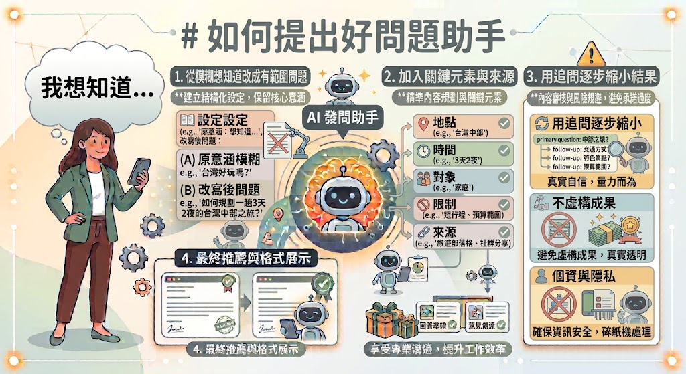
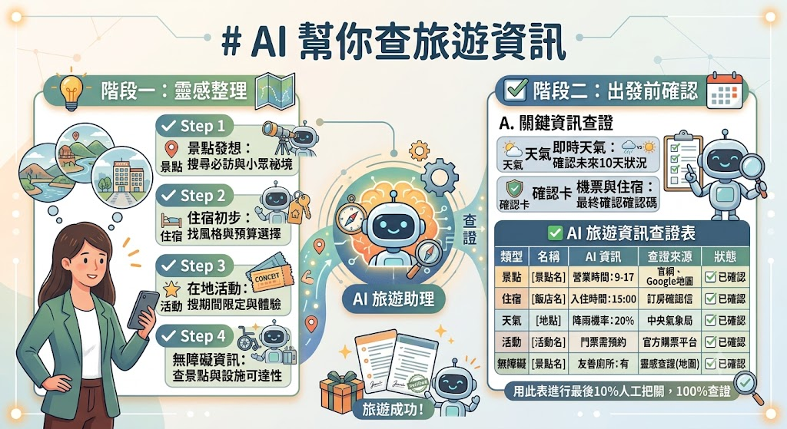
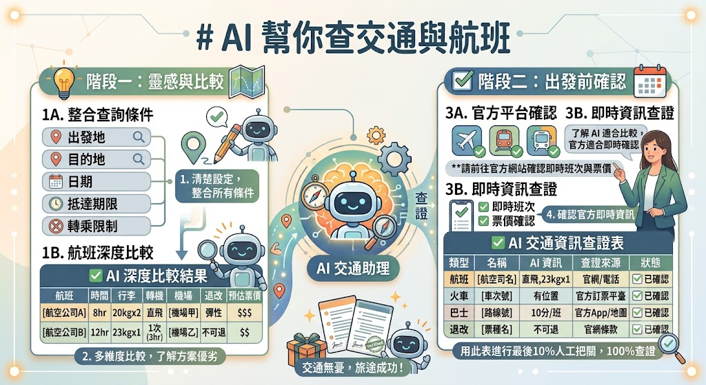
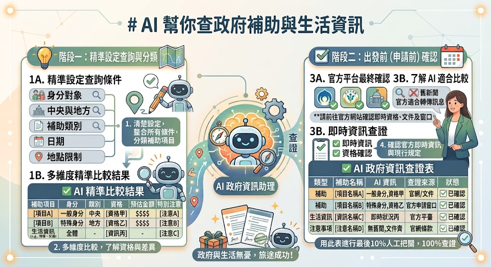
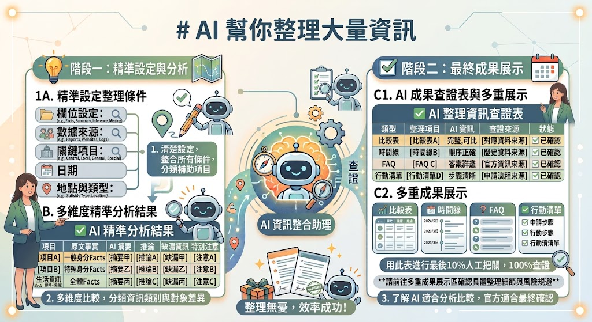

# AI搜尋與資訊整理：

## AI搜尋比Google更有效？

- [手把手打造自動化AI 資料搜集小助手](https://www.youtube.com/watch?v=BEmbCq9SMg4)
- [為什麼科技巨頭都愛用 Perplexity？網友用過後驚呼：終於可以跟滿是廣告的 Google 說拜拜了！！](https://www.youtube.com/watch?v=ZC3L94U0_sc)

「AI 搜尋不一定永遠比 Google 好。Google 很適合找官方網站、地址或特定頁面；AI 適合把複雜問題拆開、整理多個來源和協助比較。真正有效的是選對工具。」

先理解兩者最大的差別：

| Google 搜尋  | AI 搜尋          |
| ------------ | ---------------- |
| 找官方網站   | 幫你整理重點     |
| 找地址、電話 | 幫你比較不同方案 |
| 找最新公告   | 幫你解釋難懂內容 |
| 找特定網頁   | 根據需求提出建議 |
| 自己閱讀內容 | AI 幫忙閱讀整理  |

### 示範

題目：「台南有哪些適合長輩的半日景點？」

Google 搜尋後，通常看到部落格、地圖、官方網站、旅遊文章、廣告。至於哪一邊比較可以信，其實我們並不知道。

而透過AI搜尋：

```text
請推薦台南適合長輩的半日景點。

條件：

- 不需要走很多路
- 有停車位
- 有室內休息區
- 每人預算 500 元內
- 下午四點以前結束
```

AI找完後，不要急著相信。要回到來源查證，確認：

- 營業時間
- 是否休館
- 是否有輪椅
- 是否需要預約
- 票價

### 搜尋類AI有哪些

| 工具              | 特色                               | 適合用途                  |   是否可搜尋網路   |
| ----------------- | ---------------------------------- | ------------------------- | :----------------: |
| ChatGPT           | 對話整理能力強，可分析、比較、規劃 | 學習、寫作、整理資訊      |         ✅         |
| Gemini            | 整合 Google 生態，搜尋速度快       | 查資料、旅遊、Google 服務 |         ✅         |
| Microsoft Copilot | 結合 Bing 搜尋                     | 工作、Office、網頁搜尋    |         ✅         |
| Perplexity AI     | 每段回答都附來源                   | 查資料、研究、學術        |         ✅         |
| Claude            | 長文閱讀、摘要能力佳               | 文件整理、閱讀報告        | ✅(需開啟網路功能) |
| Grok              | 即時資訊、社群內容                 | 新聞、時事、X 平台資訊    |         ✅         |
| Felo              | 中文搜尋體驗佳，整理快速           | 中文資料整理、學習        |         ✅         |

### Problem. 哪個工具最快？

請學生判斷最適合使用 Google、AI 或兩者搭配。

| 任務             | Google | AI  | 都可以 |
| ---------------- | :----: | :-: | :----: |
| 找台鐵官方網站   |   □    |  □  |   □    |
| 敬老卡有哪些用途 |   □    |  □  |   □    |
| 找某醫院電話     |   □    |  □  |   □    |
| 比較三個雨天景點 |   □    |  □  |   □    |
| 幫我安排一天行程 |   □    |  □  |   □    |
| 找最新颱風公告   |   □    |  □  |   □    |
| 比較三款手機     |   □    |  □  |   □    |
| 找政府補助資格   |   □    |  □  |   □    |

### Problem. 最快找到答案

教師出題，學生必須在最短時間找到正確答案，並說出使用的工具。例如：

- 某家醫院門診時間
- 高鐵最早班車時間
- 台南市垃圾車時間
- 敬老卡申請方式

### Problem. 台電夏季電價是多少？

學生必須找到：

- 官方網站
- 官方公告
- 更新日期

不能只貼 AI 回答。

### Problem. 最新資訊

很多 AI 容易引用舊資料。

題目例如：

- 今天油價
- 最新補助方案
- 最新高鐵優惠

學生需要回答：

- AI 有沒有提供日期？
- 官方網站怎麼寫？
- 哪個比較新？

## 如何提出好問題

- 將「我想知道」改成有範圍的問題。
- 加入地點、時間、對象、限制及來源。
- 用追問逐步縮小結果。



### 教師示範

```
### 從模糊到清楚：
> 第一版：長輩有什麼補助？
> 第二版：請查台灣長輩目前有哪些補助。
> 第三版：請查 2026 年目前適用於設籍高雄市、年滿 65 歲一般市民的生活或交通福利。優先引用政府官方網站，列資格、內容、申請方式、期限及連結；排除低收入戶專屬項目。
```

### 好問題六格

| 格子 | 問自己                       |
| ---- | ---------------------------- |
| 主題 | 到底想知道什麼？             |
| 對象 | 適用於誰？                   |
| 地點 | 哪個國家、縣市或區域？       |
| 時間 | 哪一年、哪一天、是否要最新？ |
| 條件 | 預算、交通、健康或其他限制？ |
| 證據 | 要官方來源、日期與連結嗎？   |

### Problem. 一句話變專業

請將下面的問題改成 AI 更容易回答的版本，至少加入 4 個資訊(對象、地點、時間、條件、來源)。

| 原始問題         | 改寫後 |
| ---------------- | ------ |
| 哪裡好玩？       |        |
| 哪裡有好吃的？   |        |
| 有什麼補助？     |        |
| 怎麼減肥？       |        |
| 哪裡可以學電腦？ |        |

### Problem. 找出缺少什麼資訊

```text
我想買手機，至少還需要知道哪些資訊？
```

### Problem.

這邊有一個模糊需求：「我要送禮。」

請小組列出 AI 應該先知道哪些資訊。例如：

- 送誰？
- 預算？
- 年齡？
- 興趣？
- 節日？
- 男女？
- 是否需要宅配？

列得最多的小組獲勝。

## 查旅遊資訊

- 搜尋景點、住宿、天氣、活動及無障礙資訊。
- 區分靈感整理與出發前確認。
- 建立旅遊資訊查證表。



### 示範

```text
規劃 2026 年 10 月平日的嘉義一日遊資訊蒐集。
兩位 60 多歲成人從台南搭火車，步行不宜太多，每人預算 2,000 元。
先不要排最終行程，請分別搜尋交通、兩個候選景點、午餐區域、休息地點及雨天備案；每項列官方來源、資料日期和出發前要再確認的事項。
```

### Problem. 第一次去，不知道從哪開始

請規劃一趟**自己從沒去過** 的城市。

不用安排行程，只需要蒐集資料。

至少找到：

- 如何前往
- 必去景點 3 個
- 必吃美食 3 個
- 最佳旅遊季節
- 是否需要預約
- 官方旅遊網站

最後回答：「還有哪些資訊是 AI 沒有告訴你的？」

### Problem. 旅遊預算大挑戰

兩人一天旅遊，每人預算1,500 元。

請搜尋：

- 交通
- 門票
- 午餐
- 下午茶
- 停車(或大眾運輸)
- 預估總花費

最後整理成表格。

| 項目 | 金額 |
| ---- | ---- |
| 交通 |      |
| 景點 |      |
| 餐飲 |      |
| 其他 |      |
| 合計 |      |

### Problem. 長輩旅遊健檢

請規劃適合 70 歲長輩的一日遊。

搜尋並確認：

- 是否有電梯
- 是否有輪椅服務
- 是否有無障礙廁所
- 停車是否方便
- 是否需要長時間步行

### Problem. 找最適合自己的住宿

請收尋一間符合以下條件的住宿。

- 每晚 2,500 元以下
- 有早餐
- 免費停車
- 有電梯
- 離車站步行 10 分鐘內
- 可免費取消

最後比較三家住宿。

### Problem. 交通方式比較

同一個景點。請比較：

- 火車
- 高鐵
- 客運
- 自行開車

比較：

- 花費
- 時間
- 轉乘次數
- 適合長輩嗎？

最後選出最推薦方式。

### Problem. 旅遊踩雷預防

出發前一天，請重新搜尋：

- 天氣
- 景點公告
- 是否休館
- 是否施工
- 活動是否取消
- 停車資訊
- 大眾運輸異動

## AI查交通與航班

- 清楚查詢出發地、目的地、日期、抵達期限及轉乘限制。
- 了解 AI 適合比較方案，官方平台適合確認即時班次與票價。
- 比較航班時納入行李、轉機、機場及退改條件。



### 示範提示詞

```text
我要在 2026 年 9 月 18 日上午 10:30 前，從台南火車站抵達桃園機場第二航廈。
帶一件大行李，希望最多轉乘兩次，並保留至少 90 分鐘緩衝。
請提出可查詢的交通方案與比較欄位，不要把班次和票價當成已確認；
最後列出應到哪些官方平台核對。
```

### Problem. 準時抵達挑戰

你需要 上午 9:30 前 抵達高雄榮總。請規劃交通方案，並考慮：

- 最晚幾點出門
- 是否需要轉乘
- 是否有備案
- 建議提早多久抵達

最後提醒哪些資訊要到官方平台確認。

### Problem. 最快？最便宜？最舒服？

請比較台南 → 台北的：

- 高鐵
- 台鐵
- 客運
- 自行開車

並整理成表格：

| 交通方式 | 時間 | 花費 | 轉乘 | 優點 | 缺點 |
| -------- | ---- | ---- | ---- | ---- | ---- |

### Problem.

準備搭飛機。請搜尋：

- 需要提前多久到機場？
- 行李限制有哪些？
- 液體攜帶規定
- 網路報到時間
- 哪些資訊一定要向航空公司確認？

最後整理成出發前一天檢查清單。

### Problem. 選機票，不只看價格

請AI推薦三個航班，並比較：

- 總價格
- 是否含托運
- 飛行時間
- 轉機次數
- 抵達時間
- 起降機場
- 是否可退票

最後回答：哪一班最適合家庭旅遊？

### Problem. 安排接送時間

朋友搭高鐵到高雄。請搜尋：

- 幾點到站
- 建議提前多久到車站
- 哪個出口接人最方便
- 是否有停車場
- 是否有計程車排班區

最後整理成一份接送提醒。

## AI查政府補助與生活資訊

- 從官方網站查資格、期限、文件及申請窗口。
- 分辨中央與地方、一般資格與特殊身分。
- 避免把舊新聞或轉傳訊息當成現行規定。

「補助最容易差一個縣市、年齡、所得條件或申請期限。AI 可以幫忙找方向和整理問題，但能不能申請，必須以主管機關最新公告及承辦窗口確認。」



### 提示詞

```text
請查 2026 年目前設籍台中市、年滿 65 歲一般市民可能使用的交通福利。只使用政府機關或官方服務網站。以表格列名稱、資格、內容、申請地點、應備文件、官方更新日期與連結。若沒有找到明確資料就寫「未確認」，不要依其他縣市推測。
```

### Problem. 我可以申請嗎？

請根據以下情境，整理可能符合資格的補助，並標示哪些需要到官方網站確認。

- 65 歲退休長輩
- 新生兒家庭
- 大學生
- 身心障礙者
- 創業青年

並要求整理：

- 補助名稱
- 申請資格
- 補助內容
- 主管機關
- 官方網站

### Problem. 網路傳言是真的嗎？

根據這則訊息：https://tw.news.yahoo.com/%E7%A7%9F%E5%B1%8B%E6%B4%A5%E8%B2%BC%E4%BE%86%E4%BA%86-5000%E5%85%83%E9%A0%9812%E5%80%8B%E6%9C%88-225000476.html

請利用 AI 協助拆解查證重點，再到官方網站確認：

- 有沒有這項補助？
- 哪個政府機關負責？
- 是否有資格限制？
- 是否有申請期限？

### Problem. 同樣名稱，真的一樣嗎？

請比較台南與台北兩個縣市相同類型的福利。例如：

- 敬老卡
- 育兒補助
- 租屋補貼

並整理：

| 比較項目 | 縣市 A | 縣市 B |
| -------- | ------ | ------ |
| 申請資格 |        |        |
| 福利內容 |        |        |
| 使用限制 |        |        |
| 官方網站 |        |        |

### Problem. 第一次辦理

找到一項補助後，不直接看金額。

請整理：

- 去哪裡辦？
- 要帶哪些文件？
- 是否需要本人辦理？
- 是否需要預約？
- 是否有截止日期？

最後製作：「第一次申請懶人包」。

### Problem. 打電話前先準備

假設你要打電話詢問市政府。

先請 AI 幫你整理：

- 我目前的情況
- 想確認哪些問題
- 還缺哪些資料
- 最後產生一份 30 秒詢問重點。並要求不要透露不必要的個人資料。

### Problem. 讓AI 採訪你

輸入：

```text
我想知道自己有哪些政府補助，請先問我最多 6 個問題，再開始搜尋。
```

觀察 AI 是否詢問：

- 年齡
- 居住縣市
- 身分別
- 工作狀況
- 家庭狀況
- 是否已有其他補助

### Problem. 把官方網站變簡單

找到一篇政府公告。請 AI 幫忙整理成：

- 我符合資格嗎？
- 要準備什麼？
- 去哪裡辦？
- 什麼時候截止？
- 有哪些注意事項？

### 官方來源優先順序

1. 主管機關正式網站或法規系統。
2. 縣市政府及所屬局處網站。
3. 政府服務入口與正式公告。
4. 新聞、社群或部落格只作為線索，不作最終依據。

### 補充：高風險提醒

看到要求先匯款、點陌生連結、提供密碼或驗證碼才能領補助，先停止操作並透過官方電話查證。

## AI幫你整理大量資訊

- 先設定欄位，再整理多份資料。
- 區分原文事實、AI 摘要、推論及缺漏。
- 將結果轉成比較表、時間線、FAQ 和行動清單。



### 教師示範提示詞

```text
我會依序貼上三份資料。在我說「資料貼完」之前，只回覆「已收到第幾份」，不要開始整理。
資料貼完後，請只根據我提供的內容，以表格整理：來源名稱、發布日期、適用對象、主要內容、期限、需要採取的行動、原文未說明之處。
不同資料矛盾時並列，不要自行選一個答案。
```

### Problem. 我要買哪一個？

```text
以下為三份資料：
MMBCU：https://tw.sym-global.com/mmbcu
G7：https://www.kymco.com.tw/motor/g7
RTS R 165：https://www.kymco.com.tw/motor/rts-165
```

請 AI 整理成比較表。至少包含：

- 優點
- 缺點
- 適合誰
- 共通點
- 意見不同之處

### Problem. 重要資訊一頁看懂

- [Z世代對愛和性的看法是否更加務實？](https://www.bbc.com/zhongwen/trad/world-60068041)

請 AI 整理成：

- 一句話重點
- 三個重點
- 五個關鍵資訊
- 三件要做的事

要求不要加入原文沒有提到的內容。

### Problem. 建立 FAQ

請將以下政府公告：https://www.redoakspe.com.tw/application/%E8%BA%AB%E5%BF%83%E9%9A%9C%E7%A4%99%E8%A3%9C%E5%8A%A9.html

請 AI 整理成常見問題。例如：

```
Q：誰可以申請？
Q：要準備什麼？
Q：多久可以完成？
Q：去哪裡辦？
Q：什麼時候截止？
```

讓一般人不用閱讀整份公告。

### 補充：大量資料提示詞安全版

> 只使用我提供的資料，不使用記憶或外部知識補充。每項結論標示來源編號；原文未提供就寫「未提及」。數字、日期、資格和例外不得合併改寫。先列矛盾與缺漏，再提供摘要。
