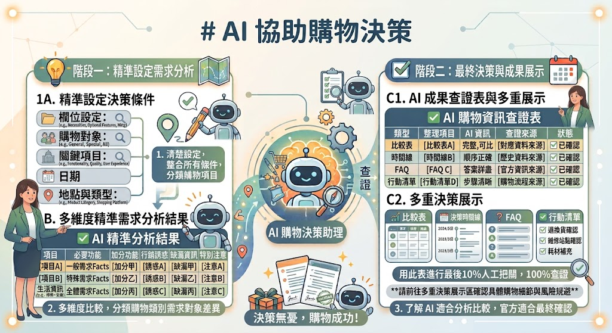
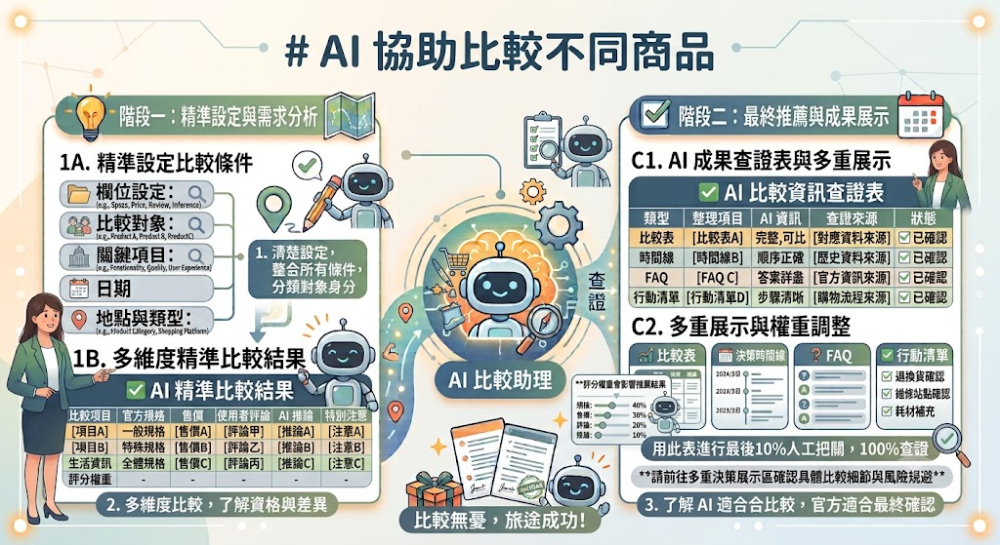
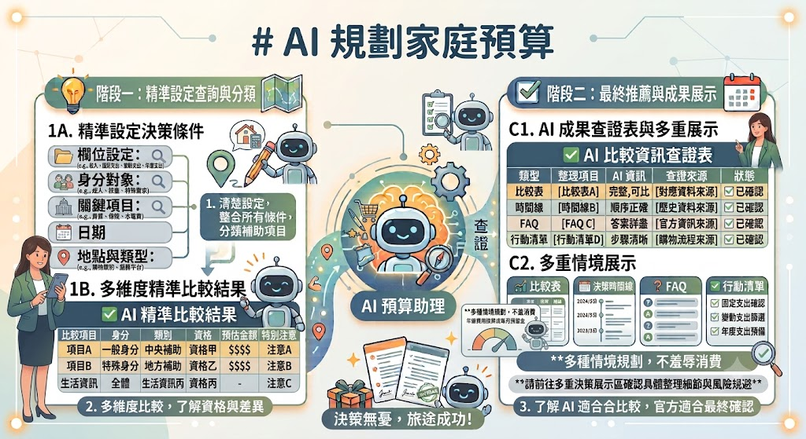
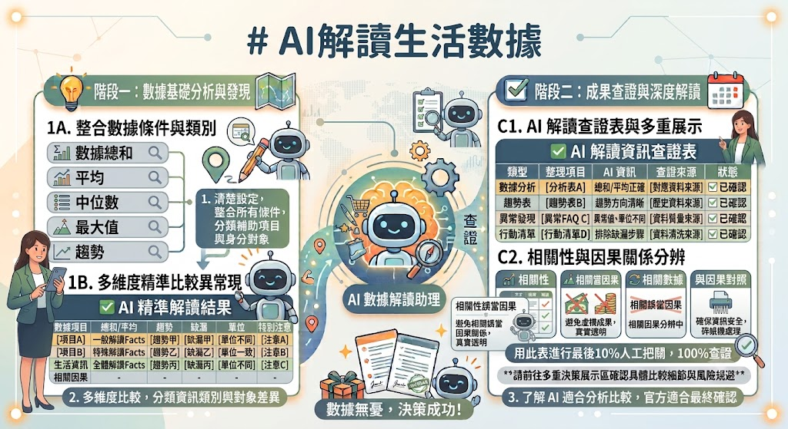

# AI決策與生活分析：

## AI協助購物決策

- 先確認是否需要購買，再討論買哪一個。
- 分辨必要功能、加分功能及行銷誘惑。
- 納入使用頻率、空間、維修、耗材與退換貨。



「購物決策常被『限時』『熱銷第一』『別人都有』推著走。AI 最有價值的工作不是勸你買，而是幫你停下來，把真正需求說清楚。」

### 示範提示詞

```text
我想買掃地機器人，兩人住在約 25 坪的公寓，有長髮、沒有寵物，地面有兩處高低差。我每週願意手動整理一次，預算 15,000 元。
請先問我 5 個會影響購買與否的問題，再把需求分成必要、加分、不需要。不要先推薦品牌。
```

### Problem. 該修，還是該換？

你的手機已經用了四年。

最近電池衰退明顯，一天需要充兩次電，但拍照、聊天、看影片都還算正常。請 AI：

- 先判斷目前最大的問題是什麼。
- 比較「換電池」「繼續使用」「直接換新機」三種方案。
- 從花費、便利性、安全性、使用年限、環境影響分析優缺點。
- 最後說明在什麼情況下才值得換新手機。

### Problem. 買電視前，先不要看品牌

家裡客廳觀看距離約 2.5 公尺，預算 25,000 元，希望看電影、追劇，也偶爾玩遊戲。

請 AI：

- 列出購買前需要先量測、確認的資訊。
- 哪些規格真的會影響體驗？
- 哪些規格容易只是行銷話術？
- 如果空間有限，應該如何決定尺寸，而不是直接買最大的？

### Problem. 倒數兩小時，你真的會用嗎？

看到一台咖啡機正在限時特價，原價 12,900 元，現在只要 6,990 元，活動還剩兩小時。

請 AI：

- 不要直接推薦購買。
- 用五個問題幫我冷靜思考。
- 問題要圍繞用途、使用頻率、替代方案、後續成本、退貨風險。
- 最後判斷：「我是需要這台咖啡機，還是只是害怕錯過優惠？」

### Problem. 三個月後的自己會怎麼抱怨？

假設我今天買了一台健身器材。

請 AI 扮演三個月後的我，列出三個最可能後悔的原因。

再根據這些原因，重新整理出購買前應該確認的條件，避免衝動消費。

### Problem. 便宜，不一定最省

我想買一台印表機，看到一台只要 1,990 元。

請 AI：

- 不要只比較售價。
- 幫我估算一年可能產生的總成本，包括墨水、紙張、維修、耗電。
- 比較「買印表機」與「去便利商店列印」哪個更划算。
- 最後說明在什麼使用頻率下，自己買才值得。

### Problem. 買了以後，真的每天都會用嗎？

我想買一支智慧手錶，主要原因是最近很多朋友都有。

請 AI：

- 不要推薦品牌。
- 先分析我真正想解決的需求。
- 分辨哪些功能是必要、哪些只是加分、哪些可能只是跟風。
- 最後請 AI 判斷：「如果一個月後新鮮感消失，我還會每天戴嗎？」

## AI比較不同商品

- 建立公平且一致的比較欄位。
- 區分官方規格、售價、使用者評論及 AI 推論。
- 理解評分權重會影響推薦結果。



### 示範提示詞

```
我會提供三款益生菌的官方產品資訊。請只使用我提供的資料，以菌株種類、菌數、是否含益生質、建議食用方式、適用族群、保存方式、包裝數量及價格進行比較：

LP33益生菌膠囊2盒組：https://24h.pchome.com.tw/prod/CFADBL-A900556MI
娘家益生菌NTU101乳酸菌：https://24h.pchome.com.tw/prod/DBCQ00-1900FDY9L
義美生醫常順軍益生菌：https://24h.pchome.com.tw/prod/DBBB5X-1900G9FYC

缺少資料請寫「未提供」，不得自行補充功效、醫學知識或任何數字，也不要根據品牌知名度推測優劣。
請先整理成比較表，不要先推薦哪一款，也不要選出勝者。
```

### Problem. 哪一台最適合你的生活？

你準備購買掃地機器人，請 AI：

```text
Electrolux 伊萊克斯安心管家 800 全能掃拖機器人：https://24h.pchome.com.tw/prod/DMBL5X-A900K8CTK
MOVAP70 Pro Ultra 雙機械臂防纏掃拖機器人：https://24h.pchome.com.tw/prod/DMBL5W-A900K8PRF
MOVAE50 Pro Ultra 雙機械臂防纏繞掃拖機器人：https://24h.pchome.com.tw/prod/DMBL5W-A900K8PR0
```

- 先建立一份公平的比較欄位，不要直接推薦。
- 將三款商品整理成比較表。
- 缺少資料請標示「未提供」，不要自行推測。
- 最後指出哪些資訊不足，還不能下結論。

### Problem. 同一份資料，不同的人答案不同

教師提供同一份筆記型電腦規格：https://24h.pchome.com.tw/prod/DHAFSZ-A900JUH8R
請分別以三種角色設定評分權重：

- 大學生
- 上班族
- 遊戲玩家

請 AI：

- 說明每個角色最重視哪些規格。
- 公開每項權重。
- 依照不同權重重新排名，並解釋排名改變的原因。

### Problem. 規格最好，不一定最值得買

以下為三台無線吸塵器的規格與價格：

```
Xiaomi 小米無線洗地機 W30 Pro：https://24h.pchome.com.tw/prod/DMAXAZ-A900JD9G7
YATES亞堤斯 台灣製MD-880ST 專利技術 第三代超強吸力無線手持吸塵器：https://24h.pchome.com.tw/prod/DMAX20-A900J5YHF
Electrolux 伊萊克斯Well Q7無線吸塵器：https://24h.pchome.com.tw/prod/DMBH01-A900HTAV9
```

請 AI：

- 不要只依規格排名。
- 加入價格一起分析。
- 比較每增加 1,000 元，多獲得了哪些功能。
- 找出 CP 值最高、規格最高、價格最低三種不同結果。

### Problem. 同一個商品，換個需求答案就不同

以下為三款行動電源的規格與價格：

```
sp 廣穎QS55：https://24h.pchome.com.tw/prod/DYAO8Z-A900GR8QT
ANKER授權直營 A1664 超薄磁吸行動電源：https://24h.pchome.com.tw/prod/DYAOFA-A900I84NN
sp 廣穎CP10 自帶線行動電源：https://24h.pchome.com.tw/prod/DYAO44-A900J83HG
```

請 AI分別站在以下三種情境比較：

- 每天通勤族
- 三天兩夜旅行
- 長期出國工作

說明：

- 哪些規格變得重要？
- 哪些規格反而可以忽略？
- 排名是否改變？原因是什麼？

## AI規劃家庭預算



- 將收入、固定支出、變動支出與年度支出分開。
- 把年繳費用換算成每月預留金。
- 使用多種情境規劃，不羞辱任何消費選擇。

### 示範提示詞

```
以下為兩人家庭的虛構月資料：收入 60,000 元；房租 10,000 元、交通 5,000 元、餐費 16,000 元、水電網路 4,500 元、保險年繳 36,000 元、休閒 5,000 元。請先檢查期間是否一致，把年繳保險換成每月預留，再計算剩餘金額。只做整理，不批評支出。
```

### Problem. 收入改變，預算怎麼調整？

假設有一個兩人家庭，每月支出如下：

- 房租：10,000 元
- 交通：5,000 元
- 餐費：16,000 元
- 水電網路：4,500 元
- 保險(年繳 36,000 元，請先換算成每月預留)
- 休閒：5,000 元

請 AI 分別分析以下三種收入情境：

1. 每月收入 60,000 元
2. 每月收入 48,000 元(減少 20%)
3. 每月收入 69,000 元(增加 15%)

請完成下列工作：

- 先確認所有金額是否都是以「每月」為單位，若不是請先換算。
- 計算三種情境下的每月總支出與剩餘金額。
- 保留房租、水電網路、保險等必要支出。
- 若收入減少，請提出可調整的支出方式，例如降低餐費、調整交通方式或減少非必要消費，但不要直接建議取消休閒或興趣支出。
- 最後以表格比較三種收入情境的「收入、總支出、剩餘金額」，並用 100 字內說明最大的差異。

可以把三個家庭的數字都固定，這樣學員比較有代入感，也能避免 AI 自行腦補資料。

### Problem. 同樣收入，不同生活方式

以下三個家庭，每月收入都為 **60,000 元**，但生活型態不同。

```
### 家庭 A：租屋族(夫妻，無小孩)
- 房租：12,000 元
- 交通：5,000 元
- 餐費：16,000 元
- 水電網路：4,500 元
- 保險(年繳 36,000 元)
- 休閒：5,000 元
```

```
### 家庭 B：有房貸家庭(夫妻，一名國小孩子)
- 房貸：20,000 元
- 交通：6,000 元
- 餐費：18,000 元
- 水電網路：5,000 元
- 保險(年繳 48,000 元)
- 教育費：4,000 元
```

```
### 家庭 C：退休夫妻
- 房屋已繳清
- 餐費：12,000 元
- 水電網路：3,500 元
- 醫療保健：6,000 元
- 保險(年繳 24,000 元)
- 休閒旅遊：8,000 元
```

請 AI 完成以下工作：

1. 先確認所有金額是否都是以「每月」為單位，若不是請先換算(保險請換算成每月預留)。
2. 分別計算三個家庭的每月總支出與剩餘金額。
3. 以表格比較三個家庭的主要支出項目與金額。
4. 說明三個家庭的支出差異，例如租金、房貸、教育費、醫療保健等，哪些屬於不同生活階段產生的支出。
5. 指出哪些支出不能直接比較，例如房租與房貸、教育費與醫療保健，不要直接判斷哪一個家庭比較會理財。
6. 最後用 100 字內整理三種生活型態的主要特色，不提供理財建議或價值判斷。

### Problem. 同一個存款目標，可以有不同做法

某個兩人家庭，每月收入60,000 元，扣除固定支出後，平均每月約有10,000～15,000 元可以自由運用。

家庭希望一年後存到 120,000 元，但不希望影響日常生活品質，因此想規劃不同的存錢方式。

請 AI 完成以下工作：

1. 提出三種可行的存錢策略，例如：
   - 每月固定存 10,000 元。
   - 平時每月存 6,000 元，年底利用年終獎金補足剩餘金額。
   - 每月先支付所有支出，只把當月剩餘金額存起來。
2. 說明三種方式在一年後是否有機會達成 **120,000 元**的目標，若不足請說明還差多少。
3. 比較三種存錢方式的特色，例如：
   - 每月需預留多少金額。
   - 適合收入穩定或收入不固定的人。
   - 遇到臨時支出時可能受到哪些影響。
4. 最後用表格整理三種策略的「每月預計存款、年底預計存款、優點、需要注意的地方」。

## AI解讀生活數據

- 看懂總和、平均、中位數、最大值與趨勢。
- 發現資料缺漏、單位不同及異常值。
- 不把相關性誤當因果關係。



### Problem. 家庭電費有變化，但原因不能亂猜

以下是某家庭近 12 個月電費(元)：

| 月份  |  電費 |
| ----- | ----: |
| 1 月  | 1,280 |
| 2 月  | 1,190 |
| 3 月  | 1,340 |
| 4 月  | 1,610 |
| 5 月  | 2,180 |
| 6 月  | 3,050 |
| 7 月  | 3,420 |
| 8 月  | 3,680 |
| 9 月  | 2,940 |
| 10 月 | 2,010 |
| 11 月 | 1,560 |
| 12 月 | 1,320 |

請 AI：

- 計算總額、平均、中位數。
- 找出最高、最低月份。
- 找出與前一個月差異最大的月份。
- 只描述數據現象，不推測原因。
- 另外列出需要補充哪些資訊才能分析原因。

### Problem. 平均數會騙人嗎？

以下是某人一週每日步數：

| 星期 |   步數 |
| ---- | -----: |
| 一   |  6,100 |
| 二   |  6,500 |
| 三   |  6,300 |
| 四   |  5,900 |
| 五   |  6,200 |
| 六   | 25,000 |
| 日   |  5,800 |

請 AI：

- 計算總步數、平均數、中位數。
- 比較平均數與中位數的差異。
- 說明哪一天屬於異常值。
- 不得根據步數判斷健康狀況。

### Problem. 哪個才是真的比較便宜？

最近三次購買白米：

| 商品 |   重量 |   售價 |
| ---- | -----: | -----: |
| A    | 1 公斤 | 145 元 |
| B    | 2 公斤 | 275 元 |
| C    | 3 公斤 | 420 元 |

請 AI：

- 換算每 100 公克價格。
- 重新排序。
- 說明為什麼不能只看總價。

### Problem. 資料真的可以直接比較嗎？

教師提供某家庭每月用水量：

| 月份 | 用水量 |
| ---- | -----: |
| 1 月 |  18 度 |
| 2 月 |  17 度 |
| 3 月 |  20 度 |
| 4 月 |  19 度 |
| 5 月 | 未提供 |
| 6 月 |  32 度 |

請 AI：

- 找出缺漏資料。
- 說明哪些分析仍可進行。
- 哪些結論不能下。
- 不要自行補資料。

### Problem. 看到暴增，不代表出問題

某人近六個月信用卡帳單：

| 月份 |   金額 |
| ---- | -----: |
| 1 月 | 18,500 |
| 2 月 | 17,900 |
| 3 月 | 19,300 |
| 4 月 | 51,200 |
| 5 月 | 18,600 |
| 6 月 | 19,100 |

請 AI：

- 找出異常值。
- 說明哪些月份值得進一步了解。
- 不要直接推測刷卡原因。
- 列出還需要哪些資訊才能判斷。

### Problem. 不同單位不能直接比較

三家超市牛奶價格：

| 品牌 |   容量 |   售價 |
| ---- | -----: | -----: |
| A    | 936 mL |  89 元 |
| B    |  1.5 L | 138 元 |
| C    |  1.8 L | 159 元 |

請 AI：

- 全部換算成每公升價格。
- 重新排序。
- 說明換算前後的排名是否改變。

### Problem. 看到一起變化，不代表有因果

某家庭近六個月冰淇淋花費與電費：

| 月份 | 冰淇淋(元) | 電費(元) |
| ---- | ---------: | -------: |
| 4 月 |        220 |    1,650 |
| 5 月 |        380 |    2,180 |
| 6 月 |        610 |    3,020 |
| 7 月 |        850 |    3,480 |
| 8 月 |        790 |    3,360 |
| 9 月 |        420 |    2,760 |

請 AI：

- 描述兩組資料的變化趨勢。
- 不要說冰淇淋造成電費增加。
- 列出至少三種可能同時影響兩者的因素。
- 標示哪些只是推測，哪些可由資料確認。

# 第 40 堂　AI 看懂財經新聞

## 學習目標

- 分辨事件、數據、記者解讀、專家意見與預測。
- 看懂百分點、年增率、月增率及基期。
- 不只看聳動標題做重大財務決策。

## 教師示範提示詞

> 請只根據我貼上的財經新聞，分成：已發生的事實、引用數據、消息來源、作者解讀、未來預測及文章未回答的問題。保留原文日期與單位，不補充外部資料。若標題比內文更肯定，請指出差異。

### 練習 1：標題與內文

教師提供一篇虛構新聞：「房價全面反轉？」內文只有單一區域單月資料。請學生找出標題擴大解讀之處。

### 練習 2：百分比與百分點

失業率由 4% 變 5%，請 AI 解釋「增加 1 個百分點」與「增加 25%」的差異，再由學生自行計算。

### 練習 3：誰說的？

把新聞中的政府統計、公司說法、分析師預測和匿名消息分開，討論證據強度。

### 練習 4：一則新聞三種影響

同一則利率新聞，分別整理它對存款人、房貸戶與企業可能的影響；必須使用「可能」，並列出影響方向不確定的條件。

## 新聞閱讀卡

什麼時候發布？數據涵蓋哪段期間？比較基準是什麼？原始資料在哪裡？內容是事實還是預測？

---

# 第 41 堂　AI 協助投資資訊閱讀

## 學習目標

- 請 AI 解釋名詞及整理官方文件。
- 分辨公司公告、新聞、評論與社群傳言。
- 建立投資前應查問題，不請 AI 預測漲跌。

## 重要聲明

本堂只教「閱讀與查證」，不推薦個股、不預測買賣點、不代替合格專業人員。臺灣證券交易所的投資人教育資料強調，投資伴隨利益、風險與責任；較高報酬通常也伴隨較高風險。

## 教師示範提示詞

> 請用一般成人能懂的語言解釋「營收、毛利率、每股盈餘、現金流」各代表什麼、不能單獨證明什麼。提供生活化比喻，但不要據此推薦任何公司或預測股價。

### 練習 1：名詞翻譯

分組解釋殖利率、本益比、資產配置、波動與流動性風險，最後回官方投資教育來源核對。

### 練習 2：財報摘要不等於結論

使用教師提供的虛構公司數字，請 AI 描述變化、列未知資訊與需要比較的歷史期間，不判定「值得買」。

### 練習 3：投資群組訊息健檢

分析「老師有內線、保證獲利、限時加入、先匯款」的虛構訊息，圈出警訊並列官方查證管道。

### 練習 4：建立研究問題

不問「這支會不會漲」，改問：公司如何賺錢？主要風險？資料日期？一次性收益？負債與現金流？資訊來源？

## 投資閱讀來源順序

1. 主管機關、公開資訊觀測站、證交所等官方資料。
2. 公司依法發布的財務與重大訊息。
3. 專業媒體與研究資料，仍需辨識立場。
4. 社群、群組與網紅內容只能作線索，不作唯一依據。

## AI的限制與風險

「AI 說得流暢，不代表它知道；附上來源，不代表來源真的支持那句話；算出漂亮表格，也不代表輸入資料完整。越重要的決定，越不能只問一次。」

- 認識幻覺、過時資訊、偏見、隱私與自動化偏誤。
- 依決策風險決定查證強度。
- 建立個人的 AI 安全使用守則。

### 八項常見限制

1. **幻覺**：產生不存在的事實、來源或數字。
2. **過時**：法規、價格、人物、功能可能已改變。
3. **偏見**：答案受到訓練資料與問法影響。
4. **脈絡不足**：不了解家庭關係、身體與真正優先順序。
5. **計算錯誤**：加總、百分比或單位可能算錯。
6. **隱私風險**：輸入內容可能包含不必要的敏感資料。
7. **假引用**：連結存在但不支持該說法，或來源根本不存在。
8. **過度依賴**：人因答案流暢而停止思考與查證。

### Problem. 這段回答哪裡有問題？

教師提供以下 AI 回答：

```text
根據衛福部 2026 年公告，所有 65 歲以上民眾都可以免費施打最新流感疫苗。另外，全台各縣市都提供每月 2,000 元交通補助，因此不用另外申請。根據最新統計，98% 民眾都已完成接種。
```

請 AI：

- 找出哪些內容可以直接接受。
- 哪些內容需要查證。
- 哪些內容完全沒有證據支持。
- 說明每一項應該到哪裡查證。

### Problem. 哪些資料其實不用給 AI？

```
### 原始問題：
我叫王小明，身分證 A123456789，住高雄市○○區○○路 88 號，銀行存款 125 萬元，上週在○○醫院檢查出高血壓，目前每天吃 A 藥。我想知道早餐怎麼吃比較好？
```

請 AI：

- 刪除所有不必要的個人資料。
- 保留分析所需資訊。
- 說明哪些資訊屬於敏感個資。
- 改寫成可以安全詢問 AI 的版本。

### Problem. 不同事情，查證方式不同

請將以下情境分成低、中、高風險：

- 今晚適合吃什麼？
- 週末要不要帶雨傘？
- 買哪一台掃地機器人？
- 是否停用醫師開立的藥物？
- 簽三年手機合約。
- 投資 50 萬元購買股票。

請 AI：

- 說明風險等級。
- 建議至少需要幾個資訊來源。
- 哪些情況一定要詢問專業人士。

### Problem. AI 說服了你，現在請它反駁自己

教師提供 AI 推薦：

> 「你應該購買掃地機器人，因為可以節省大量時間。」

請 AI：

改用反方立場回答：

- 哪些假設可能是錯的？
- 缺少哪些重要資訊？
- 哪些人可能根本不適合購買？
- 還有哪些替代方案？
- 如果現在就買，最大的風險是什麼？

### Problem. 引用來源，不代表內容是真的

教師提供一段 AI 回答，每一句都附有來源連結。

請 AI：

- 將每一句分類為：
  - 有來源且支持內容。
  - 有來源，但來源沒有提到。
  - 找不到來源。
  - 需要更多證據。

- 說明不能只因為有引用就相信內容。

### Problem. 最後一關——可以先不做決定

情境：

AI 建議你投資一檔 ETF，理由包括：

- 最近一年績效很好。
- 很多人推薦。
- 長期報酬率不錯。

請 AI：

- 列出目前還不知道的重要資訊。
- 說明哪些資料需要自行查證。
- 哪些資訊應詢問銀行、理財專員或閱讀公開資料。
- 如果資訊不足，可以直接給出「目前不建議做決定」的結論。
