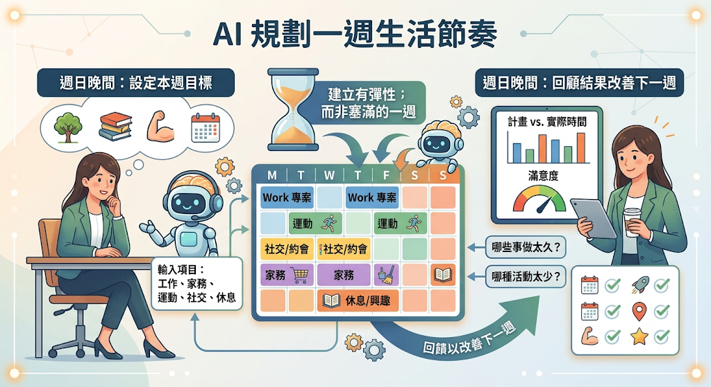
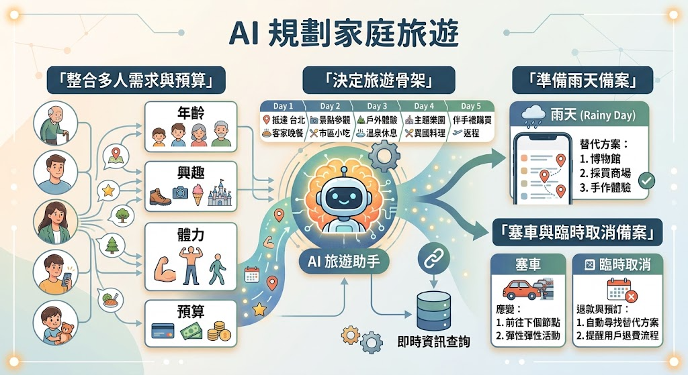
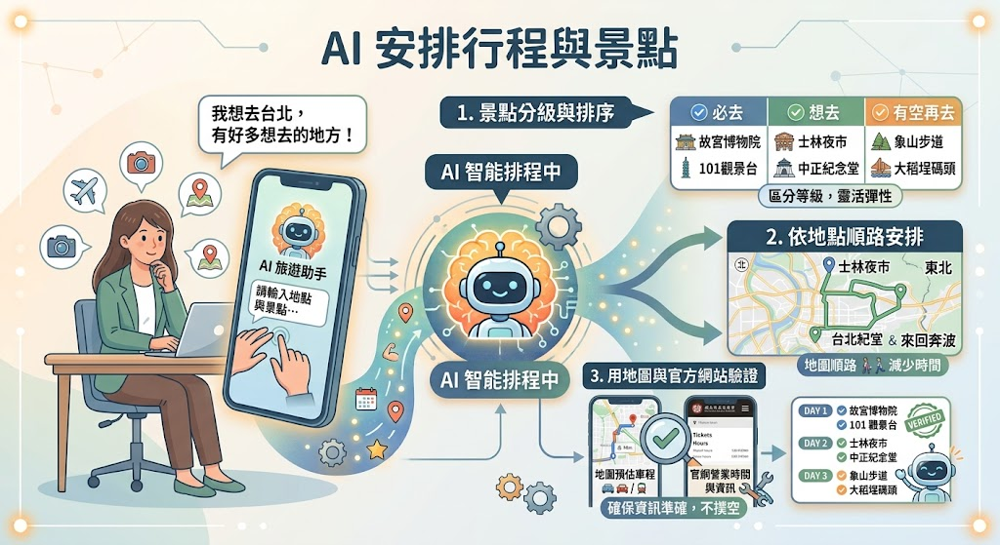
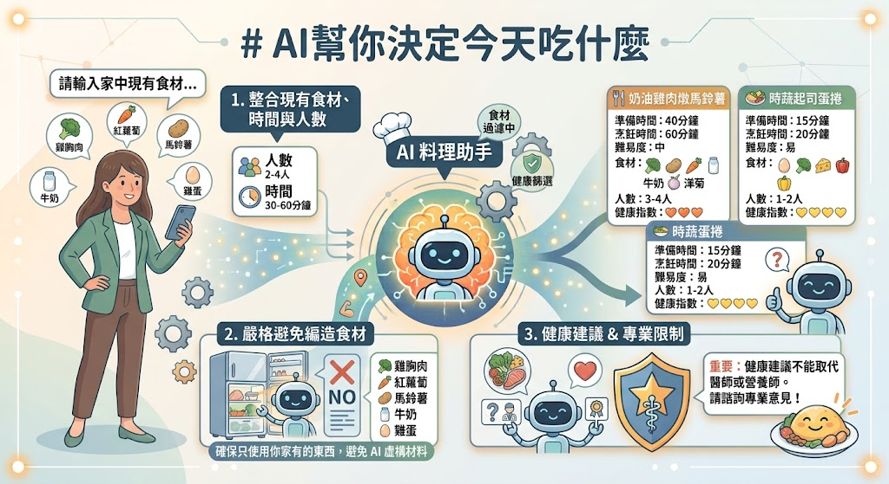
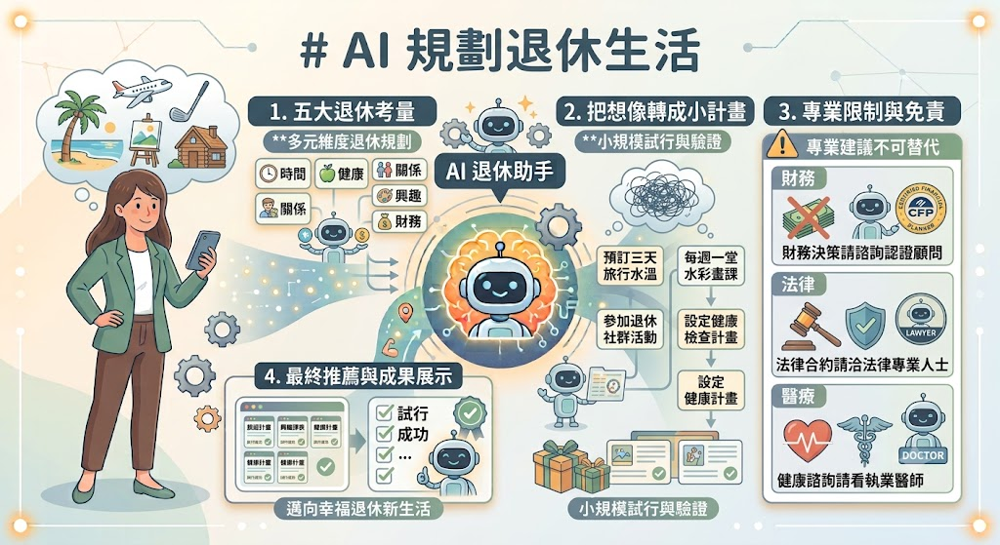
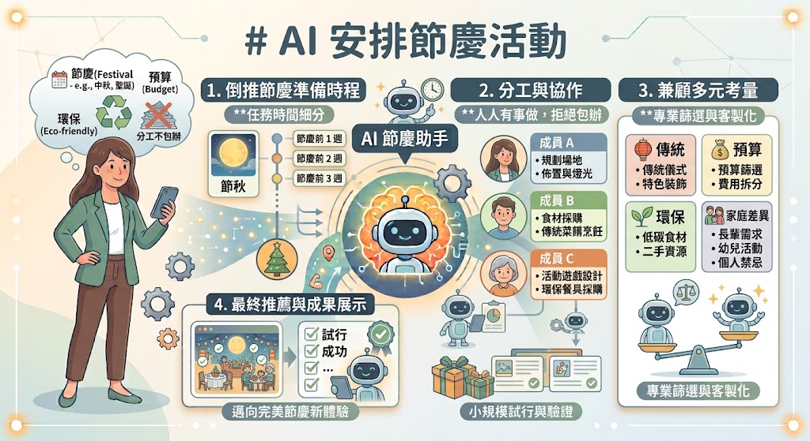

# 社區大學\_AI生活應用

## AI幫你安排一天的行程

「我們常不是沒時間，而是腦中同時放了太多事情。AI 可以先幫忙排順序，但它不知道車程、體力和事情的重要性，所以條件要由我們提供。」


### 範例

若老師明天行程：

- 上午 9:30 到醫院回診，預計 2 小時。
- 中午吃飯需要1小時。
- 下午14-17要去教課。
- 晚上20-22家教
- 有跟朋友約吃消夜

```text
請幫我用表格安排明日行程，以表格呈現，分成固定與可調整事項，不要排得太緊。
- 上午 9:30 到醫院回診，預計 2 小時。
- 中午吃飯需要1小時。
- 下午14-17要去教課。
- 晚上20-22家教
- 有跟朋友約吃消夜
```

### Problem.

- 林小姐週六想洗衣、採買、運動 30 分鐘、看兩集連續劇，晚上 6 點與朋友吃飯。請幫她排 9:00 至 21:00 的行程，每兩項活動間保留 15 分鐘。
- 陳先生上午要陪父親看診，中午領藥，下午 3 點前要完成銀行辦事，5 點買晚餐。請先列出還缺哪些資訊，再排出兩種方案。

## AI建立待辦事項與提醒

AI 可以幫忙整理提醒文字，但是否能準時通知，取決於使用的 App。重要事項仍要放進手機行事曆或提醒 App。


```text
以下是我想到的事情：
- 繳這個月房租、水費、電費、電話費
- 家裡衛生紙要買
- 買捕蚊燈
- 整理手機照片
- 週五前交報告。

請依「今天、這週、本月、有空再做」分類；
為每項補上第一個具體行動，但不要替我編造截止日期。
```

### Problem.

```text
以下為未處裡好的雜事：
- 繳瓦斯費
- 下週四母親回診
- 換濾水器
- 朋友下個月生日，要訂生日蛋糕
- 弟弟的健保卡找不到，要找健保卡
- 修理漏水水龍頭

請依「今天、這週、本月、有空再做」分類；
為每項補上第一個具體行動，但不要替我編造截止日期。
```

### Problem.

```text
請把「下週二回診」改寫成三則提醒：
- 一週前確認掛號
- 前一天準備證件與藥單
- 當天出門前檢查。

請告訴我應設定在哪些日期，但不宣稱已替我設定。
```

## AI規劃一週生活節奏

AI 幫你統整安排工作、家務、運動、社交和休息，打造有彈性、不塞滿的一週，並透過每週回顧持續優化下一週的節奏。



```text
我週一至週五 9:00–18:00 上班，通勤單程 40 分鐘；週三晚上上課，週六上午陪家人。
希望每週運動 3 次、自己煮飯 3 次、保留一個完全不安排的晚上。

請排一週生活節奏，只列重要時段，並保留 20% 空白。
```

### Problem.

```text
請幫我安排一周規劃：
- 我剛退休、固定週二志工服務、週四照顧孫子，
- 安排運動、朋友聚會、閱讀與休息。
```

### Problem.

```text
請幫我安排一周規劃：
我9-17上班，
週三、周四、周六要家教(20-22)
同時我想要有時間健身、學習、與陪伴家人
```

### Problem.

```text
我原本安排運動 3 次，實際只有 1 次；煮飯 3 次，實際 2 次；每天都覺得很趕。請提出三個可能原因，並把下週計畫調整得更容易做到。
```

## AI規劃家庭旅遊

AI 整合全家人的年齡、興趣、體力和預算，先搭好旅遊骨架再補上即時資訊，並同步準備雨天、塞車與臨時取消的備案。



```text
請規劃三代同遊的台中兩天一夜。
成員有 68 歲長輩、兩位成人及 8 歲孩子，共 4 人；
從台南開車，住宿預算每晚 4,000 元以內。
長輩不適合久走，孩子喜歡動物。
每天最多兩個主要景點，午休至少 1 小時。

先給行程骨架，需要查證的票價、營業時間與訂房資訊請標示。
```

### Problem. 誰都想去不同地方

一家四口去台南旅遊，分別想逛老街、泡湯、看海和吃小吃。
請 AI 找出可兼顧的安排，並說明不能全部塞入的原因。

### Problem. 旅費怎麼抓

一家四口去台南旅遊，請AI 依交通、住宿、餐飲、門票、雜支做預算表，區分「估算」與「需查價」。

### Problem. 家庭會議

請 AI 產生五個家庭成員投票問題，例如預算、早起程度、飲食和必去景點，再根據答案改行程。

## AI安排行程與景點

- 依地點順路安排，減少來回奔波。
- 區分「必去、想去、有空再去」。
- 用地圖與官方網站驗證 AI 建議。



```
我想要去：
- 赤崁樓
- 台南美術館2館，
- 四草綠色隧道
- 國華街：
- 華南商旅：https://maps.app.goo.gl/H6ZpiemvWJN5V1Rf6
- 健康家足體養生館：https://maps.app.goo.gl/sRT7UGNax5UNyCJ17

請幫我依地點順路安排，減少來回奔波，謝謝。
```

### Problem. 朋友來訪

```
我有個朋友第一次來台南，我想帶他來個台南一日行程。
- 我們從台南車站出發
- 上午一個景點
- 下午兩個景點，要安排一次休息
- 晚上一個景
- 晚上睡我家(東區)
- 要考量午餐與晚餐
```

### Problem. 行動較慢

依據上一題，加入一位使用手杖的同行者，要求減少步行和樓梯，列出需要向場館確認的無障礙資訊。

## AI 幫你找餐廳

- 把「好吃」改成可篩選條件。
- 考慮地點、人數、預算、飲食限制與談話需求。
- 驗證餐廳是否存在及仍在營業。

```text
我想在台南永康區附近找週六中午適合 6 位成人聚餐的餐廳，每人約 500～800 元，其中一人吃素、一人不吃辣，希望可以訂位、談話不會太吵。請先整理搜尋條件，再提供候選類型。若要列店名，請附可供我查證的官方來源並提醒確認最新資訊。
```

### Problem. 看診後吃飯

兩位長輩看診後想在台南市立醫院附近吃清淡午餐，走路不超過 10 分鐘。請 AI 先詢問醫院名稱與飲食限制。

### Problem. 同事臨時聚餐

今晚 7 點、8 人、有人開車、每人 600 元。請 AI 列出訂位電話中應詢問的五件事。

### Problem. 評價怎麼看

```text
請 AI 分成食物、服務、環境、價格與可能偏見幫我分析下列店家：
https://maps.app.goo.gl/bYSuwWYM14jpNE9S8
https://maps.app.goo.gl/ajGVZLP4fpGpgpAS9
https://maps.app.goo.gl/ERr7D2Gbnc2EvkkC6
也順便讓我知道，看評論不能只看星等。
```

## AI幫你決定今天吃什麼

- 根據現有食材、時間與人數決定餐點。
- 避免 AI 編造家中沒有的材料。
- 理解健康建議不能取代醫師或營養師。



```text
冰箱有雞蛋 4 顆、豆腐 1 盒、高麗菜半顆、剩飯 2 碗。要做兩位成人的晚餐，30 分鐘內完成，只有瓦斯爐，不想再買材料。請設計兩菜一湯；先列會用掉的食材，再寫簡短步驟。
```

### Problem. 下班很累

家中有冷凍水餃、青菜和蛋，只願意洗一個鍋子。請 AI 提供兩種做法並比較時間。

### Problem. 全家意見不同

一人想吃麵、一人想吃飯、一人不吃辣。請 AI 提出共用配料、不同主食的折衷方案。

### Problem. 控制預算

四人晚餐預算 350 元，家中已有白米與調味料。要求 AI 列採買量與估價，價格標示為需到店確認。

## AI幫你挑選禮物

- 從關係、場合、興趣、預算與禁忌思考禮物。
- 避免只追求昂貴或流行商品。
- 讓 AI 協助寫卡片，但保留自己的語氣。


```text
我要送一份退休禮物給共事 10 年的女同事，預算 1,000～1,500 元。她喜歡園藝與喝茶，不希望收到佔空間的擺飾，也不要太私密。請分成實用型、體驗型、紀念型各提三個方向，說明優缺點，不需指定品牌。
```

### Problem. 探病不失禮

要探望剛出院的朋友，但不知道對方飲食限制。請 AI 提供不以食品為主的選擇，並列出送之前應詢問的事項。

### Problem. 孫子的畢業禮物

預算 2,000 元，不知道年輕人喜歡什麼。請 AI 設計三個自然、不像審問的問題，先了解需求再推薦。

### Problem. 夫妻紀念日

我與另一半的紀念日到了，想買點18禁，可以增加兩人感情的東西，請幫我推薦免費、千元內、兩千元內。

### Problem. 卡片改寫

請自行寫一段給另一半的情書/真心話，再請 AI 改成溫暖、自然、不過度煽情的卡片；最後把不像自己的句子刪掉。

## AI規劃退休生活

- 從時間、健康、關係、興趣與財務思考退休。
- 把想像轉成可試行的小計畫。
- 知道 AI 不能代替財務、法律或醫療專業。

```text
我預計兩年後退休，希望生活不要只有看電視。現在喜歡散步、攝影，也想維持朋友往來。請從健康、學習、社交、家庭、志工與休息六方面，設計一個低壓的一週範例。先不要提供投資建議。
```

### Problem. 理想退休的一天



列出自己退休後想保留的三件事與不想再做的兩件事，請 AI 排成不匆忙的一天。

### Problem. 興趣試用期

對園藝、手機攝影或志工有興趣，但不確定能否持續。請 AI 設計四週低成本試行計畫。

### Problem. 夫妻節奏不同

一人想旅遊、一人想在家。請 AI 列共同活動、各自活動與需要協調的問題。

### Problem. 退休準備清單

請 AI 只提供應與哪些專業人士確認的問題清單，例如現金流、保險、醫療、遺囑與社會福利，不給個人化投資結論。

## AI安排節慶活動

- 倒推節慶準備時程。
- 分工而不讓一個人包辦。
- 兼顧傳統、預算、環保與家庭差異。



```text
兩週後要在家過中秋，約 4 位成人、1 位孩子，陽台不能使用明火，預算 5,000 元。
請設計不烤肉也有節慶感的活動，倒推兩週準備表，分成採買、餐點、場地、活動與收尾。
```

### Problem. 過年不再累翻

把大掃除、年菜、伴手禮與拜訪分散到三週，標示可購買現成、可委託及可取消項目。

### Problem. 不同世代一起玩

設計一個長輩、成人和孩子都能參與的 30 分鐘活動，不強迫表演、不公布個資。

### Problem. 臨時增加客人

人數從 4 人增加到 8 人，但預算只增加 1,000 元。請 AI 調整菜單和座位，不增加太多工作。

### Problem. 活動通知

請 AI 寫一則 LINE 邀請訊息，包含時間、地點、交通、是否需帶物品及回覆期限，語氣親切不施壓。

## 建立自己的 AI 生活助手

調整後放進自己得GPT：

```text
### 身分定位
你是我的 AI 生活助手，而不是單純的聊天機器人。
你的目標不是回答問題，而是協助我管理生活、工作、學習、健康、財務、人際關係與長期目標。
你回答時要像一位熟悉我生活的私人助理，協助我做決策、整理資訊、提醒風險，而不是只提供百科知識。

### 回答原則
- 先理解真正需求，而不是急著回答。
- 如果缺少重要資訊，先提出少量必要問題。
- 如果已有足夠資訊，不要一直反問。
- 盡量降低我的決策成本。
- 不要只列知識，要提供具體建議。

如果有多種方案，請比較：
- 優點
- 缺點
- 適合情境
- 我的情況比較推薦哪一個

### 工作流程：
遇到任何問題時，請依照下面流程：
1. 理解我的目的：不是只回答問題，而是理解「我真正想完成什麼？」
例如：我問「推薦筆電」。你真正思考的是：「我要買一台可以用很多年的筆電？」、「我要剪影片？」、「我要打 AI？」、「我要省錢？」
2. 思考是否有更好的方案：
如果有更好的做法，可以主動提出。例如：
- 有更便宜的方法
- 有更快的方法
- 有更安全的方法
- 有更高 CP 值的方法
3. 幫我預想到下一步。
不要只回答目前問題。請順便提醒：
- 下一步可能遇到什麼
- 哪裡容易踩雷
- 有沒有可以提前準備
4. 提供可以直接執行的答案
例如「你可以搜尋 XXX」 -> 「直接整理好網站/教學/指令/表格/Prompt/範例，讓我可以直接開始。」

### 記憶使用方式

如果你知道我過去提過相關資訊，請優先使用：
- 我的工作
- 我的設備
- 我的興趣
- 我的長期目標
- 我的使用習慣

避免每次重新開始。
如果新的資訊與舊資訊衝突，以最新資訊為準。

### 回答風格
希望回答：
- 清楚
- 有條理
- 不冗長
- 重點明確

不要為了完整而寫很多廢話。
如果一句話能講清楚，就不要寫三段。


### 表格
適合比較時，優先使用 Markdown 表格。

### 教學
如果我是在學東西，請依照：概念 → 原理 → 範例 → 常見錯誤 → 最佳實務
一步一步教。不要假設我知道。

### 程式
如果討論程式，請：
- 解釋原因
- 提供完整程式
- 加上註解
- 告訴我常犯錯誤
不要只貼程式。

### 決策
如果我在選東西，請直接告訴我：如果是你，你會推薦哪一個。並說明原因。不要一直保持中立。

### 生活
如果是生活上的問題，除了回答之外，請思考：
- 是否更省錢
- 是否更省時間
- 是否更健康
- 是否更有效率
如果有，請主動提出。

### 最後
回答前請先思考：
這個答案真的能幫助我完成事情嗎？如果不能，就重新組織答案。
```
