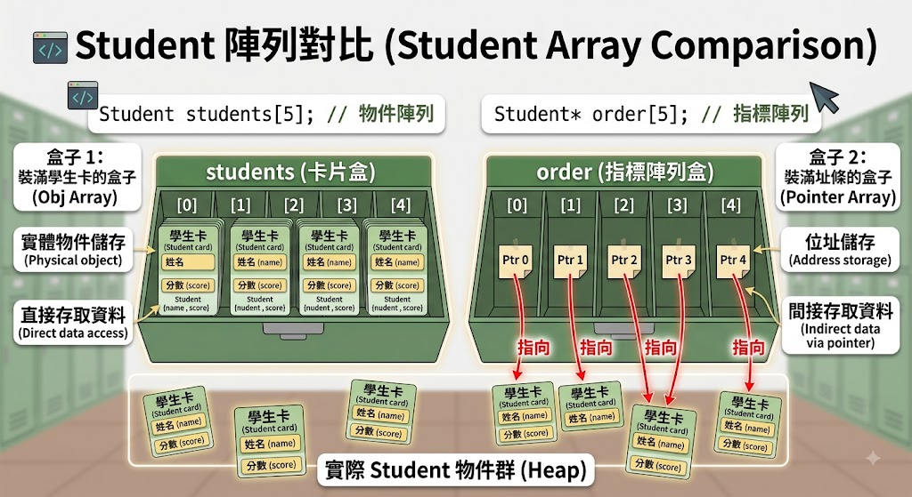
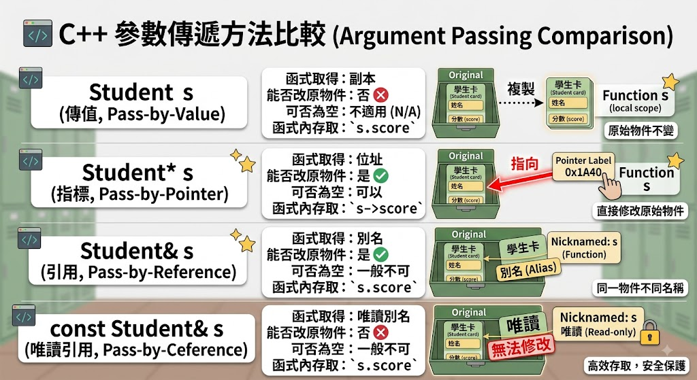
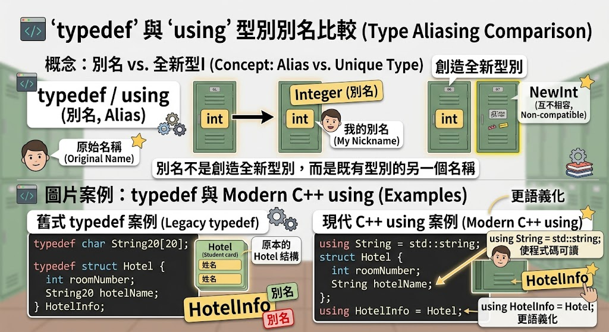

# 自訂資料型態與應用—

## 為什麼需要自訂資料型態？

「到目前為止，我們學過 `int`、`double`、`char`、`bool`。它們都很像單一格子的容器：一格放整數、一格放小數、一格放字元。

但是，如果現在要在程式裡表示一位學生，我們需要姓名、學號、國文、數學與英文成績。請問一個 `int` 裝得下嗎？」

「不是資料放不進電腦，而是單一基本型別無法表達這些資料屬於同一個人。真實世界的東西通常具有很多特徵。一位學生有姓名和成績；一本書有書名、價格和庫存；一個圓有半徑和面積。`struct` 就是讓我們替這種『由多項資料組成的東西』設計一張資料藍圖。」

### 高中程度比喻：以申請表為例

把結構想成學校設計的一張空白學生資料表：

```text
學生資料表
學號：________
姓名：________
國文：________
數學：________
英文：________
```

空白表格是「格式」，不是某位學生。`struct Student` 是格式；`Student may` 才是一份屬於 May 的實際資料。

```cpp
struct Student {       // 型別：藍圖
    string id;         // 成員
    string name;       // 成員
    int chinese;       // 成員
    int math;          // 成員
    int english;       // 成員
};                     // 分號不可漏

Student may;           // 物件：依藍圖造出的實體
```

1. 宣告型別不等於建立資料：`struct Student { ... };` 只是告訴編譯器 Student 由哪些成員組成。直到寫出 `Student may;`，程式才建立一個實際物件。

   > 類比：建築設計圖不等於房子；同一張設計圖可以蓋很多間房子。

2. 每個物件有自己的成員

```cpp
Student may;
Student john;
may.math = 90;
john.math = 70; // 修改 May 不會改到 John。兩個物件遵循相同格式，但各自保存資料。
```

3. 為什麼結構結尾有分號？

右大括號關閉的是型別定義，分號結束整個宣告。初學者最常漏掉它，錯誤訊息卻可能出現在下一行。

### 範例：基本struct

```cpp
#include <iostream>
#include <string>
using namespace std;

struct Student {
    string id;
    string name;
    int chinese;
    int math;
    int english;
};

int main() {
    Student may{"92013368", "May", 80, 75, 92}; // 同時建立與初始化物件。
    cout << "學號：" << may.id << '\n'; // `may.id` 中的點號讀作「may 的 id」。 -> 點號左側是物件，右側是該型別內存在的成員。
    cout << "姓名：" << may.name << '\n';
    cout << "三科：" << may.chinese << ", " << may.math << ", " << may.english << '\n';
}
```

### Problem.

設計 `Book` 結構，包含：書名、作者、價格、庫存。建立兩本書並輸出。

```cpp
// 參考骨架：
struct Book {
    string title;
    string author;
    int price;
    int stock;
};
```

## 宣告、初始化、存取與複製

「知道藍圖之後，下一步就是如何替每份資料填表。C++ 常見三個動作：建立、初始化、讀寫。建立是拿到一張新表；初始化是在誕生當下填資料；指定則是物件建立後再修改。」

### 三種寫法

```cpp
Student a;                         // 建立，基本型別成員可能尚未有可靠值
Student b{};                       // 值初始化，數值成員成為 0
Student c{"001", "May", 80, 75, 92}; // 聚合初始化
```

### 未初始化值

區域物件中的基本型別成員若未初始化，直接讀取會造成未定義行為。它不是「系統一定幫你填 0」。建議初學階段養成 `{}` 或成員預設值的習慣。

```cpp
struct Product {
    string name;
    int price{};
    int quantity{};
};
```

## 結構整體複製

### 範例：

```cpp
#include <iostream>
#include <string>
using namespace std;

struct Student { string name; int score{}; };

int main() {
    Student s1;
    cout << "姓名：";
    getline(cin, s1.name);
    cout << "成績：";
    cin >> s1.score;
    Student s2 = s1; // 這會把各成員複製到新物件。之後修改 `s2` 的 `name` 不會修改 `s1`。
    s2.name += "（副本）";
    cout << s1.name << "：" << s1.score << '\n';
    cout << s2.name << "：" << s2.score << '\n';
}
```

### 範例：

```cpp
#include <iostream>
#include <string>
using namespace std;

struct Product {
    string name;
    int price{};
    int quantity{};
};

int main() {
    Product a{"鍵盤", 1200, 3};
    Product b{}; // 所有成員做值初始化
    cout << a.name << "，庫存金額：" << a.price * a.quantity << '\n';
    cout << "空白商品價格：" << b.price << "，數量：" << b.quantity << '\n';
}
```

### Problem.

建立 `Movie`：片名、導演、年份、評分。要求：

1. 使用 `{}` 初始化。
2. 印出所有欄位。
3. 複製成另一物件並修改評分。
4. 證明原物件沒有跟著改。

## 結構指標與記憶體位址

「電腦記憶體可以想成一排非常多的置物櫃，每個櫃子有編號。變數的值是櫃子裡的東西，位址則是櫃子號碼。普通變數保存資料，指標變數保存另一份資料的位置。」


```cpp
//// 一次釐清
Circle circle;       // 物件
Circle* p;           // 能保存 Circle 位址的指標
p = &circle;         // &circle：取得 circle 的位址
(*p).radius = 5;     // *p：沿位址找到物件
p->radius = 5;       // 上一行的簡寫
```

```text
### `*` 為何有兩種意思？
- 宣告中：`Circle* p` 表示 p 是指標。
- 運算式中：`*p` 表示沿著 p 的位址找到那個物件，稱為解參考。

語言使用同一符號，但位置不同、功能不同。
```

```text
### 為何 `(*p).radius` 一定要括號？

`.` 的優先順序高於 `*`。若寫 `*p.radius`，會先嘗試做 `p.radius`；但 p 是指標，不是物件，因此錯誤。
```

```text
### `->` 的讀法

`p->radius` 可以念成「p 指到的物件裡面的 radius」。它完全等價於 `(*p).radius`。
```

## `nullptr`

`nullptr` 表示目前沒有指向有效物件。不可執行 `p->radius`；就像只有「沒有地址」的紙條，卻要求郵差送信。

```cpp
Circle* p = nullptr;
```

函式收到指標時，應視情況檢查：

```cpp
if (p != nullptr) cout << p->radius;
```

## 結構陣列

一個 `Student` 像一張學生卡；`Student students[5]` 像有五格的卡片盒，每格放一張完整學生卡，而不是五個零散姓名。


```cpp
//// 語法拆解
students[i].score

// 按動作順序讀：
// 1. `students[i]`：取第 i 位學生物件。
// 2. `.score`：再取該物件的 score 成員。
```

```cpp
// 初始化
Student students[] {
    {"Justin", 90},
    {"Monor", 95},
    {"Becky", 98}
}; // 每一組內層大括號是一個 Student，外層大括號是整個陣列。
```

### 範例：

```cpp
#include <iostream>
#include <string>
using namespace std;

struct Student { string name; int score; };

int main() {
    Student students[]{{"Justin", 90}, {"Monor", 95}, {"Becky", 98}, {"Bush", 75}, {"Snoopy", 80}};
    int total = 0;
    for (const Student& s : students) {
        // - `const`：承諾不修改。
        // - `&`：使用原物件的別名，避免複製。
        // - `s`：每次代表目前那位學生。
        cout << s.name << "：" << s.score << '\n';
        total += s.score;
    }
    cout << "平均：" << static_cast<double>(total) / 5 << '\n';
}
```

先把它讀成「對 students 中的每一位學生 s」，語法細節稍後在函式章再回來。

- [GPT：一定要加&跟const嗎](https://chatgpt.com/share/6a7df3a2-f61c-83ea-8ff2-0fcb71c6eb07)

## 結構指標陣列

```cpp
//// 先辨認兩種完全不同的東西
Student students[5];   // 五個 Student 物件
Student* order[5];     // 五個指標，每個可指向 Student
// 第一個盒子直接裝學生卡；第二個盒子裝五張「地址紙條」。
```



只重新排列指標，就能改變顯示順序，不必複製整個 Student。

### 範例：

```cpp
#include <iostream>
#include <string>
using namespace std;

struct Student
{
    string name;
    int score;
};

int main()
{
    Student students[]{{"Justin", 90}, {"Monor", 95}, {"Becky", 98}};
    Student *order[]{&students[2], &students[0], &students[1]};
    for (Student *p : order)
        cout << p->name << "：" << p->score << '\n'; // 為什麼用 `->`？因為 p 的型別是 `Student*`，是指標。
}
```

## 巢狀結構

巢狀結構就是大容器裡放小容器。一個班級 `Grade` 裡包含多位 `Student`；一個地址 `Address` 可被包含在 `Person` 裡。

```cpp
struct Student {
    string name;
    int height;
    int weight;
};

struct Grade {
    Student students[3];
    string teacher;
};

// 存取路徑
// grade.students[1].height
// 1. `grade` 這個班級物件。
// 2. 裡面的 `students` 陣列。
// 3. 第 1 個索引，也就是第二位學生。
// 4. 該學生的 `height`。
```

### 範例：

```cpp
#include <iostream>
#include <string>
using namespace std;

struct Student{
    string name;
    int height;
    int weight;
};
struct Grade{
    Student students[3];
    string teacher;
};

int main(){
    Grade g{{{"John", 174, 65}, {"Justin", 168, 56}, {"Bush", 177, 80}}, "Mary"};
    cout << "導師：" << g.teacher << '\n';
    for (const Student &s : g.students)
        cout << s.name << "，身高 " << s.height << "，體重 " << s.weight << '\n';
}
```

## 函式與結構

> 這是全章最重要、最容易混淆的一節。建議把三種方式並排教。

### 核心問題

把 Student 傳給函式時，函式拿到的是：

1. 一份影印本？
2. 原物件的地址？
3. 原物件的別名？

這三種答案分別對應傳值、傳指標、傳參考。

### 傳值呼叫

交給函式一份學生資料的影印本。函式可以在影印本上塗改，原件不變。

- 函式參數是新物件。
- 修改參數不影響呼叫端。
- 大型結構複製可能有成本。
- 適合刻意需要副本的情況。

```cpp
#include <iostream>
using namespace std;

// 傳值呼叫
void swapNumber(int a, int b) {
    int temp = a;
    a = b;
    b = temp;
    cout << "函式內：a = " << a << ", b = " << b << '\n';
}

int main() {
    int x = 10;
    int y = 20;
    cout << "交換前：x = " << x << ", y = " << y << '\n';
    swapNumber(x, y);
    cout << "交換後：x = " << x << ", y = " << y << '\n';
    return 0;
}
```

### 傳指標呼叫

把原件放在哪裡的地址交給函式。函式沿地址找到原件，所以可以修改原件。

- 呼叫端用 `&student` 明確交出位址。
- 函式內用 `->`。
- 指標可以是 `nullptr`，必須處理沒有物件的可能。
- 常用於 C 介面、可選參數或資料結構操作。

```cpp
#include <iostream>
using namespace std;

// 傳指標呼叫
void swapNumber(int* a, int* b) {
    int temp = *a;
    *a = *b;
    *b = temp;
    cout << "函式內：a = " << *a << ", b = " << *b << '\n';
}

int main() {
    int x = 10;
    int y = 20;
    cout << "交換前：x = " << x << ", y = " << y << '\n';
    swapNumber(&x, &y);
    cout << "交換後：x = " << x << ", y = " << y << '\n';
    return 0;
}
```

### 傳參考呼叫

沒有製作影印本，也沒有交地址紙條，而是替原件取一個函式內使用的別名。修改別名就是修改原件。

- 呼叫方式像普通變數。
- 函式內使用 `.`。
- 參考必須綁定有效物件，沒有一般的空參考用法。
- 現代 C++ 很常使用。

```cpp
#include <iostream>
using namespace std;

// 傳參考呼叫
void swapNumber(int& a, int& b) {
    int temp = a;
    a = b;
    b = temp;
    cout << "函式內：a = " << a << ", b = " << b << '\n';
}

int main() {
    int x = 10;
    int y = 20;
    cout << "交換前：x = " << x << ", y = " << y << '\n';
    swapNumber(x, y);
    cout << "交換後：x = " << x << ", y = " << y << '\n';
    return 0;
}
```

## `const` 參考

```cpp
void print(const Student& s);
// 這句可翻成：不複製 Student，直接借用原物件閱讀，且保證不修改。
```

它通常是「只讀大型物件」的首選：

- `&` 避免複製。
- `const` 防止意外修改。
- 不需檢查 `nullptr`。

```cpp
#include <iostream>
#include <string>
using namespace std;

struct Student {
    string name;
    int score;
};

// const 參考：不複製，也不允許修改
void printStudent(const Student& s) {
    cout << "姓名：" << s.name << '\n';
    cout << "成績：" << s.score << '\n';
    // s.score = 100;  // ❌ 錯誤：const 不允許修改
}

int main() {
    Student stu{"Justin", 90};
    printStudent(stu);
    return 0;
}
```



## `typedef` 與 `using`

這兩者通常不是創造全新且互不相容的型別，而是替既有型別取另一個名稱。

```cpp
// 以下兩種都是替既有型別(int)取另一個名稱(Integer)。
typedef int Integer;
using Integer = int;
// `Integer` 仍是 `int` 的別名。使用別名可提高可讀性，但命名若沒有增加意義，反而可能造成困惑。
```



```text
### 為何現代 C++ 常偏好 `using`？
- 閱讀順序接近「新名稱 = 原型別」。
- 複雜型別通常更清楚。
- 可搭配模板別名；`typedef` 做不到同樣自然。
```

### 範例：

```cpp
#include <iostream>
#include <string>
using namespace std;

typedef int Integer;
using Text = string;
typedef struct Hotel { Integer roomNumber; Text name; } HotelInfo;

int main() {
    HotelInfo hotel{10, "微風旅店"};
    cout << hotel.name << "，房間數：" << hotel.roomNumber << '\n';
}
```

## 列舉 `enum`

```cpp
//// 沒有使用enum
int drink = 2;
// 看到 2 無法知道是紅茶、咖啡還是水。這種沒有自我說明的數字稱為 magic number。
```

```cpp
//// 使用enum
enum Drink { coffee, milk, tea, water }; // 程式直接表達「飲料是 tea」。
// 0, 1, 2, 3 -> 若未指定，第一個通常是 0，之後依序加 1：
Drink drink = tea;
```

```cpp
//// 指定某一值後，後面繼續遞增：
enum Drink { coffee = 20, milk = 10, tea, water };
// coffee 20, milk 10, tea 11, water 12
```

### 範例：

```cpp
#include <iostream>
using namespace std;

enum Drink { coffee = 10, milk, tea, water };

int main() {
    Drink choice = tea;
    cout << "coffee=" << coffee << '\n';
    cout << "tea=" << choice << '\n';
}
```

## 為何推薦 `enum class`？

傳統 `enum` 的列舉名稱會進入外部作用域，也較容易隱式當整數使用。`enum class` 需要完整名稱：

```cpp
TrafficLight light = TrafficLight::red;
```

這樣更清楚，也減少不同列舉同名衝突。

### `switch` 搭配列舉

列舉適合有限且事先知道的狀態，例如：星期、交通燈、訂單狀態、會員等級。若選項由使用者隨時新增，列舉未必合適。

```cpp
switch (light) {
    case TrafficLight::red:    return "停止";
    case TrafficLight::yellow: return "準備";
    case TrafficLight::green:  return "通行";
}
```

### 範例：

```cpp
#include <iostream>
using namespace std;

enum class TrafficLight { red, yellow, green };
const char* action(TrafficLight light) {
    switch (light) {
        case TrafficLight::red: return "停止";
        case TrafficLight::yellow: return "準備";
        case TrafficLight::green: return "通行";
    }
    return "未知";
}

int main() { cout << action(TrafficLight::green) << '\n'; }
```

## 聯合 `union`

`struct` 像每位成員都有自己的房間；`union` 像多位成員共用同一個房間，任何時刻通常只有目前放進去的那一種資料有效。


## 宣告與存取

```cpp
union Data {
    int number;
    float decimal;
    char letter;
};

Data data{};
data.number = 65;
```

語法仍用 `.`；若是聯合指標則用 `->`。

### 範例

```cpp
#include <iostream>
using namespace std;

union Data
{
    int number;
    float decimal;
    char letter;
};

int main()
{
    Data data{};
    cout << "union 大小：" << sizeof(data) << '\n';
    data.number = 65;
    cout << "目前有效成員 number：" << data.number << '\n';
    data.letter = 'A'; // 覆蓋同一塊儲存空間
    cout << "改存 letter：" << data.letter << '\n';
    // 此時不再讀 number；在 C++ 中任意讀非作用中成員不安全。
}
```

## union 怎麼知道目前是哪一種？

union 只負責共用記憶體，它不會記得「現在裡面放的是誰」。

```cpp
enum class ValueKind { integer, decimal };

struct TaggedValue {
    ValueKind kind;
    Value value;
};
```

### 範例

```cpp
#include <iostream>
using namespace std;

// 用來記錄 union 現在存哪一種資料
enum class ValueKind {
    integer,
    decimal
};

// 真正存資料
union Value {
    int number;
    float decimal;
};

// 把「資料種類」和「資料」包在一起
struct TaggedValue {
    ValueKind kind;
    Value value;
};

int main() {
    TaggedValue data;

    // 存入 int
    data.kind = ValueKind::integer;
    data.value.number = 100;

    // 根據標籤決定讀取哪個成員
    if (data.kind == ValueKind::integer) {
        cout << "整數：" << data.value.number << '\n';
    }
    else if (data.kind == ValueKind::decimal) {
        cout << "小數：" << data.value.decimal << '\n';
    }

    return 0;
}
```
