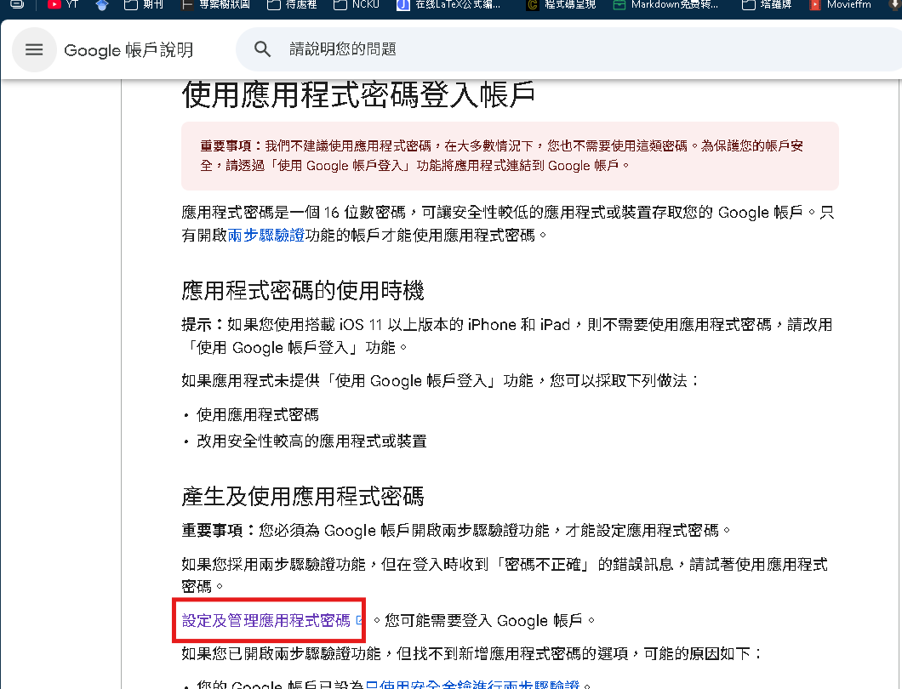
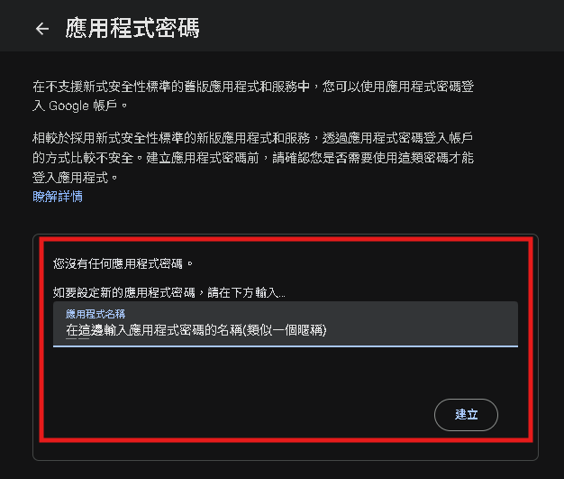
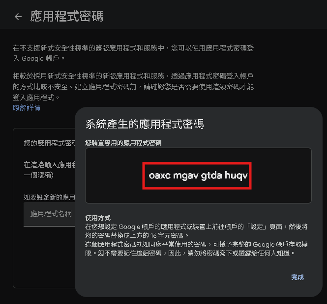
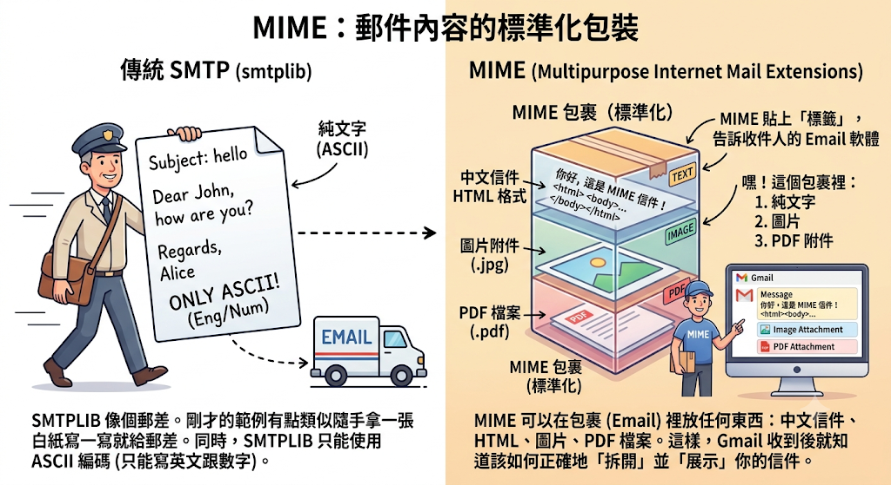
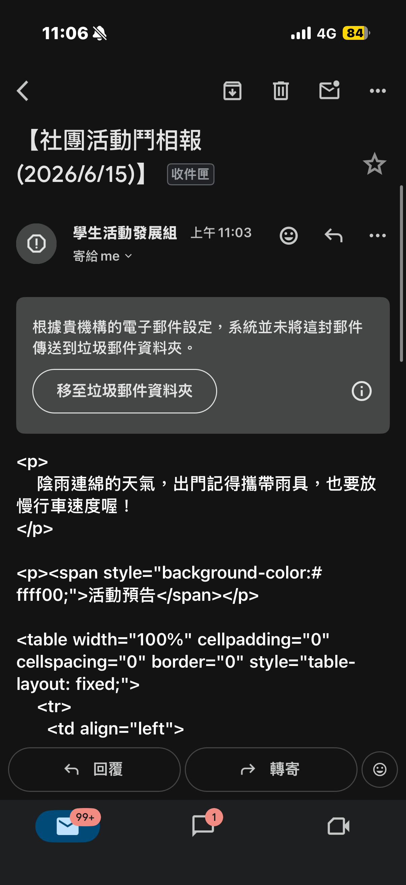
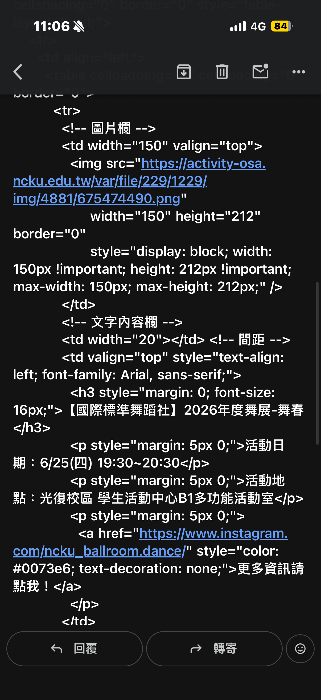

# Gmail

==專案下載：https://github.com/kcwc1029/kcwc1029.github.io/tree/main/docs/python-notebooks/Gmail==

> 補充影片
>
> - [什么是SMTP 1080P 高清 AVC](https://www.youtube.com/watch?v=SRo7oL1kCeI)
> - [自行瀏覽：Part12 - 什麼是郵件伺服器？ (Mail Server簡介與應用)](https://www.youtube.com/watch?v=ziGtmbljXeE)

## SMTP 協定：電子郵件傳送的基礎

SMTP 是 Simple Mail Transfer Protocol 的縮寫，中文是「簡單郵件傳輸協定」。它主要定義了網際網路上傳送電子郵件的相關細節。

### SMTP 伺服器的網域名稱

SMTP 伺服器的網域名稱通常就是電子郵件服務供應商的網域名稱。

- SMTP 伺服器的網域名稱通常就是電子郵件服務供應商的網域名稱。

下表列出了幾個常見的 SMTP 伺服器網域名稱範例：

| 公司        | SMTP 伺服器網域名稱                        |
| ----------- | ------------------------------------------ |
| HiNet       | `msxxx.hinet.net` (其中 `xx` 為伺服器編號) |
| Outlook.com | `smtp-mail.outlook.com`                    |
| Yahoo Mail  | `smtp.mail.yahoo.com`                      |
| Gmail       | `smtp.gmail.com`                           |

## 取得 Gmail 應用程式密碼

- [Google帳戶說明-應用程式密碼](https://support.google.com/accounts/answer/185833?hl=zh-Hant)



<!-- 兩張 -->
<div style="display: flex; flex-wrap: wrap; gap: 20px;">
    
    
</div>

## 到.env設定寄件相關資訊

```
### env

# 應用程式密碼
AppPassword = "0000 0000 0000 0000"
# 登入信箱
LoginEmail = "xxxxxxx@gmail.com"
# 寄件者
FromAddress = "xxxxxxx@gmail.com"
# 收件者
ToAddress = "ooooooooo@gmail.com"
```

### 範例：發送簡單gmail

```python
import smtplib
import os
from pathlib import Path
from dotenv import load_dotenv

### 環境變數
current_file = Path(__file__).resolve() # 取得目前這個 main.py 檔案的絕對路徑
project_root = current_file.parent.parent # 透過 .parent 往上跳兩層，回到專案根目錄 (my_project/)
env_path = project_root / ".env" # 指定根目錄底下的 .env 檔案路徑
load_dotenv(dotenv_path=env_path) # 載入指定路徑的 .env 檔案


### 讀取環境變數
AppPassword = os.getenv("AppPassword")
LoginEmail = os.getenv("LoginEmail")
FromAddress = os.getenv("FromAddress")
ToAddress = os.getenv("ToAddress")


mySMTP = smtplib.SMTP('smtp.gmail.com', 587) # 建立一個 SMTP 物件
ehlo_response = mySMTP.ehlo() # 啟動與 SMTP 伺服器的對話 (mySMTP.ehlo()回傳職必須要是250，才算成功)
starttls_response = mySMTP.starttls() # 建立加密傳輸 (必須要回傳220，才算成功)
login_response = mySMTP.login(LoginEmail, AppPassword) # 登入 (必須要回傳235，才算成功)
print(login_response)


### 撰寫一封簡單gmail
status = mySMTP.sendmail(
    FromAddress, # 寄件者
    ToAddress, # 收件者
    # 信件內容 (標題與內文之間要空一行，而且只能用英文)
	"Subject: 2026.04.20 send gmail test.\n\nIt's very hot today."
) # 寄信 (status回傳{}表示成功)()只能用英文)

mySMTP.quit() # 結束與 SMTP 伺服器的對話 (必須要回傳221，才算成功)
print("信件發送成功")
```

## MIME

我們剛剛使用的 `smtplib`，可以把它想成**負責送信的郵差**。

如果只使用 `smtplib`，就像是在一張白紙上寫幾行英文，直接交給郵差寄出去。這種方式很簡單，但功能有限，只能傳送純文字，而且預設只能處理 ASCII 字元，也就是英文、數字和部分符號，遇到中文就容易出現亂碼。

MIME (Multipurpose Internet Mail Extensions) 則像是**專門寄包裹的包裝規格**。

它會先把 Email 包裝好，再貼上各種標籤，告訴收件人的郵件系統：

- 這一段是純文字。
- 這一段是 HTML 網頁內容。
- 這裡有一張圖片附件。
- 這裡有一份 PDF 檔案。

有了這些標籤，Gmail、Outlook 等郵件軟體收到信後，就知道該怎麼解析內容，正確顯示中文、HTML 版面，以及各種附件。

因此，實際開發中通常會搭配使用：

- `smtplib`：負責把信送出去。
- `email.mime` (MIME)：負責把信的內容包裝成標準格式，讓各種郵件軟體都能正確顯示。



| 標頭          | 名稱                            | 解釋                                                                                                                                          |
| ------------- | ------------------------------- | --------------------------------------------------------------------------------------------------------------------------------------------- |
| `['From']`    | 寄件人                          |                                                                                                                                               |
| `['To']`      | 收件人                          | 如果要寄給多人，可以用逗號 `,` 隔開，例如：`'person1@a.com, person2@b.com'`。                                                                 |
| `['Cc']`      | 副本<br>(Carbon Copy)           | 這封信主要是寄給 `To` 的人，但我也想讓 `Cc` 的人看到這封信的內容<br>所有收件人都看得到 `Cc` 列表。                                            |
| `['Bcc']`     | 密件副本<br>(Blind Carbon Copy) | 這是 `Cc` 的秘密版本。`Bcc` 列表上的人會收到信，但是其他收件人 (To, Cc) 完全不會知道你把信也寄給了 `Bcc` 的人。非常適合用於保護收件人的隱私。 |
| `['Subject']` | 主旨                            |                                                                                                                                               |

### 範例：使用MIME發送信件

- [範例：使用MIME發送純文字信件](./Gmail_src/使用MIME發送純文字信件.md)
- [範例：使用MIME發送HTML格式信件](./Gmail_src/使用MIME發送HTML格式信件.md)
- [範例：使用MIME發送圖片+純文字信件](./Gmail_src/使用MIME發送圖片+純文字信件.md)
- [範例：使用MIME發送附件+純文字信件](./Gmail_src/使用MIME發送附件+純文字信件.md)
- [範例：客製化行銷信件大量發送](./Gmail_src/客製化行銷信件大量發送.md)
- [範例：串接yfinance抓股票資料，寄送固定財經信件](./Gmail_src/串接yfinance抓股票資料，寄送固定財經信件.md)
- [範例：系統發送Gmail介面網頁版.md](./Gmail_src/系統發送Gmail介面網頁版.md)

### 補充：成大亂發郵件

<!-- 兩張 -->
<div style="display: flex; flex-wrap: wrap; gap: 20px;">
    
    
</div>
