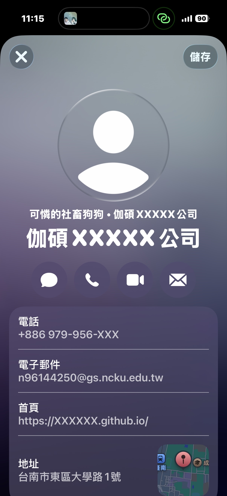

# Qrcode

> 補充：
> 電腦讀取qrcode 線上工具：https://zxing.org/w/decode.jspx


# 一維Qrcode：Barcode

## 不同條碼格式，能存的東西差很多

| 條碼格式 | 可存英文 | 可存中文 | 可存數字 | 常見用途  |
| -------- | -------- | -------- | -------- | --------- |
| EAN13    | ❌       | ❌       | ✅       | 商品條碼  |
| UPC      | ❌       | ❌       | ✅       | 美國商品  |
| Code128  | ✅       | ❌       | ✅       | 物流/倉儲 |
| Code39   | ✅       | ❌       | ✅       | 工業      |
| QRCode   | ✅       | ✅       | ✅       | 網址/文字 |

### 範例：查看所有支援的條碼類型

```py
import barcode

# 查看所有支援的條碼類型
print(barcode.PROVIDED_BARCODES)
```

- [補充：EAN-13條碼要素：從基本理解到生成](https://zh.onlinetoolcenter.com/blog/EAN-13-Barcode-Essentials-From-Basic-Understanding-to-Generate.html)
- [補充：可以拿來測試EAN13的數字碼](./Qrcode_datasets/可以拿來測試EAN13的數字碼.txt)

### 補充：查看SVG與PNG


- [SVG or PNG? Must-Know Tips for Crystal Clear Designs!](https://www.youtube.com/watch?v=bE98tqXUJaU)
- [Vibe Coding 玩家必備的 SVG 進階操作指南](https://www.youtube.com/watch?v=qSiu53ChHeE&t=70s)

### 範例：建立一個條碼，轉成svg

- 優點：無限放大不失真，適合印刷。
- 缺點：一般圖片檢視器可能打不開。

```python
from pathlib import Path
import barcode


### 輸出資料夾
current_file = Path(__file__).resolve()  # 取得目前 Python 檔案的絕對路徑
project_root = current_file.parent.parent  # 回到專案根目錄
output_dir = project_root / "Qrcode_outputs"  # 條碼輸出資料夾


### 條碼資料
barcode_number = "5901234123457"
barcode_name = "my_barcode_svg"


### 建立 EAN13 類別
EAN = barcode.get_barcode_class("ean13")


### 建立條碼物件
# EAN13 必須輸入 12 或 13 碼數字
# 若輸入 12 碼，python-barcode 會自動計算第 13 碼檢查碼
# 若輸入 13 碼，會驗證最後一碼是否正確
svg_barcode = EAN(barcode_number)


### 儲存 SVG 條碼
# save() 不需要加副檔名
# python-barcode 會自動建立 .svg 檔案
output_file = output_dir / barcode_name
svg_barcode.save(str(output_file))


print("SVG 條碼已產生完成！")
```

### 範例：建立一個條碼，轉成png

- 優點：通用圖片格式，大家都能開。
- 關鍵：必須加上 writer=ImageWriter() 參數

```python
import barcode
from barcode.writer import ImageWriter
from pathlib import Path


### 輸出資料夾
current_file = Path(__file__).resolve()  # 取得目前 Python 檔案的絕對路徑
project_root = current_file.parent.parent  # 回到專案根目錄
output_dir = project_root / "Qrcode_outputs"  # 條碼輸出資料夾

# 若資料夾不存在則自動建立
output_dir.mkdir(parents=True, exist_ok=True)


### 條碼資料
barcode_number = "5901234123457"
barcode_name = "my_barcode_png"


### 建立 EAN13 類別
EAN = barcode.get_barcode_class("ean13")


### 建立 PNG 條碼物件
# ImageWriter() 用來將條碼輸出為 PNG 圖片
barcode_image = EAN(
    barcode_number,
    writer=ImageWriter()
)


### 儲存 PNG 條碼
# save() 不需要加副檔名
# python-barcode 會自動建立 .png 檔案
output_file = output_dir / barcode_name
barcode_image.save(str(output_file))

print("PNG 條碼已產生完成！")
```

- [實作：Python + Gradio barcode條碼產生](./Qrcode_src/Python_Gradio_barcode條碼產生.py)
- [作業：實驗室設備借用與維修管理系統](./Qrcode_src/實驗室設備借用與維修管理系統.md)

# 二維Qrcode

> - [QR code的歷史：日本發明影響全球，小小黑白格大大奧秘【TODAY 看世界｜小發明大革命】](https://www.youtube.com/watch?v=zOx-JpBH-UM&t=222s)
> - [二維碼 QR code 的原理是什麼?](https://www.youtube.com/watch?v=rLAv85l4fqk)
> - [❄️ 設計生活冷知識❄️ QR Code 設計靈感竟然來自圍棋 !?｜說哈設計 Show Hand Design](https://www.youtube.com/watch?v=7Qcap43XOKA)
> - [Vol.120 二維碼的秘密](https://www.youtube.com/watch?v=XW8sgT_D0To&t=475s)

QR Code (Quick Response Code) 是一種二維條碼，由日本 Denso-Wave 公司在 1994 年發明。它的名稱意思是「快速反應」，因為它設計用來讓掃描器能夠快速讀取其內含的資訊。

QR Code常見的例子包括：

- 顯示網址資訊：掃描 QR Code 即可直接進入網頁。
- 行動支付：消費者掃描商家或個人的 QR Code，就能快速完成支付。
- 電子票券：如展覽、高鐵、電影票等，將資訊儲存在 QR Code 中，掃描後即可入場。
- 文字資訊：儲存名片資訊、產品說明等文字內容，方便快速獲取。


### QR Code 的容量

QR Code 有 40 個不同版本，版本 1 是 21x21 個模塊，每增加一個版本，長寬各增加 4 個模塊。因此，版本 40 的 QR Code 大小是 177x177 個模塊。

根據資料類型和容錯等級，QR Code 的最大資料容量不同：

- 數字：最多 7089 個字元。
- 字母：最多 4296 個字元。
- 二進位數字：最多 2953 個位元組。
- 日文漢字/片假名：最多 1817 個字元 (Shift JIS 編碼)。
- 中文漢字：最多 984 個字元 (UTF-8 編碼)，或最多 1800 個字元 (big5/gb2312 編碼)。


### 建立 QR Code 基本方法

```python
# 函式會自動設定好所有參數，直接將文字內容轉換成 QR Code 圖片物件。
img = qrcode.make(codeText)
```

- [範例：將連結做成QRcode](./Qrcode_src/將連結做成QRcode.md)
- [範例：客製化QRCode](./Qrcode_src/客製化QRCode.md)
- [範例：在 QR Code 內加入圖片](./Qrcode_src/在QRCode內加入圖片.md)

## VCARD

vCard 格式的資料，它是一種用於儲存和交換個人聯絡資訊的電子名片標準。簡單來說，vCard 就像是你的手機聯絡人資料，但以純文字格式呈現。

- [vcard是什么格式？如何进行转换？难吗？](https://zhuanlan.zhihu.com/p/690935297)
- [How to Create Your Own VCard QR Code](https://www.youtube.com/watch?v=XlhrOE2cGVU)

### 範例：建立名片資訊QRCode

```python
from pathlib import Path
import qrcode
from PIL import Image


# vCard 個人資料
vc_str = """BEGIN:VCARD
VERSION:3.0
FN;CHARSET=UTF-8:陳維誠 Wei-Cheng Chen
TEL;CELL:+886-979-956-XXX
ORG;CHARSET=UTF-8:伽碩XXXXX公司
TITLE;CHARSET=UTF-8:可憐的社畜狗狗
EMAIL:n96144250@gs.ncku.edu.tw
URL:https://XXXXXX.github.io/
ADR;CHARSET=UTF-8:台南市東區大學路1號
END:VCARD
"""

# 建立 QRCode
qr = qrcode.QRCode(
    version=10,
    error_correction=qrcode.constants.ERROR_CORRECT_H,
    box_size=15,
    border=5
)

qr.add_data(vc_str.encode("utf-8"))
qr.make(fit=True)

# 生成圖片
img = qr.make_image(
    fill_color="#222222",
    back_color="#FFFFFF"
)

img = img.convert("RGB")

# 儲存圖片
# output_path = Path("個資Qrcode.png")
# img.save(output_path)
# print(f"QRCode 已儲存：{output_path.resolve()}")

img.show() # 顯示圖片
```

```html=
<!-- 兩張 -->
<div style="display: flex; flex-wrap: wrap; gap: 20px;">
    
    
</div>
```

```html=
<!-- 兩張 -->
<div style="display: flex; flex-wrap: wrap; gap: 20px;">
    
    
</div>
```
