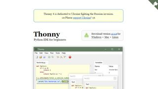
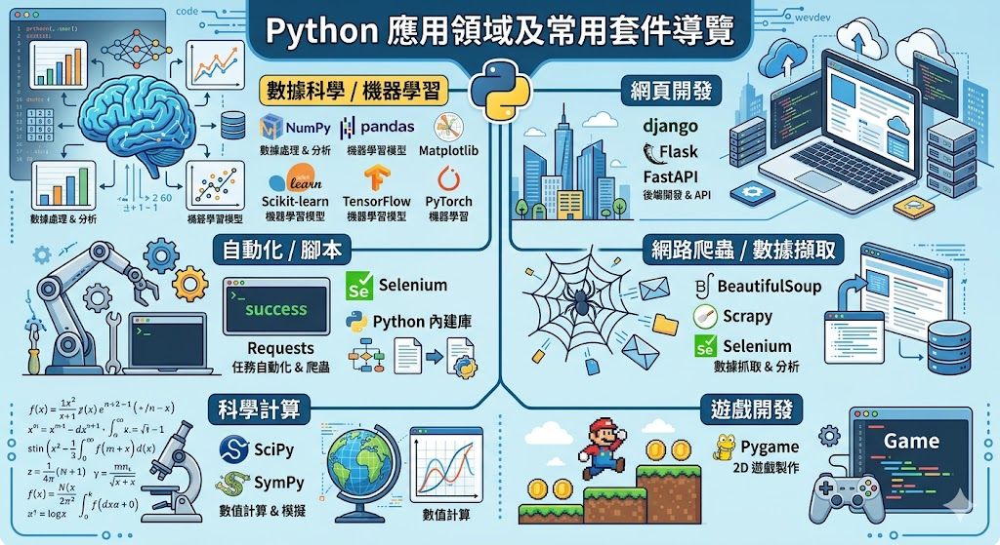
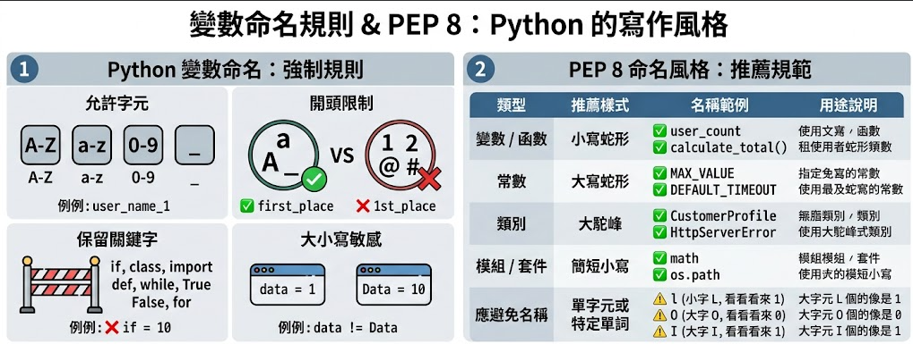

# Python程式設計：先備知識

## vscode相關設定

> - 在vscode中安裝run code 要去設定【fileDirectoryAsCwd】打勾
> - 處裡輸出中文為亂碼：https://ouch1978.github.io/blog/2022/12/29/solve-vscode-python-utf8-display

## 撰寫程式環境IDE

IDE 是 Integrated Development Environment（整合開發環境）的縮寫。

我們目前在使用電腦都會有一個習慣，就是某個功能會對應的一個對應的操作APP

- 寫文字要用word
- 記錄數據要用excel
- 製作簡報要用powerpoint

但在程式這一塊比較不同，「寫程式」與「寫程式的環境」是獨立的。

> 像吃飯一樣，我們吃飯可以用湯匙、可以用筷子、甚至可以用叉子。
>
> 寫程式也是有相同道理，我們可以選用不同的IDE，來做「寫程式」這件事情（甚至你要用記事本來寫也是可以的）。


但這邊一定會想反駁我，因為在吃飯時，使用湯匙跟筷子一定會比用叉子方便呀

沒錯，IDE也是一樣的道理，不同的IDE都有他們的優缺點。

### Visual Studio Code (VS Code) (我們使用這個)


### Thonny



### [Google Colaboratory (Colab)](https://www.youtube.com/watch?v=p0rCAiXV8K4&t=47s)

如果在vscode運行，我們就會稱呼他為ipynb檔。

## 介紹python


Python 之所以會比較紅的原因，是因為他有很多的模組(可以想成，他有很多的小工具)可以完成各是各項的事。以下是它最常出沒的領域：



> 如果你想深入了解某個領域，隨時可以 Google 搜尋【`[套件名稱] python 教學`】。
> e.g.,`gradio python 教學`。

## 註解

```python
# 以下為註解的示範
a = 10 # 這行電腦會讀到

# b = 20 # 這行電腦不會讀到
```

## 變數

- 變數即為一筆資料的暱稱。

```python
x = 10      # 把數字 10 放進名為 x 的置物櫃
name = "Amy" # 把文字 "Amy" 放進名為 name 的置物櫃

print(x)      # 取出 x 裡的資料 → 10
print(name)   # 取出 name 裡的資料 → Amy
```

- 變數名稱要盡量有意義，讓別人（也包含未來的你自己）一看就知道這個變數是幹嘛的。
- 例如：用 `annual_salary` 比用 `y` 好得多！

```python
hourly_salary = 183   # 每小時薪資 183 元
annual_salary = hourly_salary * 8 * 300  # 年薪計算：時薪 * 8 小時 * 300 天
annual_fee = 9000 * 12                   # 年支出：每月 9000 元 * 12 個月
annual_savings = annual_salary - annual_fee # 年儲蓄
print(annual_savings) # 輸出計算結果
```

### 變數命名規則 & PEP 8：Python 的寫作風格



## [練習題目\_A](./先備知識_practices/練習題目_A.ipynb)

## Assignment：賦值

Assignment是一個比較學術的詞，簡單來說就是用  `=`  把右邊算出來的結果存到左邊的變數裡。

```python
a = 10

# 下面這一段在幹嘛呢
a = 10, b = 20

temp = a
a = b
b = temp
```

## 餘數與整除

在程式設計中，除法有兩種常見的應用：

| 運算符 | 程式意義 | 數學意義             | 範例         | 結果    |
| ------ | -------- | -------------------- | ------------ | ------- |
| `//`   | 整除     | 取商（不包含小數）   | `b = 7 // 2` | `b = 3` |
| `%`    | 取餘數   | 取除法後的餘數 (mod) | `c = 7 % 2`  | `c = 1` |

## 次方運算

```python
a = 3*2
print(a)

a = 3**2
print(a)
```

## [練習題目\_B](./先備知識_practices/練習題目_B.ipynb)

<p style="text-align: center;">Copyright © 2026 Wei-Cheng Chen</p>
