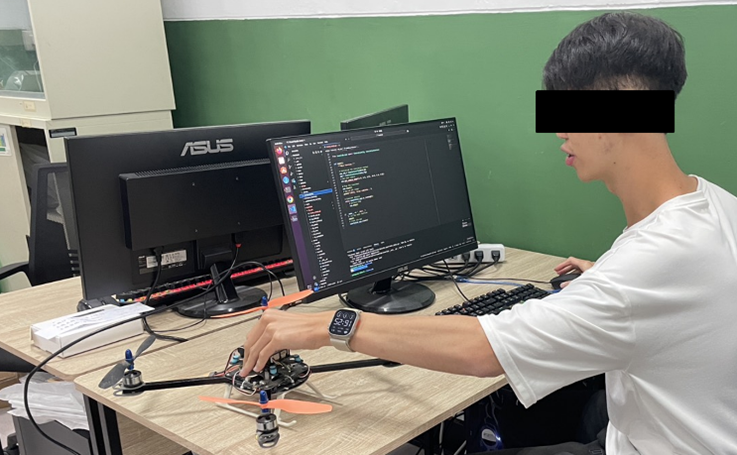
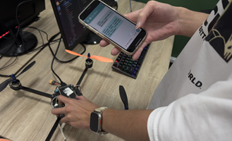

## 摘要

Generative AI 作為無人機 STEM 專題中的反思支架：一項探討學生高層次思維與認知轉化的混合方法研究

在人工智慧技術加速整合教育情境的當代知識社會中，如何設計具備認知支架(Cognitive Scaffolding)功能的智慧學習系統，以促進學生高層次思維與深度反思，已成為學習科技研究的關鍵議題。無人機（UAV）課程融合機構裝配、感測整合、資料運算與飛行控制，構成高度整合的 STEM 學習任務，亦為檢驗 Generative AI 輔助學習成效的理想場域。本研究採準實驗設計，招募 64 位來自工學院的大一學生，隨機分為實驗組與控制組，參與為期六週的 UAV 專題式 STEM 課程。實驗組使用具語義提示與動態回饋功能的 GPT 互動系統，引導學生進行反思提問與策略調整；控制組則採紙本反思方式。獨立樣本 t 檢定結果顯示，實驗組學生在 STEM 素養、反思層級與高層次思維指標上，皆顯著優於前測與控制組。另以主題分析法(Thematic Analysis)針對學生反思紀錄與 AI 對話進行質性編碼，結果顯示 GPT 系統有效促進語言化反思與多層次認知調整，學生歷程亦由操作導向逐步轉化為概念層級的策略性理解。本研究驗證了 AI 輔助反思的可行性，並為未來智慧學習系統的設計與評估提供具體的理論依據與實務參照。

Keywords: Generative AI, Reflective Thinking, Higher-Order Thinking Skills, UAV-based Engineering Learning, STEM Education

 

    
    

