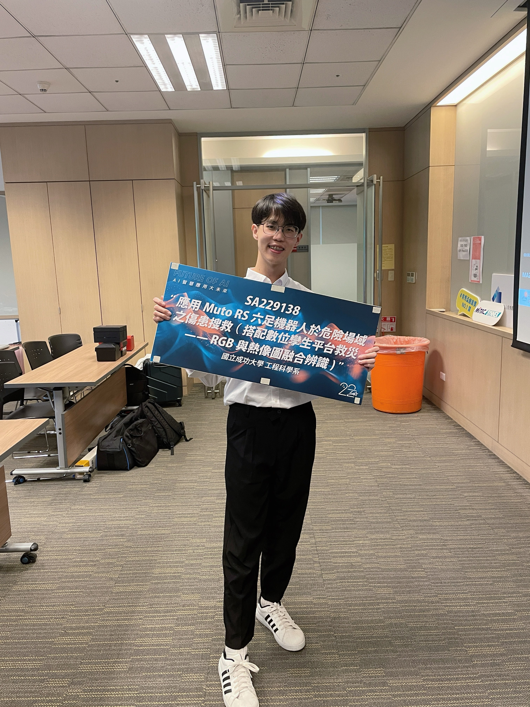
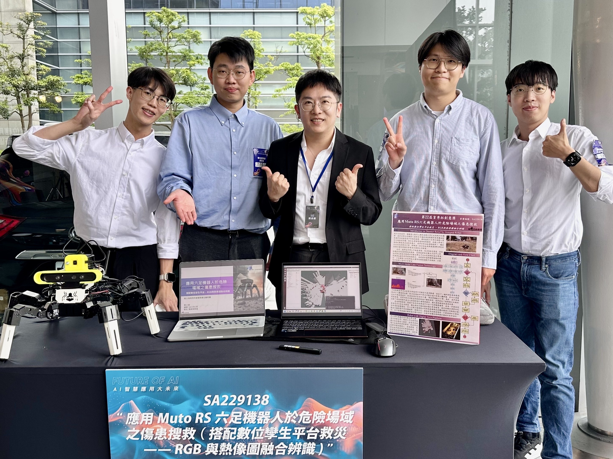
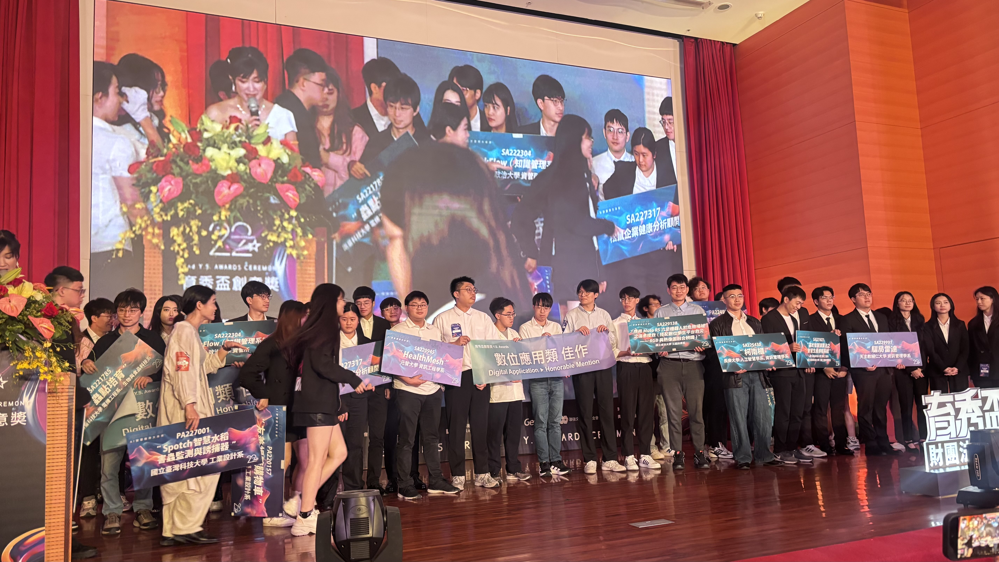
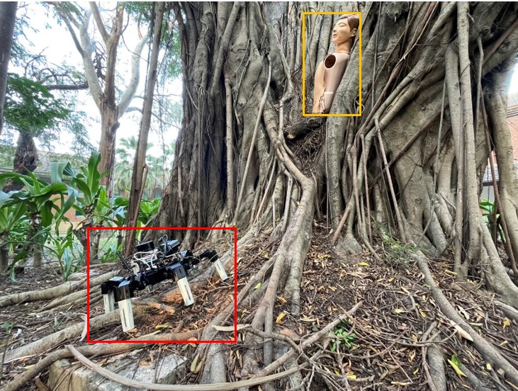

## 作品說明

我們基於 Muto RS 六足機器人，並結合多種感測技術與深度視覺技術，旨在應對高危險區域中的搜救挑戰。傳統搜救方式常面臨人員安全風險與效率低下的問題，例如在火災現場、高溫濃煙阻礙視線，或地震後倒塌建築中狹窄不穩的空間環境，救援人員進入難度高且危險系數大。我們針對這些場域提供了一種安全且高效的解決方案，將機器人整合紅外線感測器、SLAM 激光雷達、深度相機(RGB-D)和熱像儀，能夠精確感知周圍環境，檢測生命跡象並生成實時數據回傳指揮中心。六足結構設計使機器人具備卓越的靈活性與穩定性，能輕鬆穿越瓦礫堆、狹窄通道和不平坦地面，執行自主搜尋與定位傷患的任務。此外藉由 Wi-Fi(Lora)技術，實現影像與數據的遠程傳輸，讓指揮者能即時掌握現場情況，並快速作出決策。相比人力進入危險場域，Muto RS 六足機器人能有效降低搜救過程中的風險，同時提高效率與成功率，成為災害救援的強力輔助手段，展現科技與人道結合的價值。

<a href="./決賽簡報.pdf" target="_blank" rel="noopener noreferrer"><strong>決賽簡報</strong></a>

    

 

    

 

    

 

    
    

 
