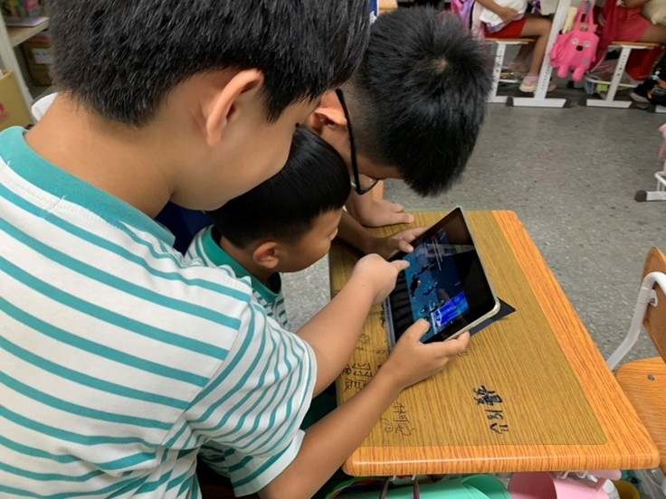
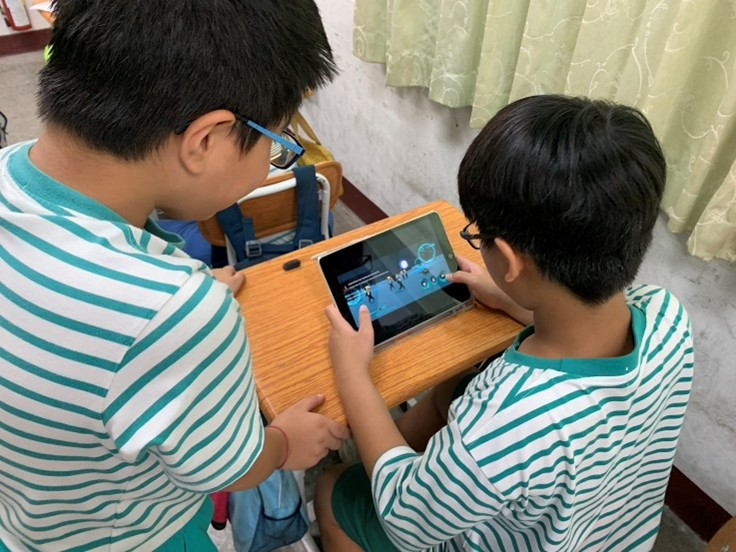

## Abstract

在數位時代，網路安全教育是培養永續數位素養的關鍵。然而，現有教學方式多聚焦於資訊素養與基礎知識，對永續數位素養技能的培養相對不足。為填補此缺口，本研究開發了一款針對國小學童的網路安全教育遊戲，結合 ChatGPT 作為內容生成的輔助工具，透過 prompt 生成初步的遊戲情節與學習素材，並經人工優化以確保教育性與吸引力。模擬遊戲多樣化的網路攻擊情境，引導學生識別威脅、採取應對措施，強化知識應用能力，提升其網路安全認知與永續數位素養技能。本研究採用準實驗設計，依據是否導入 ChatGPT 的行動嚴肅遊戲學習進行分組，並測量學生的永續數位素養技能及 AI 遊戲自我效能。結果顯示，基於生成式 AI 的遊戲化學習，學生能主動建構網路安全知識，並提高學習興趣和參與度，以達永續學習之目的。未來研究可探索不同遊戲類型與 AI 技術在個性化學習體驗中的應用，以全面提升學生的永續數位技能及數位時代競爭力。

關鍵字：Mobile Serious Games, Cybersecurity Education, Sustainable Digital Literacy, Gameplay Self-Efficacy, Generative artificial intelligence

 

 

    
    

