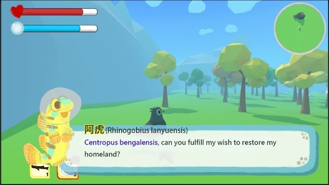
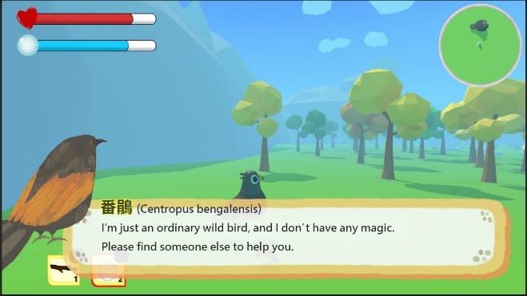

## ABSTRACT

隨著全球物種多樣性急速下降，環境保育的重要性越來越受到重視。位於台灣東南方的蘭嶼一個生態豐富且獨特的島嶼，其海域孕育著多樣性的海洋生物，包括珊瑚、海龜和各種熱帶魚類，形成獨特的海洋生態系。在陸地上，原生樹木和植被茂盛，而蘭嶼角鴞等特有鳥類成為島上珍貴的生態資源之一。由於人類活動和環境變遷的影響，當地的生態系統正面臨威脅，急需大眾對其生態保護的理解與參與。為了倡導保育這些瀕危物種，我們選擇採用 Unity 引擎來製作一款環境保育的遊戲，旨在幫助年輕的孩童更快速地認識這些濒危物種。這款遊戲將透過生動的互動方式，呈現蘭嶼特有的生態環境，提高大眾對於自然保育以及蘭嶼特有種的關注度，並激發更多人參與保護這片寶貴的生態環境。遊戲中結合敘事視角轉換和角色代入的設計，讓學習者通過角色扮演來理解和體驗保護環境的重要性。實驗結果顯示，數位教育遊戲顯著提升了學習者的環保行動知識與意願，且在敘事視角轉換的幫助下，促進了學習者在現實中的同理心行為表現。未來建議進一步探索多元化的情境模擬與即時回饋系統，以擴展數位遊戲在環保教育的應用，推動更多人參與環境保護的行動，增強其對生態保育的認知與責任感。

關鍵字：Game-Based Learning、Environmental Conservation、蘭嶼吻鰕虎、Narrative Perspective-Taking、Education for Sustainable Development

 

 

    
    

