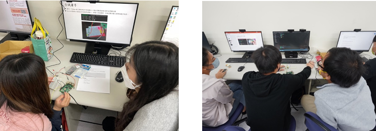

## ABSTRACT

With the promotion of global educational equity and quality education under the United Nations Sustainable Development Goals (SDGs), technology-assisted instruction has become a critical pillar in engineering education. This study aims to apply computer vision and deep learning technologies to electronics circuit lab teaching, enhancing learners' efficiency and addressing fairness issues in experimental assessment. Traditional assessment methods for electronics experiments focus on experiment success or failure, which may fail to accurately reflect the efforts of some students. To address this, the study developed an intelligent experimental assessment system based on computer vision, capable of accurately identifying the number and position of components amidst environmental noise. Combined with deep learning for experiment classification, the system provides dynamic scoring and subsequent operational suggestions based on the recognition results, thereby improving learners' understanding and interest in electronics experiments. The system leverages image processing to filter external noise and accurately extract key experimental features. To enhance adaptability and versatility, the system supports automated recognition and scoring across various experimental scenarios. Experimental results demonstrate that this system not only reduces the workload of educators but also significantly increases learner engagement and learning outcomes. The study contributes to integrating technological innovation into engineering education, achieving the SDGs vision of educational equity and quality education.

    

 

